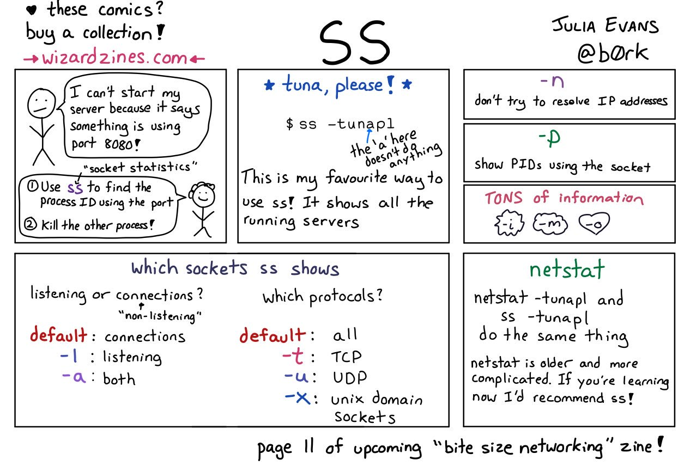

# Linux/Unix/macOS Network Shell Commands

* [arpwatch](https://linux.die.net/man/8/arpwatch) - Ethernet Activity Monitor.
* [bmon](https://github.com/tgraf/bmon) - bandwidth monitor and rate estimator.
* [bwm-ng](https://www.gropp.org/?id=projects&amp;sub=bwm-ng) - live network bandwidth monitor.
* [curl](https://curl.haxx.se/) - transferring data with URLs. (or try [httpie.org](https://httpie.org/))
* [darkstat](https://unix4lyfe.org/darkstat/) – captures network traffic, usage statistics.
* [dhclient](https://linux.die.net/man/8/dhclient) -  – Dynamic Hostµ Configuration Protocol Client
* [dig](https://linux.die.net/man/1/dig) - query DNS servers for information.
* [dstat](https://github.com/dagwieers/dstat) - replacement for vmstat, iostat, mpstat, netstat and ifstat.
* [ethtool](https://mirrors.edge.kernel.org/pub/software/network/ethtool/) - utility for controlling network drivers and hardware.
* [gated](https://www.oreilly.com/library/view/linux-in-a/0596000251/re101.html) -  – gateway routing daemon.
* [host](https://linux.die.net/man/1/host) -  – DNS lookup utility.
* [hping](http://www.hping.org/) -  – TCP/IP packet assembler/analyzer.
* [ibmonitor](http://ibmonitor.sourceforge.net/) - shows bandwidth and total data transferred.
* [ifstat](http://gael.roualland.free.fr/ifstat/) - &nbsp;report network interfaces bandwidth.
* [iftop](http://www.ex-parrot.com/pdw/iftop/) - &nbsp;– display bandwidth usage.
* [ip](https://access.redhat.com/sites/default/files/attachments/rh_ip_command_cheatsheet_1214_jcs_print.pdf) - &nbsp;(PDF file) –&nbsp;a&nbsp;command&nbsp;with more features that ifconfig (net-tools).
* [ipcalc] - ipnetwork calculator.
* [iperf3](https://github.com/esnet/iperf) -  – network bandwidth measurement tool. (above screenshot <a href="https://stacklinux.com/" target="_blank" rel="noopener">Stacklinux VPS</a>)
* [iproute2](https://wiki.linuxfoundation.org/networking/iproute2) - collection of utilities for controlling&nbsp;TCP/IP.
* [iptables](https://netfilter.org/) -  – take control of network traffic.
* [IPTraf](http://iptraf.seul.org/) - &nbsp;– An IP Network Monitor.
* [iputils](https://wiki.linuxfoundation.org/networking/iputils) - set of small useful utilities for Linux networking.
* [iw](https://wireless.wiki.kernel.org/en/users/documentation/iw) - nl80211&nbsp;based CLI configuration utility for wireless devices.
* [jwhois](https://www.gnu.org/software/jwhois/) - &nbsp;(whois) –&nbsp;client for the whois service.
* [“lsof -i”](https://www.novell.com/coolsolutions/tip/18078.html) -  – reveal information about your network sockets.
* [mtr](http://www.bitwizard.nl/mtr/) - network diagnostic tool.
* [net-tools](http://net-tools.sourceforge.net/) - tool, iptunnel and ipmaddr.
* [ncat](https://nmap.org/ncat/) - improved re-implementation of the venerable netcat.
* [netcat](http://nc110.sourceforge.net/) -  – networking utility for reading/writing network connections.
* [nethogs](https://github.com/raboof/nethogs) - a small ‘net top’ tool.
* [Netperf](https://github.com/HewlettPackard/netperf) - &nbsp;– Network bandwidth Testing.
* [netsniff-ng](http://netsniff-ng.org/) -  – Swiss army knife for daily Linux network plumbing.
* [netstat](http://net-tools.sourceforge.net/man/netstat.8.html) -  – Print network connections, routing tables, statistics, etc.
* [netwatch](http://www.slctech.org/~mackay/NETWATCH/netwatch.html) - monitoring Network Connections.
* [ngrep](https://github.com/jpr5/ngrep/) - grep applied to the network layer.
* [nload](https://linux.die.net/man/1/nload) -  – display network usage.
* [nmap](https://nmap.org/) - network discovery and security auditing.
* [nmcli](https://developer.gnome.org/NetworkManager/stable/nmcli.html) - a command-line tool for controlling NetworkManager and reporting network status.
* [nmtui](https://access.redhat.com/documentation/en-US/Red_Hat_Enterprise_Linux/7/html/Networking_Guide/sec-Networking_Config_Using_nmtui.html) - provides a text interface to configure networking by controlling&nbsp;<span class="application">NetworkManager</span>.
* [nslookup](https://en.wikipedia.org/wiki/Nslookup) - query Internet name servers interactively.
* [ping](https://en.wikipedia.org/wiki/Ping_(networking_utility)) - send icmp echo_request to network hosts.
* [route](https://en.wikipedia.org/wiki/Route_(command)) - show / manipulate the IP routing table.
* [slurm](https://github.com/mattthias/slurm) -  – network load monitor.
* [snort](https://www.snort.org/) -  – Network Intrusion Detection and Prevention System.
* [smokeping](https://oss.oetiker.ch/smokeping/) - &nbsp;keeps track of your network latency.
* [socat](http://www.dest-unreach.org/socat/) - establishes two bidirectional byte streams and transfers data between them.
* [speedometer](http://excess.org/speedometer/) - Measure and display the rate of data across a network.
* [speedtest-cli](https://github.com/sivel/speedtest-cli) -  – test internet bandwidth using speedtest.net
* [ss](http://linux-ip.net/gl/ss/) - utility to investigate sockets.
* [ssh](https://www.ssh.com/ssh/) - &nbsp;secure system administration and file transfers over insecure networks.
* [tcpdump](https://www.tcpdump.org/) - command-line packet analyzer.
* [tcptrack](https://github.com/bchretien/tcptrack) -  – Displays information about tcp connections on a network interface.
* [telnet](https://www.unix.com/man-page/linux/1/telnet/) - user interface to the TELNET protocol.
* [tracepath](https://linux.die.net/man/8/tracepath) - very similar function to traceroute.
* [traceroute](http://traceroute.sourceforge.net/) - print the route packets trace to network host.
* [vnStat](https://humdi.net/vnstat/) - &nbsp;– network traffic monitor.
* [websocat](https://github.com/vi/websocat) - &nbsp;– Connection forwarder from/to web sockets to/from usual sockets, in style of socat.
* [wget](https://www.gnu.org/software/wget/) - &nbsp;retrieving files using HTTP, HTTPS, FTP and FTPS.
* [Wireless Tools for Linux](https://hewlettpackard.github.io/wireless-tools/Tools.html) - iwconfig,&nbsp;iwlist,&nbsp;iwspy,&nbsp;iwpriv and&nbsp;ifrename.
* [Wireshark](https://www.wireshark.org/) - network protocol analyzer.


## `@conntrack`


## `curl`

Transfer a URL.

`curl`  is  a  tool  to  transfer  data from or to a server, using one of the supported protocols (DICT, FILE, FTP, FTPS, GOPHER, HTTP, HTTPS, IMAP, IMAPS, LDAP, LDAPS, POP3, POP3S, RTMP, RTSP, SCP, SFTP, SMB, SMBS, SMTP, SMTPS,  TELNET  and TFTP). The command is designed to work without user interaction.


```bash
# aliased curl download
dl="curl -LO $URL"

# save files as
curl -L $URL -o $FILE

# keep it silent
curl -Ls $URL -o $FILE
```

## `iptables`


---


## `mrt`

A network diagnostic tool

```bash
mrt
mrt --udp
mrt --tcp
mrt --sctp
```

## `@nc`


## `@traceroute`

`todo`

## `@tshark`

Wireshark cli


## `@tc`


## `@socat`


## `ss`



## `ssh`

`ssh`q (SSH client) is a program for logging into a remote machine and for executing commands on a remote machine


```bash

# Proxy Jump
ssh -J user@example.com me@internal-host.lan

# Running Command on remote host
ssh made.ua "echo 1"

# Bastion
ssh made.ua "ssh internal.made.ua \"echo 1\""

# Create ~/media.tag.gz on hqweb3
ssh made.ua "ssh internal.made.ua \"tar -zcvf ~/media.tar.gz -C /mnt media &> /dev/null\""

# Copy Over remote hosts
ssh made.ua "scp oleg@internal.made.ua:~/media.tar.gz ~/media.tar.gz"
```

## `ssh-keygen`

Authentication key generation, management and conversion

```bash
# Removes keys from hostname
ssh-keygen -R <hostname>
```

## `@ssh-copy-id`

Use locally available keys to authorise logins on a remote machine

