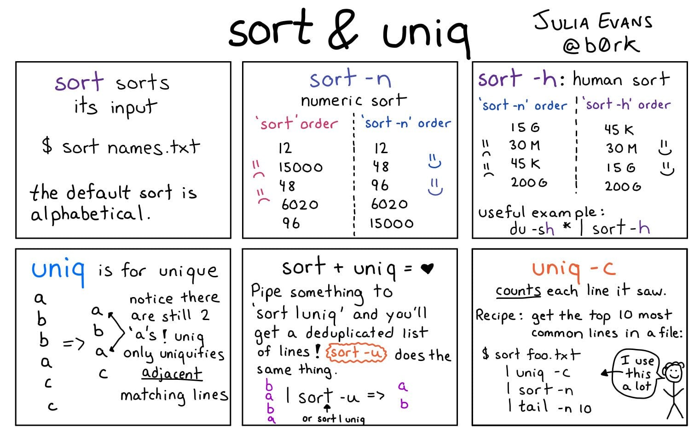

# Linux/Unix/macOS Shell Commands

* https://en.wikipedia.org/wiki/List_of_Unix_commands
* https://uk.wikipedia.org/wiki/Категорія:Стандартні_програми_для_Unix

**Resources:**
* https://coderwall.com/t/terminal/popular
* https://explainshell.com/

## Archives

### `ar`

Create and maintain library archives

```bash
# Compile c to object file.
gcc -c libClib/*.c
# check what we have
file libC.o
> libC.o: Mach-O 64-bit object x86_64
ar rs libC.a *.o
file libC.a
libC.a: current ar archive random library
```

###  `tar`

`tar` saves many files together into a single tape or disk archive, and can restore individual files from the archive


```bash

# zip folder `media` at /mnt into file `media.tar.gz`
# and pipe output to /dev/null
tar -zcvf ~/media.tar.gz -C /mnt media &> /dev/null

# Let tar to find out which algorith to use for compression.
tar acvf ~/media.tar.gz -C /mnt media &> /dev/null

# Same, but tar
tar -cvf ~/media.tar -C /mnt media &> /dev/null

# Excluding files from archiving
tar -cf notes.tar * --exclude "*.md"

# Or using a list of patterns from file
tar -cf notes.tar * --X list.file

# Adding extra (folder) to existing tar
tar -rvf ~/media.tar -C /mnt extra

# Show tar contents
tar -tf ~/media.tar

# Untar into current directory
tar -vxf ~/media.tar

# merge to archivers
tar -Af one.tar two.tar

# add file if modified
tar -uf notes.tar test.txt
tar -uvvf notes.tar test.txt

# delete 
tar -f notes.tar --delete test.txt
```

### `gunzip`

Tool for Compression/decompression using Lempel-Ziv coding

```bash
# k - for keep file 
gunzip -k hello.gz
```

### `zcat`

Tool for Compression/decompression using Lempel-Ziv coding

* linux  - `exec gzip -cd "$@"`
* (don't use) macosx - binary 

## Network

See [`network.ipynb`](network.ipynb).

## File System 

 * https://www.thegeekstuff.com/2008/10/6-awesome-linux-cd-command-hacks-productivity-tip3-for-geeks/

### `quota`

Disk usage and limits

```bash
quota -v
```

### `rsunc`

Sync

```bash
# sync A into B
rsync -avu --delete "/path/to/A" "/path/to/B"
# Sync A contents into B
rsync -avu --delete "/path/to/A/" "/path/to/B"
```

### `mount`

mount file system

```bash
# mount /dev/file into /mnt/hdd path
mount /dev/file /mnt/hdd

# samba
mount -r smbfs -o username=user,password=pass / /winclient/share /nmt/share

# directory into directory
# also https://unix.stackexchange.com/questions/198590
mount -o bind /nmt/share /nmt/shared
mount --bind  /nmt/share /nmt/shared
# updating mount with readonly readonly
mount -o remount,ro,bind /nmt/shared
```

### `umount`

unmount file system

```bash
umount /dev/file
```

### `df`

```bash
# short report
df
```

### `du`

```bash

# heavy directories
du -h /directory/path | grep '[0-9\,]\+G' # comma in size
du -h /directory/path | grep '[0-9\.]\+G' # dots in size

# summary 
du -sh .

# depth limiting
du -h --max-depth 3 .  
du -hd 3 .

# stay in filesystem and don't follow symlinks
du -Pshx .

# biggest dirs
du -xm / | sort -rn
# or top 25 
du -xm / | sort -rn | head -25

# bigger then 
du -kx / | awk '{ if ($1 > 500000) { print $0} }'
```

### `mdfind` 

macOS Spotfline Search

```bash
mdfind search phraze -onlyin "/Volumes/SharedDocuments" | less
```

### `find`

Walk a file hierarchy


```bash
# Searching for pattern *torrent* exceprt in ./Volumes
find * -path ./Volumes -prune -o -name "*torrent*"

# Searching and Executing Command ( -exec )
find * -path ./Volumes -prune -o -name "*torrent*" -exec file -i '{}' \;

# basic 'find file' commands
#--------------------------
find / -name foo.txt -type f -print             # full command
find / -name foo.txt -type f                    # -print isn't necessary
find / -name foo.txt                            # don't have to specify "type==file"
find . -name foo.txt                            # search under the current dir
find . -name "foo.*"                            # wildcard
find . -name "*.txt"                            # wildcard
find /users/al -name Cookbook -type d           # search '/users/al' dir

#search multiple dirs
#--------------------
find /opt /usr /var -name foo.scala -type f     # search multiple dirs

# search by user
#--------------------------
find . -user butuzov

# case-insensitive searching
#--------------------------
find . -iname foo                               # find foo, Foo, FOo, FOO, etc.
find . -iname foo -type d                       # same thing, but only dirs
find . -iname foo -type f                       # same thing, but only files

# find files with different extensions
#------------------------------------
find . -type f \( -name "*.c" -o -name "*.sh" \)                       # *.c and *.sh files
find . -type f \( -name "*cache" -o -name "*xml" -o -name "*html" \)   # three patterns

# dealing with size 
# --------------------------------------------
find / -size +10000k                                              # filesize > 10000k
find / -mount -type d -exec du -s "{}" \; | sort -n               # find directories and sort by size

# find files that don't match a pattern (-not)
# --------------------------------------------
find . -type f -not -name "*.html"                                # find all files not ending in ".html"

# find files by text in the file (find + grep)
#--------------------------------------------
find . -type f -name "*.java" -exec grep -l StringBuffer {} \;    # find StringBuffer in all *.java files
find . -type f -name "*.java" -exec grep -il string {} \;         # ignore case with -i option
find . -type f -name "*.gz" -exec zgrep 'GET /foo' {} \;          # search for a string in gzip'd files

# 5 lines before, 10 lines after grep matches
-------------------------------------------
find . -type f -name "*.scala" -exec grep -B5 -A10 'null' {} \;
# http://alvinalexander.com/linux-unix/find-grep-print-lines-before-after-search-term

# find files and act on them (find + exec)
#----------------------------------------
find /usr/local -name "*.html" -type f -exec chmod 644 {} \;      # change html files to mode 644
find htdocs cgi-bin -name "*.cgi" -type f -exec chmod 755 {} \;   # change cgi files to mode 755
find . -name "*.pl" -exec ls -ld {} \;                            # run ls command on files found

# find and copy
#-------------
find . -type f -name "*.mp3" -exec cp {} /tmp/MusicFiles \;       # cp *.mp3 files to /tmp/MusicFiles

# copy one file to many dirs
#--------------------------
find dir1 dir2 dir3 dir4 -type d -exec cp header.shtml {} \;      # copy the file header.shtml to those dirs

# find and delete
#---------------
find . -type f -name "Foo*" -exec rm {} \;                        # remove all "Foo*" files under current dir
find . -type d -name CVS -exec rm -r {} \;                        # remove all subdirectories named "CVS" under current dir

# find files by modification time
#-------------------------------
find . -mtime 1               # 24 hours
find . -mtime -7              # last 7 days
find . -mtime -7 -type f      # just files
find . -mtime -7 -type d      # just dirs

# find files by modification time using a temp file
#-------------------------------------------------
touch 09301330 poop           # 1) create a temp file with a specific timestamp
find . -mnewer poop           # 2) returns a list of new files
rm poop                       # 3) rm the temp file

# find with time: this works on mac os x
#--------------------------------------
find / -newerct '1 minute ago' -print

# find and tar
#------------
find . -type f -name "*.java" | xargs tar cvf myfile.tar
find . -type f -name "*.java" | xargs tar rvf myfile.tar

# http://alvinalexander.com/blog/post/linux-unix/using-find-xargs-tar-create-huge-archive-cygwin-linux-unix

# find, tar, and xargs
#--------------------
find . -name -type f '*.mp3' -mtime -180 -print0 | xargs -0 tar rvf music.tar
# (-print0 helps handle spaces in filenames)
# http://alvinalexander.com/mac-os-x/mac-backup-filename-directories-spaces-find-tar-xargs

# find and pax (instead of xargs and tar)
#---------------------------------------
find . -type f -name "*html" | xargs tar cvf jw-htmlfiles.tar -
find . -type f -name "*html" | pax -w -f jw-htmlfiles.tar
# http://alvinalexander.com/blog/post/linux-unix/using-pax-instead-of-tar

# find files with permitions
#----------
find . -perm -u+s              # search for files with SUID set.   
```

### `ls` 

List directory contents

```bash
# Usage Examples
# ------------------------------------------
ls -1      # One file/directory per line
ls -lah    # Show files size in "human" size

# Order -----------------------------------
ls -lt     # time based order
ls -ltr    # time based reverse order

# Filtering -------------------------------
ls -a      # Show also hidden files 
ls -A      # Show also hidden files  but not . and ..

# Options ---------------------------------
ls -i      # Inodes numbers
ls -ln     # UID/GID

```

 inode  | Type-Permissions | Number of Links | Owner   | Group | Size | Last-Modified | Name
--------|------------------|-----------------|---------|-------|------|---------------|-----------
5649755 | drwxr-xr-x       | 70              | butuzov | staff | 2380 | Jan 23 23:45  | KubeCon-2018
3990493 | drwxr-xr-x       | 56              | butuzov | staff | 1904 | Jan  2 13:13  | GopherCon-2017

### `ln`

Make links between files

```bash
ln -s Original/File_Location Target/File_Location

# Correct way
ln -s ../../../../WP_Plugins_Dev/Yojimbo  Yojimbo && ls -la

> drwxr-xr-x@  7 butuzov  admin   238 Mar 13 18:14 .
> drwxr-xr-x@ 11 butuzov  admin   374 Mar 13 18:00 ..
> lrwxr-xr-x   1 butuzov  admin    34 Mar 13 18:14 Yojimbo -> ../../../../WP_Plugins_Dev/Yojimbo

# Incorrect way
ln -s Yojimbo ../www.made.ua/www-main/wp-content/plugins \
  && cd ../www.made.ua/www-main/wp-content/plugins \
  && ls -la

> drwxr-xr-x@  7 butuzov  admin   238 Mar 13 18:09 .
> drwxr-xr-x@ 11 butuzov  admin   374 Mar 13 18:00 ..
> lrwxr-xr-x   1 butuzov  admin    10 Mar 13 18:09 Yojimbo -> Yojimbo

# creates links for cuda libraries
CUDA_LOCATION=/Developer/NVIDIA/CUDA-9.1/lib/
ls -l $CUDA_LOCATION \
    | awk '{print $9}' \
    | xargs  -I {} sh -c "ln -s $CUDA_LOCATION{} /usr/local/lib/{}"
```

### `lsof`

List open files


cmd | explaintion
----|------------
`lsof` | List open files.
`lsof -i :PORT` | Shows networking related port
`lsof -i@IP` | Shows connections to a specific host
`lsof -i -sTCP:LISTEN` | Shows listening ports
`lsof -i -sTCP:ESTABLISHED` | Shows established connections
`lsof -u USER` | What user opens
`lsof DIR` | Shows everything interacting with a given DIR
`lsof -i :PORT` | Shows which process uses the port

```bash
# What lisning port 80 ?
lsof -i :80

# Opened by process (ID)
lsof -p 17426

# Opened ports
lsof | grep LISTEN

# List all Network File System(NFS) files
lsof -N

# List all TCP or UDP connections
lsof -i tcp
lsof -i udp

# Kill all process that belongs to what you find out (-t returns process id list)
kill -9 `lsof -t options`

# Execute lsof in repeat mode (-r will continue to list, delay, list until a interrupt is given. +r will end when no open files are found.)
lsof /path-of-a-file -r5

# List opened files under a directory (+D will recurse the sub directories also)
lsof +D /path-of-a-directory

# List opened files based on process names starting with (You can give multiple -c switch on a single command line)
lsof -c ssh -c init

# List files opened by a specific user
lsof -u username
```

### `file`

Determine file type

```bash
# usage 
file text.txt 
```

## Monitoring & Processes

### `kill`

Send signals to processes, or list signals

```bash
# kill it with a fire (no safety)
kill -9 "${PROC_ID}"
kill -KILL "${PROC_ID}"

# kill it gracefuly
kill - TERM "${PROC_ID}"

# kill it gracefuly
kill - TERM "${PROC_ID}"
```

### `last`

Last will list the sessions of specified u`ser`s, `tty`s, and `host`s, in reverse time order.

```bash
# Shows last reboot (ther is pseudo "reboot" user)
last reboot

# Show last user interactions
last butuzov
```

### `pidof`

Find the process ID of a running program.  

```bash
pidof bash
> 4014
```

### `ps`

Report a snapshot of the current processes

```bash
# getting info about bash comand
ps -C bash

# show... well everything.
ps -eafw

# list of options
ps -L

# @TEST show procs ids as tree
ps -e -o pid,args --forest
```

### `top`

Display Linux processes


## System Information

### `uname`

Print (Linux) operating system name.

 * `-a` Behave as though all of the options -mnrsv were specified.
 * `-m` print the machine hardware name.
 * `-n` print the nodename (the nodename may be a name that the system is known by to a communications network).
 * `-p` print the machine processor architecture name.
 * `-r` print the operating system release.
 * `-s` print the operating system name.
 * `-v` print the operating system version.

**example**

```bash
> uname -a
Darwin bigmac 17.7.0 Darwin Kernel Version 17.7.0: Thu Dec 20 21:47:19 PST 2018; root:xnu-4570.71.22~1/RELEASE_X86_64 x86_64 i386 MacPro5,1 Darwin

> uname -m
x86_64
```

**Alternatives**

* [How to check OS and version using a Linux command](https://unix.stackexchange.com/questions/88644)
* [How do I identify which Linux distro is running?](https://unix.stackexchange.com/questions/35183)

### `date`

Print or set the system date and time

```bash
date                            # will print date
date +'%Y-%m-%d'                # will print date in YYY-mm-dd format 
date +'%s'                      # date as unixtimestamp

# Password generation based on date output
date +%s | sha256sum | base64 | head -c 32
```

### `cal`

Displays a calendar and the date of Easter

```bash
cal -d 2018-02
```

## Utils

### `xargs` 

Pass arguments for execution


The xargs utility reads space, tab, newline and end-of-file delimited strings from the standard input and executes utility with the strings as arguments.

Any arguments specified on the command line are given to utility upon each invocation, followed by some number of the arguments read from the standard input of xargs.  The utility is repeatedly executed until standard input is exhausted.

Spaces, tabs and newlines may be embedded in arguments using single (`'`) or double (`"`) quotes or backslashes (`\`).  Single quotes escape all non-single quote characters, excluding newlines, up to the matching single quote.  Double quotes escape all non-double quote characters, excluding newlines, up to the matching double quote.  Any single character, including newlines, may be escaped by a backslash.

                                                                     
```bash
# Getting Git Subcomands Help Pages to Files.
#-----------------------------------------------
git help -a | \
    awk '{printf "%s\n%s\n", $1, $2}' | \
    head -n 172 | \
    tail -n 156 | \
    xargs -I {} sh -c "git {} -h > {}.md"

# Copy the list of files and directories which start with an
# uppercase letter in the current directory to destdir
# -------
ls -1d [A-Z]* | xargs -J % cp -rp % destination_directory

# length of the video
find . -name "*mp4" -print0 | xargs -0 -I {} sh -c 'ffprobe -v error -show_entries format=duration -of default=noprint_wrappers=1:nokey=1 "{}"' 

# pip cleanup
python -m pip list | \ 
    awk 'NR>2 {print $1}' | \ 
    grep -Ev "pip|setuptools|wheel" | \
    xargs -I {} sh -c "python -m pip uninstall {} -y"
```

**Optionns**

  Key   |  Short  | Description
--------|---------|--------------------------------------------------------------------
  `-0`  |  &nbsp; | Change xargs to expect NUL (`\0`) characters as separators, instead of spaces and newlines.  This is expected to be used in concert with the `-print0` function in `find(1)`.
  `-E`  | eofstr  | Use eofstr as a logical EOF marker.
  `-I`  | replstr |  Execute utility for each input line, replacing one or more occurrences of replstr in up to replacements (or 5 if no `-R` flag is speci fied) arguments to utility with the entire line of input.  The resulting arguments, after replacement is done, will not be allowed to grow beyond 255 bytes; this is implemented by concatenating as much of the argument containing replstr as possible, to the con structed arguments to utility, up to 255 bytes. The 255 byte limit does not apply to arguments to utility which do not contain replstr, and furthermore, no replacement will be done on utility itself.  Implies `-x`.
  `-J`  | replstr |  If this option is specified, xargs will use the data read from standard input to replace the first occurrence of replstr instead of appending that data after all other arguments.  This option will not affect how many arguments will be read from input (`-n`), or the size of the command(s) xargs will generate (`-s`).  The option just moves where those arguments will be placed in the command(s) that are executed.  The replstr must show up as a distinct argument to xargs.  It will not be recognized if, for instance, it is in the middle of a quoted string.  Furthermore, only the first occurrence of the replstr will be replaced.
  `-L`  | number |  Call utility for every number non-empty lines read.  A line ending with a space continues to the next non-empty line.  If EOF is reached and fewer lines have been read than number then utility will be called with the available lines.  The `-L` and `-n` options are mutually-exclusive; the last one given will be used.
  `-n`  | number | Set the maximum number of arguments taken from standard input for each invocation of utility.  An invocation of utility will use less than number standard input arguments if the number of bytes accumulated (see the `-s` option) exceeds the specified size or there are fewer than number arguments remaining for the last invocation of utility.  The current default value for number is 5000.
  `-o`  |  &nbsp;   | Reopen stdin as `/dev/tty` in the child process before executing the command.  This is useful if you want xargs to run an interactive application.
  `-P`  | maxprocs |  Parallel mode: run at most maxprocs invocations of utility at once.
  `-p`  |  &nbsp;    | Echo each command to be executed and ask the user whether it should be executed.  An affirmative response, `y' in the POSIX locale, causes the command to be executed, any other response causes it to be skipped.  No commands are executed if the process is not attached to a terminal.
  `-R`  | replacements | Specify the maximum number of arguments that -I will do replacement in.  If replacements is negative, the number of arguments in which to replace is unbounded.
  `-s`  | size |  Set the maximum number of bytes for the command line length provided to utility.  The sum of the length of the utility name, the arguments passed to utility (including NULL terminators) and the current environment will be less than or equal to this number. The current default value for size is ARG_MAX - 4096.
  `-t`  |  &nbsp;  | Echo the command to be executed to standard error immediately before it is executed.
  `-x`  |  &nbsp;   | Force xargs to terminate immediately if a command line containing number arguments will not fit in the specified (or default) command line length.

Undefined behavior may occur if utility reads from the standard input.

The xargs utility exits immediately (without processing any further input) if a command line cannot be assembled, utility cannot be invoked, an invocation of utility is terminated by a signal, or an invocation of utility exits with a value of 255.

### `uniq` 

Report or omit repeated lines

```bash
echo "This is a line." >> "list.txt"
echo "This is a line." >> "list.txt"
echo "This is a line." >> "list.txt"
uniq list.txt

# counter
uniq -c list.txt

# only print duplicates (counter > 1)
uniq -d myfile.txt

# only print uniq (counter == 1)
uniq -u myfile.txt
```

### `sort` 

Sort lines of text files



```bash
# Top 10 commands used:
history | awk '{print $2}' | awk 'BEGIN {FS="|"}{print $1}' | sort | uniq -c | sort -nr | head

# Shorter and Faster version
history | awk 'BEGIN {FS="[ \t]+|\\|"} {print $3}' | sort | uniq -c | sort -nr | head

# Duplicate file finder
find ./ -type f -print0 | xargs -0 -n1 md5sum | sort -k 1,32 | uniq -w 32 -d --all-repeated=separate | sed -e 's/^[0-9a-f]*\ *//;'

# Sorting a CSV file by the second column alphabetically
sort -t"," -k2,2 filename.csv

# Numerically
sort -t"," -k2n,2 filename.csv

# Reverse order
sort -t"," -k2nr,2 filename.csv
```

## Development, Testing & Debug

### `@mmap`

Allocate memory, or map files or devices into memory


### `strace`

* https://zipizap.wordpress.com/tag/strace/
* https://jvns.ca/strace-zine-v3.pdf
* https://johntellsall.blogspot.com/2016/10/tip-use-strace-to-debug-issues-inside.html

```bash
# Trace the Execution of an Executable
strace ls
# -----
# Trace a Specific System Calls in an Executable Using Option -e
strace -e open ls
# If you want to trace multiple system calls use the “-e trace=” option. 
# The following example displays both open and read system calls.
strace -e trace=open,read ls /home
# -----
# Save the Trace Execution to a File Using Option -o
strace -o output.txt ls
# -----
# Execute Strace on a Running Linux Process Using Option -p
# first, we need to get PID of running process.
ps -C firefox-bin
# second use it to capture execution
sudo strace -p ${PID} -o firefox_trace.txt
# and looking live on it
tail -f firefox_trace.txt
# -----
# Print Timestamp for Each Trace Output Line Using Option -t
strace -t -e open ls /home
# -----
# Print Relative Time for System Calls Using Option -r
strace -r ls 
# Generate Statistics Report of System Calls Using Option -c
strace -c ls /home
#------
# get ioctl 
strace find /usr 2>&1 | grep ioctl
```

### `dtrace`

```bash
# http://dtrace.org/blogs/

```

### `dtruss`

Available on `macOS` instead `dtrace`.

```bash
sudo dtrace cat romeo-and-juliet.txt
> get your syscalls back
```

### `ldd` 

Shared Libraries fro an binaryexecutable

```bash
# verbose
ldd -v /usr/bin/ls

# unused direct deps
ldd -u /usr/bin/ls

# only dynamic executables
ldd -r /usr/bin/ls
```

### `otool` 

For mac users instead `ldd`

```bash
otool -L /usr/local/opt/coreutils/libexec/gnubin/ls
```

### `time`

Time command execution

```bash
time ./slowslowslow.sh

real	0m0.000s
user	0m0.000s
sys	0m0.000s
```

###  `expr`

Evaluate expressions

```bash
> expr 4 '<=' 6
1
```

|  Expression                 | Description                
|-----------------------------|-------------------------------------------------------
  <code>A &#124; B</code>     | A if it is neither null nor 0, otherwise B
  `A & B`                     | A if neither argument is null or 0, otherwise 0
  `A < B`                     | A is less than B
  `A <= B`                    | A is less than or equal to B
  `A = B`                     | A is equal to B
  `A != B`                    | A is unequal to B
  `A >= B`                    | A is greater than or equal to B
  `A > B`                     | A is greater than B
  `A + B`                     | arithmetic sum of A and B
  `A - B`                     | arithmetic difference of A and B
  `A * B`                     | arithmetic product of A and B
  `A / B`                     | arithmetic quotient of A divided by B
  `A % B`                     | arithmetic remainder of A divided by B
  `STRING : REGEXP`           | anchored pattern match of REGEXP in STRING
  `match STRING REGEXP`       | same as STRING : REGEXP
  `substr STRING POS LENGTH`  | substring of STRING, POS counted from 1
  `index STRING CHARS`        | index in STRING where any CHARS is found, or 0
  `length STRING`             | length of STRING
  `+ TOKEN`                   | interpret TOKEN as a string, even if it is a<br> keyword like 'match' or an operator like '/'
 `( EXPRESSION )`             | value of EXPRESSION

### `test`

Check file types and compare values

```bash
> test 4 -lt 6
# Info about result in the exitcode
> echo $?
0

> test 4 -gt `> echo $?
1

# or
echo $(test 4 -lt 6) $?

# or
test 4 -lt 6 && echo 1 || echo 0
```

  Example | Description
----------|--------------
`-b file`            | True if file exists and is a block special file.
`-c file`            | True if file exists and is a character special file.
`-d file`            | True if file exists and is a directory.
`-e file`            | True if file exists (regardless of type).
`-f file`            | True if file exists and is a regular file.
`-g file`            | True if file exists and its set group ID flag is set.
`-h file`            | True if file exists and is a symbolic link.
`-k file`            | True if file exists and its sticky bit is set.
`-n string`          | True if the length of string is nonzero.
`-p file`            | True if file is a named pipe (FIFO).
`-r file`            | True if file exists and is readable.
`-s file`            | True if file exists and has a size greater than zero.
`-t file_descriptor` | True if the file whose file descriptor number is file_descriptor is open and is associated with a terminal.
`-u file`            | True if file exists and its set user ID flag is set.
`-w file`            | True if file exists and is writable.  True indicates only that the write flag is on.  The file is not writable on a read-only file system even if this test indicates true.
`-x file`            | True if file exists and is executable.  True indicates only that the execute flag is on.  If file is a directory, true indicates that file can be searched.
`-z string`          | True if the length of string is zero.
`-L file`            | True if file exists and is a symbolic link.
`-O file`            | True if file exists and its owner matches the effective user id of this process.
`-G file`            | True if file exists and its group matches the effective group id of this process.
`-S file`            | True if file exists and is a socket.
`file1 -nt file2`    | True if file1 exists and is newer than file2.
`file1 -ot file2`    | True if file1 exists and is older than file2.
`file1 -ef file2`    | True if file1 and file2 exist and refer to the same file.
`string`             | True if string is not the null string.
`s1 = s2`            | True if the strings s1 and s2 are identical.
`s1 != s2`           | True if the strings s1 and s2 are not identical.
`s1 < s2`            | True if string s1 comes before s2 based on the binary value of their characters.
`s1 > s2`            | True if string s1 comes after s2 based on the binary value of their characters.
`n1 -eq n2`          | True if the integers n1 and n2 are algebraically equal.
`n1 -ne n2`          | True if the integers n1 and n2 are not algebraically equal.
`n1 -gt n2`          | True if the integer n1 is algebraically greater than the integer n2.
`n1 -ge n2`          | True if the integer n1 is algebraically greater than or equal to the integer n2.
`n1 -lt n2`          | True if the integer n1 is algebraically less than the integer n2.
`n1 -le n2`          | True if the integer n1 is algebraically less than or equal to the integer n2.

## Files (Operations)

### `tee` 

Pipe output to file and screen

```bash
echo 123123 | tee - a result.txt
> 123123
cat result.txt 
> 123123
```

### `less`

Opposite of more


```bash
less And_Then_There_Were_None.txt    # View file via less
less +6 And_Then_There_Were_None.txt # Same, but strting from 6th line.
```

*Keyboard shortcuts*

*   [Arrows]/[Page Up]/[Page Down]/[Home]/[End]: Navigation.
*   [Space bar]: Next page.
*   b: Previous page.
*   ng: Jump to line number n. Default is the start of the file.
*   nG: Jump to line number n. Default is the end of the file.
*   /pattern: Search for pattern. Regular expressions can be used.
*   n: Go to next match (after a successful search).
*   N: Go to previous match.
*   ‘^ or g: Go to start of file.
*   ‘$ or G: Go to end of file.
*   s: Save current content (got from another program like grep) in a file.
*   =: File information.
*   F: continually read information from file and follow its end. Useful for logs watching. Use Ctrl+C to exit this mode.
*   -option: Toggle command-line option -option.
*   h: Help.
*   q or zz: Quit.

*Forward Search Navigation*

*  / – search for a pattern which will take you to the next occurrence.
*  n – for next match in forward
*  N – for previous match in backward

*Backward Search Navigation*

*  ? – search for a pattern which will take you to the previous occurrence.
*  n – for next match in forward
*  N – for previous match in backward

*Line Navigation*

*  j – navigate forward by one line
*  k – navigate backward by one line

*Screen Navigation*

*  CTRL+D – forward half window
*  CTRL+U – backward half window
*  CTRL+F – forward one window
*  CTRL+B – backward one window

*Count numbers as options*

*  5j – 5 lines forward.
*  10k – 10 lines backward.

*Some more less options*

*  :p - Examine the previous file in the command line list.
*  :d - Remove the current file from the list of files.
*  v – using the configured editor edit the current file.
*  &pattern – display only the matching lines, not all.
*  CTRL+G – show the current file name along with line, byte and percentage statistics.
*  mx – mark the current position with the letter `x`.
*  ‘x – go to the marked position `x`.

### `more` 

Opposite of Less 

See `less`

## Text Tools

### TODO

* http://www.theunixschool.com/2012/07/10-examples-of-paste-command-usage-in.html    

### `awk`

Pattern-directed scanning and processing language


**Resources**
 * http://www.grymoire.com/Unix/Awk.html

**Vars**

   Keyword | Meaning
-----------|---------
  FS       | The Input Field Separator Variable
  OFS      | The Output Field Separator Variable
  NF       | The Number of Fields Variable
  NR       | The Number of Records Variable
  RS       | The Record Separator Variable
  ORS      | The Output Record Separator Variable
  FILENAME | The Current Filename Variable

**Examples**

```bash
# 10 Little Soldiers - Causes of Deathes
cat And_Then_There_Were_None.txt | awk '(NR-2)%3 == 0 {print $0}'
> One choked his little self, and then there were nine.
> One overslept himself, and then there were eight.
> One said he'd stay there, and then there were seven.
> One chopped himself in half, and then there were six.
> A bumble-bee stung one, and then there were five.
> One got in chancery, and then there were four.
> A red herring swallowed one, and then there were three.
> A big bear hugged one, and then there were two.
> One got frizzled up, and then there was one.
> He went and hanged himself and then there were none.
```

Simple `ansible` inventory generator

```bash
#!/usr/bin/env bash
DIR=$(pwd | sed "s/\//\\\\\//g")

echo "[all:vars]"
echo "ansible_connection=ssh"
echo "ansible_user=vagrant"
echo "ansible_host=127.0.0.1"
echo "ansible_ssh_common_args='-o StrictHostKeyChecking=no'"
echo ""

vagrant ssh-config| \
    grep -iE "key|host|port" | \
    grep -ivE "strict|hosts" | \
    sed "s/^  //" | \
    sed "s/$DIR\///" | \
    awk '{
        row= ( NR/4 == int(NR/4)) ? NR/4 : int(NR/4)+1;
        if ( array[row] == "" ) {
            array[row] = $2
        } else {
            array[row]= array[row] " " $2
        }
    }
    END {
        for( i=1; i<= row; i++){
            print(  array[i] )
        }
    }
    ' | \
    sed "s/\"//g" | \
    awk '{print $1, "ansible_port="$3, "ansible_private_key_file="$4}' | \
    awk '{
        split( $1, a, /-/)
        if ( groups[a[1]] == "" ){
            groups[a[1]] = a[1]
            printf("\n[%s]\n", a[1])
        }
        print $1, $2, $3
    }'
```

```bash
# Comman Usage Patterns
# TOP 10 used commands: 
history | awk '{print $2}' | awk 'BEGIN {FS="|"}{print $1}' | sort | uniq -c | sort -nr | head

# Same, but shorter:
history | awk 'BEGIN {FS="[ \t]+|\\|"} {print $3}' | sort | uniq -c | sort -nr | head
```

### `grep`

File pattern searcher


```bash
# search for "HEY" in text.txt and show lines that has it
grep HEY text.txt

# same as above AND highlight searched term
grep --color=auto HEY text.txt

# same as above AND lines surrounding match
grep -C 1 -color=auto HEY text.txt

# same as above AND case insensetive search
grep -C 1 -color=auto -i HEY text.txt

# almost same as above but inverted. shows everything that not match term
grep -i -v HEY text.txt

# Find the character 's' followed by 'pring'
grep "[s]pring" text.txt

# we can search in directories as well.
grep -i password password-dn

# we can search in directories as well (recursive search)
grep -R password password-dn

# treat binary as text
grep -a password pass.bin

# show line numbers
grep -n const syslog.go

# safe cleanup local pip folder
python3 -m pip list | awk 'NR>2 {print $1}' | grep -Ev "pip|setuptools|wheel" | xargs -I {} sh -c "python3 -m pip uninstall {} -y"

# getting local ip addresses info
ifconfig | grep inet | grep -v inet6 | awk '{print $2}'
```

### `printf`

Format and print data

```bash
# floats
printf "%.6f" 0.65

# repeated formating
printf "%4s;" {1..4}
```

### `sed`


### `tr`

Translate Characters

```bash
# Convert to uppercase
cat filename.csv | tr '[A-Z]' '[a-z]'
```

### `wc`

Word, Line, Character and Byte count

```bash
# count
#   - characters
wc -c file.txt

#   - words
wc -w file.txt

#   - lines
wc -l file.txt

# like... all!
wc -cmlw And_Then_There_Were_None.txt
> 29 173 953 953 And_Then_There_Were_None.txt
```

### `split` 

Split a file into pieces

```bash
# We will split our CSV into new_filename every 500 lines
split -l 500 file.csv file_
ls
# file_aaa
# file_aab
# file_aac

# and rename to csv
find . -type f -exec mv '{}' '{}'.csv \;
```

### `cut` 

Remove sections from each line of files

```bash
# Cut is for removing columns. To illustrate, if we only wanted the
# first and third columns.
cut -d, -f 1,3 filename.csv

# To select every column other than the first.
cut -d, -f 2- filename.csv

# >>> >>> >>> >>> In combination with other commands, cut serves as a filter.

# Print first 10 lines of column 1 and 3, where "some_string_value" is present
head filename.csv | grep "some_string_value" | cut -d, -f 1,3

#Finding out the number of unique values within the second column.
cat filename.csv | cut -d, -f 2 | sort | uniq | wc -l

# Count occurences of unique values, limiting to first 10 results
cat filename.csv | cut -d, -f 2 | sort | uniq -c | head
```

### `head`

Output the first lines of files


```bash

# usage
# --------------------------------------------
head romeo-and-juliet.txt                               # will print 10 lines of rome and juliete beginig
head romeo-and-juliet.txt -n 1                          # setting a number of lines to print 
head */list.cvs -n 20                                   # read more then one file
```

### `tail` 

Output the last part of files

```bash
# Examples -----------------
tail file.txt               # Show Last Lines of file.txt
tail -n 15 file.txt         # Show Last 15 Lines of file.txt
tail 15 file.txt            # Show Last 15 Lines of file.txt, but without providing `n` opt 

tail --bytes 8 file.txt     # Show Last 8 Bytes of file.txt
tail -f error-log.txt       # Updated output of updated file (monitoring)

```

### `pr`

Convert text files for printing

```bash
# five columns for listing directories
ls | pr -T5
```

## User & Groups Mangement

### `su`

Substitute user identity (switch to other user account)

```bash
# Basic Usage 
su butuzov                 # switch to user butuzov
su                         # switch to root user 
```

### `passwd`

Modify a user's password

```bash
# basick Usage 
# ----------------------
passwd                  # change your password
passwd butuzov          # change passowrd for user butuzov (if you are working under root)
```

### `chown` 

Change file owner and group

```
# allow cpesific user to read and write to /etc/hosts
chmod +a "$USER allow read,write" /etc/hosts

```

see also [chmod](chmod)

### `chmod`

Change file mode bits

```bash
# Usage Examples
# --------------------------
chmod +x        command.py           # Set execution permition to file command.py
chmod ugo+rws   directory            # Permitions for User/Group/Other to Read/Write/eXecute
chmod 0777      directory            # Same as above

# --------------------------
chmod u+s       command.py           # set SUID bit for all users (allows to execute file as file owner)
chmod u-s       command.py           # set SUID bit for all users (allows to execute file as file owner)
chmod g+s       directory            # set SGID bit for directory
chmod g-s       directory            # remove SGID bit for directory
chmod o+t       directory            # sticky bit (only owner can remove file in directory)
chmod o-t       directory            # remove sticky bit
```

## MacOSX  System Tools

### `system_profiler`

Reports system hardware and software configuration

```bash
> system_profiler SPSoftwareDataType
Software:

    System Software Overview:

      System Version: macOS 10.13.6 (17G5019)
      Kernel Version: Darwin 17.7.0
      Boot Volume: master
      Boot Mode: Normal
      Computer Name: bigmac
      User Name: Oleg Butuzov (butuzov)
      Secure Virtual Memory: Enabled
      System Integrity Protection: Enabled
      Time since boot: 5:31
      
> system_profiler -detailLevel mini | less
```

### `sw_vers` 

```bash
> sw_vers

ProductName:    Mac OS X
ProductVersion: 10.13.6
BuildVersion:   17G5019
    
```

### `defaults`

Access the Mac OS X user defaults system

```bash
# read all | madness
defaults read 

# version of mac
defaults read loginwindow SystemVersionStampAsString
```

## `systemd`

### `chkconfig`

Updates and queries runlevel information for system services

```bash
# show what commands will run on particular run-level
chkconfig --list | less

# disable network to work on runLevel 3
chkconfig --level 3 network off

# or on
chkconfig network on

# show particular serice
chkconfig --list network
```

### `service`

Run a System V init script

```bash
service --status-all
service network status
```

### `runlevel`

Print previous and current System V runlevel

```bash
runlevel
> N 3
```

### `systemd-cgls`

Recursively show control group contents

```bash
> systemd-cgls

├─1 /usr/lib/systemd/systemd --switched-root --system --deserialize 21
├─user.slice
│ └─user-1000.slice
│   └─session-4.scope
│     ├─ 4226 sshd: vagrant [priv]
│     ├─ 4229 sshd: vagrant@pts/0
│     ├─ 4230 -bash
│     ├─22447 systemd-cgls
│     └─22448 systemd-cgls
└─system.slice
  ├─sshd.service
  │ └─2453 /usr/sbin/sshd -D -u0
  ├─tuned.service
  │ └─2451 /usr/bin/python2 -Es /usr/sbin/tuned -l -P
  ├─rsyslog.service
  │ └─2449 /usr/sbin/rsyslogd -n
  ├─postfix.service
  │ ├─ 2698 /usr/libexec/postfix/master -w
  │ ├─ 2703 qmgr -l -t unix -u
  │ └─22427 pickup -l -t unix -u
  ├─crond.service
  │ └─1614 /usr/sbin/crond -n
  ├─systemd-logind.service
  │ └─1430 /usr/lib/systemd/systemd-logind
  ├─NetworkManager.service
  │ ├─1429 /usr/sbin/NetworkManager --no-daemon
  │ └─2385 /sbin/dhclient -d -q -sf /usr/libexec/nm-dhcp-helper -pf /var/run/dhclient-eth0.pid -lf /var/lib/NetworkManager/dhclient-5fb06bd0-0bb0-7ffb-45f1-d6edd65f3e03-eth0.lea
  ├─gssproxy.service
  │ └─1502 /usr/sbin/gssproxy -D
  ├─polkit.service
  │ └─1425 /usr/lib/polkit-1/polkitd --no-debug
  ├─dbus.service
  │ └─1262 /usr/bin/dbus-daemon --system --address=systemd: --nofork --nopidfile --systemd-activation
  ├─chronyd.service
  │ └─1316 /usr/sbin/chronyd
  ├─rpcbind.service
  │ └─1307 /sbin/rpcbind -w
  ├─auditd.service
  │ └─1092 /sbin/auditd
  ├─systemd-udevd.service
  │ └─1069 /usr/lib/systemd/systemd-udevd
  ├─system-getty.slice
  │ └─getty@tty1.service
  │   └─1613 /sbin/agetty --noclear tty1 linux
  └─systemd-journald.service
    └─1036 /usr/lib/systemd/systemd-journald
```

### `systemctl`

`systemctl action service.name` sample of command

* `status <target>`
* `enable <target>`
* `disable <target>`
* `start <target>`
* `restart <target>`
* `is-enabled <target>`
* `daemon-reload`
* `stop <target>`
* `isolate <target>`
* `mask <target>`
* `is-active <target>`
* `unmask <target>`

```bash
# remote  execution command
systemctl -H 192.168.0.10 status

# show all unit files
systemctl list-unit-files

# cat unitfile
systemctl cat <unit>

# create full copy of unitfile for modification
systemctl edit --full <unit>

# unitfiles deltra
systemd-delta
```

### `journalctl`

**persistant logs**

```bash
# permanent loging (keep logs after reboot)
mkdir -p /var/log/journal
systemd-tmpfiles --create --prefix /var/log/journal
```

`/etc/systemd/journald.conf`

* `Storage=`
  * `auto` - default (and memory, and disk)
  * `persistent` stored in `/var/log/journal` heirarchicaly
  * `volatile` - memory
  * `none` - /dev/null or balckhole.
* `Compress=`
  * `yes` - default option, above certain trashhold to compress items before they written to dick.
  * `no` - no compressing
  
**examples**

```bash
# show newest first
journalctl -r

# end of page
journalctl -e

# 1- recent entries
journalctl -n 10

# tail -f /var/logs/messages
journalctl -f

# specific unit
journalctl -u -f httpd.service

# format: for the detailes
journalctl -o  verbose

# format: get json back
journalctl -o json-pretty

# debuging journalctl
echo "Yo, systemadministrator" | systemd-cat
journalctl -f -n 10

# messages with text in service catalogue
journalctl -x

# kernel messags
journalctl -k

# since recent boot
journalctl -b

# recorded boot sessions (rutn on persistant storage before)
journalctl --list-boots

# date based queries (ok with today, now, yesterday, etc...)
# 2018-01-01 12:12:12 by default
journalctl --since,--until

# disakusage
journalctl --disk-usage

# rotates the journal
journalctl --rotate
``` 

### `timedatectl`

```bash
timedatectl
>       Local time: Sat 2018-12-29 12:31:59 UTC
>   Universal time: Sat 2018-12-29 12:31:59 UTC
>         RTC time: Sat 2018-12-29 12:31:56
>        Time zone: UTC (UTC, +0000)
>      NTP enabled: yes
> NTP synchronized: yes
>  RTC in local TZ: no
>       DST active: n/a

timedatectl list-timezones
> some timezones listed

timedatectl set-timezone "Europe/Kyiv"
```

### `localectl`

```bash
localectl
>    System Locale: LANG=en_US.UTF-8
>        VC Keymap: us
>       X11 Layout: n/a
```

### `systemd-analyze`

```bash
systemd-analyze
> Startup finished in 1.171s (kernel) + 2.134s (initrd) + 17.895s (userspace) = 21.201s
```

### `hostnamectl`

Set Hostname permanently

```bash
# set location
hostnamectl set-location "ukrtelecom, kyiv"
```

### `systemd-resolve`

```bash
systemd-resolve google.com
```

### `systemd-inhibit`

Run untill task completed

```bash
systemd-inhibit wget google.com
```

