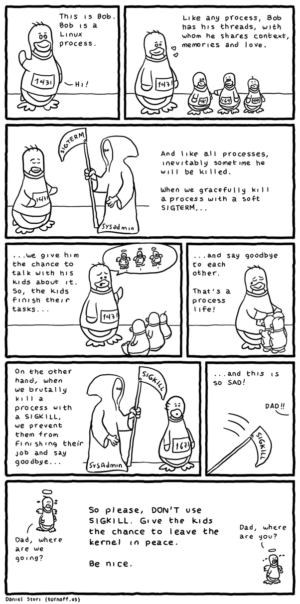

# Signals

* http://www.open-std.org/jtc1/sc22/wg14/www/standards.html
* https://www.quora.com/What-is-the-difference-between-the-SIGINT-and-SIGTERM-signals-in-Linux-What%E2%80%99s-the-difference-between-the-SIGKILL-and-SIGSTOP-signals

## SIGQUIT

* The default behavior is to terminate the process and dump core
* Shortcut: Ctrl-\

## SIGTERM

* Terminate
* C compliant
* According to ISO/IEC 9899:2011: a termination request sent to the program *

## SIGINT

* Interrupt
* C compliant
* Shortcut: Ctrl-C
* According to ISO/IEC 9899:2011: receipt of an interactive attention signal *

## SIGKILL

* Kill

## SIGSTOP

* Stop
* Causes the process to suspend execution.
* Shortcut: Ctrl-Z