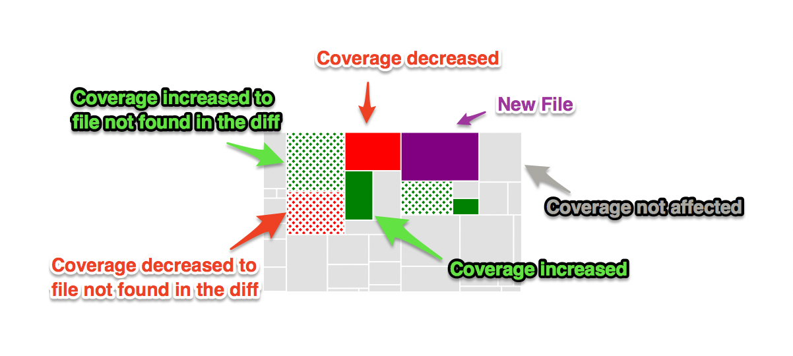

## Reach

The coverage reach graph focuses on files that have changed in coverage when comparing two commits.

<strong>New Files</strong>

---

Files with no coverage change

---

Files <strong> found</strong> in the commit/compare diff where coverage <strong>decreased</strong>

---

Files <strong>not found</strong> in the commit/compare  diff where coverage <strong>decreased</strong>

---

Files <strong>found</strong> in the commit/compare diff where coverage <strong>increased</strong>

---

Files <strong>not found</strong> in the commit/compare diff where coverage <strong>increased</strong>

