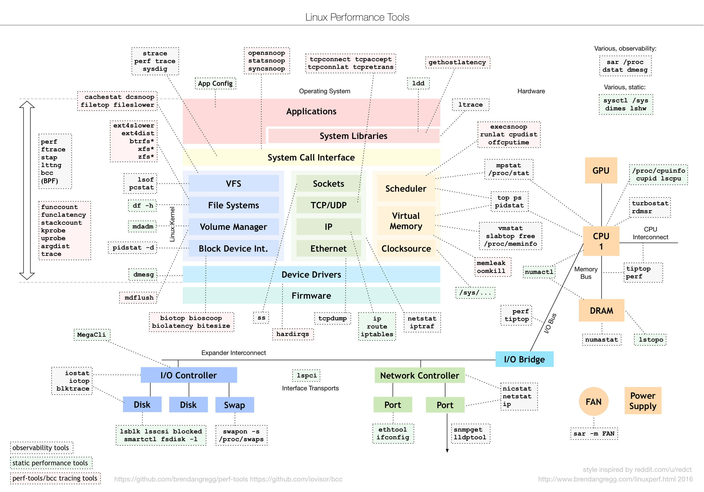

# Profiling

* Python
  * cProfile
* Go
* Linux


## Python

### scalene

* https://github.com/emeryberger/scalene

### cProfile
* `Talks`
  * https://speakerdeck.com/rwarren/a-brief-intro-to-profiling-in-python
  * https://www.youtube.com/watch?v=QJwVYlDzAXs

* `Manuals & Disussions`
  * https://stackoverflow.com/questions/582336
  * https://docs.python.org/3/library/profile.html
  * https://wiki.python.org/moin/PythonSpeed/PerformanceTips#Profiling_Code

#### Summary

```bash
# App Profiling
python -m cProfile -o output.file myscript.py

# view generated data
python3 -m pip install cprofilev
python3 -m cprofilev output.file

# Profiling function call
import cProfile
import re
cProfile.run('re.compile("foo|bar")')
```

## Go

### PProf


* Talks
  * [Slides](https://speakerdeck.com/filosottile/you-latency-and-profiling-at-golanguk-2017)

* Other
  * https://github.com/fwessels/GolangPerf
  * https://rakyll.org/custom-profiles/
  * https://jvns.ca/blog/2017/09/24/profiling-go-with-pprof/


### Profefe

  * https://github.com/profefe/profefe
  * https://gianarb.it/blog/go-continuous-profiling-profefe


## Linux

