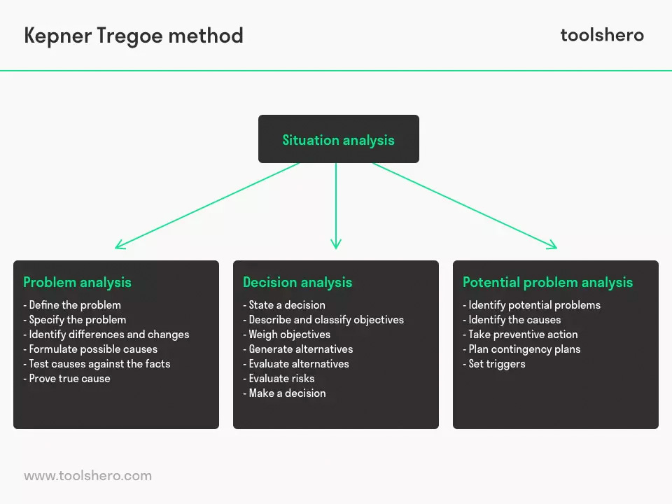

# Notes on [Problem Solving Techniques](https://www.lynda.com/Business-Skills-tutorials/Problem-Solving-Techniques/553700-2.html)

# (first) Summary

  * Never just strait to the solution.
  * involve other people of generating ideas.
  * Separate the generation of ideas from the judging of them
  * Use both logic and intuition.
  * Don't settle for the option if its still not good enough.

## What's causing the problem?

  1. Search for Couses of the problem.
  2. Make a list of possible causes
  3. Narrow it down to possible causes.

## Asking the five `whys`

  Ask `Why?` till you can.
    1. Why `A` happen? Because of `B`.
    2. Why `B` happen? Because of `C`.
    3. ...
    4. AHA!

## The Kepner-Tregoe process

  1. Analyze **Situation**.
  2. Look at **Problem**
  3. Causes
  4. Identify **Solution**.
  5. **Select** best slution
  5. Consider Possible Risks.

## Pareto analysis

  * Pareto principle - 20%/80%.
  * Fix 20% problems causeing 80% of issues.

## Look at the whole system
  * Look around how change can be abused or used.
  * `Why Things Bite Back` - https://www.amazon.com/Why-Things-Bite-Back-Consequences/dp/0679747567
  * `The Fifth Dicipline` - humans a bad on thinking ahead.

## Fast and slow thinking
   * Focused and Diffused mode

## Brainstorming
  * Get and ideas first.
  * Judje later.

## Mind maps
  * Use midly or any other mind map applcaition.

## Decision trees
  * `subj`
    * if this 1 then that 1 ->
    * if this 2 then that 2 ->
    * if this 3 then that 3 ->

## Boost your creativity

  * Think on how to make situation - worse. Than do otherwise.
  * Consider Alternative Scenarios - "What if?"
  * Sleep on it.
  * Combine variables.
  * Rubber duck debugging.
  * Develop silly and fun solutions
  * Examine the problem
  * Chunk up or down
  * Commit Yourself to Creativity
  * Become an Expert
  * Reward Your Curiosity
  * Take Risks
  * Build Your Confidence
  * Make Time for Creativity
  * Overcome a Negative Attitude
  * Fight Fear of Failure
  * Brainstorm New Ideas
  * Explore Multiple Solutions
  * Keep a Creativity Journal
  * Use Mind Maps and Flow Charts
  * Challenge Yourself and Create Opportunities
  * Try the Six Hats Technique
    * Black Hat: Use a negative perspective. Which elements of the solution won’t work?
    * Blue Hat: Think broadly. What is the best overall solution?
    * Green Hat: Think creatively. What are some alternative ideas?
    * Red Hat: Look at the situation emotionally. What do your feelings tell you?
    * White Hat: Look at the situation objectively. What are the facts?
    * Yellow Hat: Use a positive perspective. Which elements of the solution will work?
  * Look for Inspiration
  * Try the Snowball Technique

## Intuition and logic
* equalize logick and fun while malking decision.

## How to view the options
  * Waged factors/options.
  * See also `decision making with fuzzing advantages on alternatives set` [[1]](https://github.com/butuzov/CS122-KPI/tree/master/Decision-Theory/Control_Work_2), [[2]](https://github.com/butuzov/CS122-KPI/blob/master/Analytic-Ierarchy-Process/iararchy-analysys-methods)

## Rating charts

Similar to previous on `Options`. Simple charts for decision making.

| FACTOR |    | CAR vs Bike | Total: CAR vs Bike |
|--------|----|-------------|--------------------|
| Safety | 10 | 10  vs   1  |         10 vs 1    |
| Park   | 2  | 4   vs   6  |          8 vs 12   |
| Cool   | 10 | 5   vs   8  |         50 vs 40   |
|        |    |             |         68 vs 53   |

`Car won`

## Don't settle for second best
  Check all **Must have** and **Nice to have**.

## Risk analysis
  Try to calc a best possible option for you.

## Team decisions
  * Team decision tends to be risky.
  * Designated "blakc hat wearer"

## Sensitivity
  How sensitive solution to change? Is small change eq big impact?

## The sunk cost paradox
  You need to know when **to stop** wasting resources (time and money).

## Framing – subconscious and deliberate
  * Ask question with different angles?
  * With bias and without it.

## Four simple rules for decision making

  * I decision is very close - option does not matter.
  * Toss a coin with option in mind.
  * Simplest solution.
  * Delegate decision.

### Consider implementation
  Are you ready to implement solution? To use it? To learn it? TO fiddle with it?

