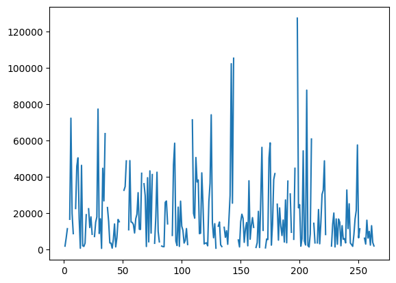
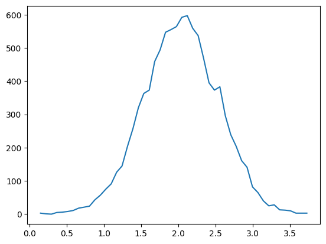
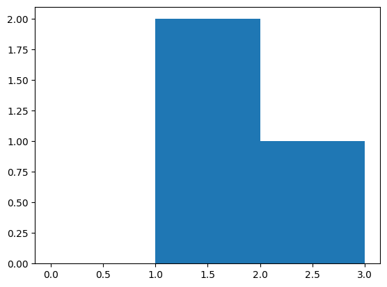
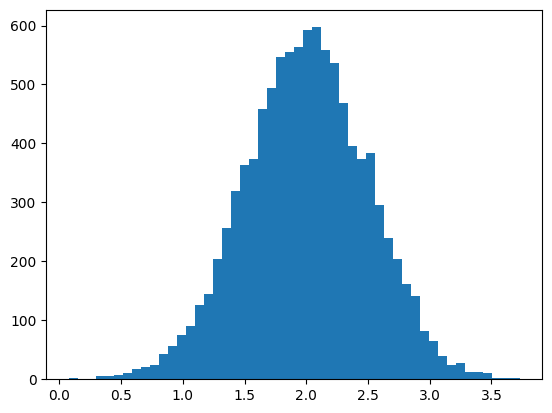
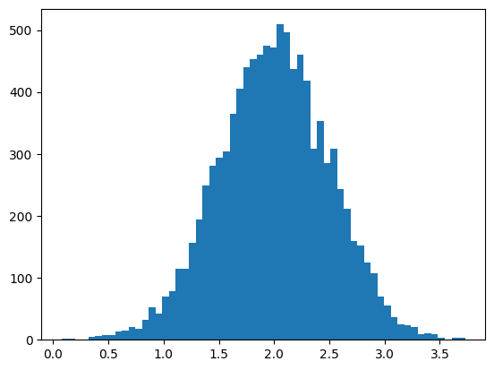
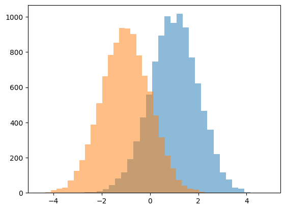
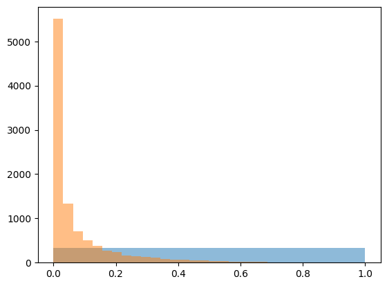

# numpy


```python
# main lib
import numpy as np

# for additional examples
import pandas as pd
import matplotlib.pyplot as plt
```

## Creating Numpy Arrays

* `array` - Convert input data (list, tuple, array, or other sequence type) to an ndarray either by inferring a dtype or explicitly specifying a dtype. Copies the input data by default.
* `asarray` - Convert input to ndarray, but do not copy if the input is already an ndarray
* `arange` - Like the built-in range but returns an ndarray instead of a list.
* `ones`, `ones_like` - Produce an array of all 1’s with the given shape and dtype. ones_like takes another array and produces a ones array of the same shape and dtype.
* `zeros`, `zeros_like` - Like ones and ones_like but producing arrays of 0’s instead
* `empty`, `empty_like` - Create new arrays by allocating new memory, but do not populate with any values like ones and zeros
* `full`, `full_like` - Create new array with predefined value.
* `eye`, `identity` - Create a square N x N identity matrix (1’s on the diagonal and 0’s elsewhere)
* `triu` and `tril` - Upper/Lower triangle of an array.

```python
# random array
np.random.random(10)

result >>> array([0.14381165, 0.43957196, 0.64480165, 0.29396112, 0.03620634,
result >>>        0.324091  , 0.01413331, 0.61707653, 0.55425182, 0.76508725])
```

```python
np.random.random((10, 10))

result >>> array([[0.84814059, 0.49366146, 0.07357296, 0.86473168, 0.90994484,
result >>>         0.59937738, 0.81070949, 0.95118411, 0.26313043, 0.40428545],
result >>>        [0.06764683, 0.31008572, 0.48085707, 0.3123668 , 0.99413403,
result >>>         0.61140935, 0.27311947, 0.46530946, 0.35310464, 0.49019337],
result >>>        [0.19613178, 0.65399376, 0.77925913, 0.3325733 , 0.0194955 ,
result >>>         0.58361935, 0.18698444, 0.56680306, 0.40493511, 0.29486893],
result >>>        [0.17297747, 0.22939305, 0.76750417, 0.67280111, 0.40667287,
result >>>         0.2769071 , 0.49143694, 0.61032024, 0.27884701, 0.28583778],
result >>>        [0.34889296, 0.24250182, 0.50627885, 0.13695109, 0.58947309,
result >>>         0.37040892, 0.05495742, 0.19997462, 0.40929128, 0.09534295],
result >>>        [0.91114241, 0.43814007, 0.54084854, 0.48690268, 0.79957151,
result >>>         0.60292787, 0.04642761, 0.19954316, 0.55384688, 0.87143598],
result >>>        [0.19789552, 0.92630145, 0.7875622 , 0.52719853, 0.35621211,
result >>>         0.15969174, 0.13203917, 0.86605477, 0.22833789, 0.88161008],
result >>>        [0.6079528 , 0.02602084, 0.28829024, 0.25180093, 0.93785455,
result >>>         0.35431702, 0.19532462, 0.63491947, 0.94570596, 0.07221944],
result >>>        [0.35733435, 0.31192497, 0.62450735, 0.65710509, 0.06752447,
result >>>         0.4298031 , 0.57751011, 0.62875046, 0.22889312, 0.55232044],
result >>>        [0.43244427, 0.57533423, 0.51541704, 0.77377705, 0.45161832,
result >>>         0.47569954, 0.78782687, 0.60993249, 0.57680231, 0.97852437]])
```

```python
# transformation
(np.random.random((10, 10))*10).astype(int)

result >>> array([[7, 1, 3, 3, 0, 6, 9, 4, 0, 9],
result >>>        [9, 3, 0, 9, 7, 8, 1, 7, 5, 3],
result >>>        [9, 9, 0, 1, 9, 2, 5, 8, 5, 0],
result >>>        [9, 3, 4, 0, 5, 9, 1, 6, 8, 9],
result >>>        [3, 9, 2, 9, 6, 7, 3, 1, 3, 1],
result >>>        [3, 8, 9, 7, 5, 4, 2, 1, 1, 4],
result >>>        [5, 9, 9, 0, 9, 1, 5, 6, 6, 3],
result >>>        [4, 8, 7, 0, 1, 5, 8, 3, 0, 7],
result >>>        [5, 8, 3, 2, 2, 9, 2, 2, 6, 4],
result >>>        [0, 1, 2, 9, 5, 4, 5, 3, 2, 6]])
```

```python
# 10 elements from 0 to 5
np.linspace(0, 5, 10)

result >>> array([0.        , 0.55555556, 1.11111111, 1.66666667, 2.22222222,
result >>>        2.77777778, 3.33333333, 3.88888889, 4.44444444, 5.        ])
```

```python
# Regular python list
np.array([1,2,3,4])

result >>> array([1, 2, 3, 4])
```

NumPy offers several functions to create arrays with initial placeholder content
Create an array of zeros with desired shape (x,y)
* x == number of rows
* y == number of columns in array

```python
np.zeros((3,4))

result >>> array([[0., 0., 0., 0.],
result >>>        [0., 0., 0., 0.],
result >>>        [0., 0., 0., 0.]])
```

```python
np.ones((3,4))

result >>> array([[1., 1., 1., 1.],
result >>>        [1., 1., 1., 1.],
result >>>        [1., 1., 1., 1.]])
```

```python
# Using dtype in order to specify the data type
np.ones((3,4),dtype=np.int16)

result >>> array([[1, 1, 1, 1],
result >>>        [1, 1, 1, 1],
result >>>        [1, 1, 1, 1]], dtype=int16)
```

```python
# np.empty() is not the same as np.zeros()
np.empty((2,3))

result >>> array([[0., 0., 0.],
result >>>        [0., 0., 0.]])
```

```python
# we also can specify type
np.full((2,3), 4, dtype=np.double)

result >>> array([[4., 4., 4.],
result >>>        [4., 4., 4.]])
```

```python
# np.eye() creates an eyedentity matrix
np.eye(3)

result >>> array([[1., 0., 0.],
result >>>        [0., 1., 0.],
result >>>        [0., 0., 1.]])
```

```python
# `*_like` will use input array as example of shape

np.full_like(np.zeros((2,4)), np.nan)

result >>> array([[nan, nan, nan, nan],
result >>>        [nan, nan, nan, nan]])
```

To create sequences of numbers, NumPy provides a function analogous to range that returns arrays instead of lists

`arange(start, stop, step, dtype)`

```python
np.arange(2, 20, 2, dtype=float)

result >>> array([ 2.,  4.,  6.,  8., 10., 12., 14., 16., 18.])
```

```python
np.arange(2, 20, 2)

result >>> array([ 2,  4,  6,  8, 10, 12, 14, 16, 18])
```

```python
array_2d = np.array([(2,4,6),(3,5,7)]) 
array_2d

result >>> array([[2, 4, 6],
result >>>        [3, 5, 7]])
```

```python
array_2d.shape

result >>> (2, 3)
```

```python
# Using reshape to create n dimensional arrays
np.arange(6).reshape(3,2)

result >>> array([[0, 1],
result >>>        [2, 3],
result >>>        [4, 5]])
```

The reshape will only take arguments that multiply to the number in arange function.
For example: for arange(8), the possible combinations for reshape are `(2,4)`, `(4,2)`, `(2,2,2)`

```python
np.arange(6).reshape(6,1)

result >>> array([[0],
result >>>        [1],
result >>>        [2],
result >>>        [3],
result >>>        [4],
result >>>        [5]])
```

```python
np.zeros_like(np.arange(6).reshape(6,1))

result >>> array([[0],
result >>>        [0],
result >>>        [0],
result >>>        [0],
result >>>        [0],
result >>>        [0]])
```

```python
np.ones_like(np.arange(6).reshape(6,1))

result >>> array([[1],
result >>>        [1],
result >>>        [1],
result >>>        [1],
result >>>        [1],
result >>>        [1]])
```

```python
np.triu((np.random.random((5, 5))*10).astype(int))

result >>> array([[9, 9, 0, 7, 0],
result >>>        [0, 5, 6, 1, 3],
result >>>        [0, 0, 8, 9, 0],
result >>>        [0, 0, 0, 8, 4],
result >>>        [0, 0, 0, 0, 0]])
```

```python
np.triu((np.random.random((5, 5))*10).astype(int), 1)

result >>> array([[0, 0, 5, 6, 1],
result >>>        [0, 0, 1, 9, 0],
result >>>        [0, 0, 0, 2, 4],
result >>>        [0, 0, 0, 0, 4],
result >>>        [0, 0, 0, 0, 0]])
```

```python
np.tril((np.random.random((5, 5))*10).astype(int))

result >>> array([[6, 0, 0, 0, 0],
result >>>        [4, 0, 0, 0, 0],
result >>>        [5, 6, 3, 0, 0],
result >>>        [8, 2, 0, 7, 0],
result >>>        [2, 0, 1, 5, 7]])
```

```python
np.tril((np.random.random((5, 5))*10).astype(int), 1)

result >>> array([[4, 5, 0, 0, 0],
result >>>        [5, 6, 4, 0, 0],
result >>>        [7, 3, 5, 7, 0],
result >>>        [7, 9, 6, 0, 0],
result >>>        [0, 6, 4, 0, 0]])
```

## Printitng arrays

```python
print(np.arange(10000).reshape(100,100))

> [[   0    1    2 ...   97   98   99]
> [ 100  101  102 ...  197  198  199]
> [ 200  201  202 ...  297  298  299]
> ...
> [9700 9701 9702 ... 9797 9798 9799]
> [9800 9801 9802 ... 9897 9898 9899]
> [9900 9901 9902 ... 9997 9998 9999]]
```

```python
np.set_printoptions(threshold = 1000)
```

```python
print(np.arange(10000).reshape(100,100))

> [[   0    1    2 ...   97   98   99]
> [ 100  101  102 ...  197  198  199]
> [ 200  201  202 ...  297  298  299]
> ...
> [9700 9701 9702 ... 9797 9798 9799]
> [9800 9801 9802 ... 9897 9898 9899]
> [9900 9901 9902 ... 9997 9998 9999]]
```

## Arithmetic Operations

If the dimensions of two arrays are dissimilar, element-to-element operations are not possible. However, operations on arrays of non-similar shapes is still possible in NumPy, because of the broadcasting capability.  

### Elementwise operations

```python
a = np.array([10,10,10])
b = np.array([5,5,5])
```

```python
a + b

result >>> array([15, 15, 15])
```

```python
a - b

result >>> array([5, 5, 5])
```

```python
a * b

result >>> array([50, 50, 50])
```

```python
a / b

result >>> array([2., 2., 2.])
```

```python
a % 3

result >>> array([1, 1, 1])
```

```python
a < 35

result >>> array([ True,  True,  True])
```

```python
a > 25

result >>> array([False, False, False])
```

```python
a ** 2

result >>> array([100, 100, 100])
```

### dot function or method

```python
A = np.array( [[1,1], [0,1]] )
B = np.array( [[2,1], [3,4]] )

print('A:\n', A)
print('B:\n', B)

> A:
> [[1 1]
> [0 1]]
> B:
> [[2 1]
> [3 4]]
```

```python
# This gives the matrix multiplication
A.dot(B)

result >>> array([[5, 5],
result >>>        [3, 4]])
```

```python
np.dot(A,B)

result >>> array([[5, 5],
result >>>        [3, 4]])
```

### in-place operations

```python
# Modifying an existing array rather than create a new one
a  *= 3
a

result >>> array([30, 30, 30])
```

```python
b += a
b

result >>> array([35, 35, 35])
```

```python
### Unary Operators
```

```python
ages = np.array([12,15,18,20])
```

```python
ages.sum()

result >>> 65
```

```python
ages.min()

result >>> 12
```

```python
ages.max()

result >>> 20
```

By default, these operations apply to the array as though it were a list of numbers, regardless of its shape. However, by specifying the axis parameter you can apply an operation along the specified axis of an array

```python
numbers = np.arange(12).reshape(3,4)
numbers

result >>> array([[ 0,  1,  2,  3],
result >>>        [ 4,  5,  6,  7],
result >>>        [ 8,  9, 10, 11]])
```

Row and column operations
In a `2D` array axis `#0` represents columns. Axis `#1` refers to rows

```python
# Sum up each column
numbers.sum(axis=0)

result >>> array([12, 15, 18, 21])
```

```python
# Sum up each row
numbers.sum(axis=1)

result >>> array([ 6, 22, 38])
```

```python
# Minimum of each row
numbers.min(axis=1)

result >>> array([0, 4, 8])
```

## Input and Output 

### File System

```python
a = np.array(range(10))
b = a * 3
```

```python
# save array in txt uncompressed
np.savetxt("np_a.txt", a)
print(np.loadtxt('np_a.txt'))

> [0. 1. 2. 3. 4. 5. 6. 7. 8. 9.]
```

```python
# save in binary format
np.save("np_a", a)
print(np.load('np_a.npy'))

> [0 1 2 3 4 5 6 7 8 9]
```

```python
# save few arrays
np.savez("np_ab", a=a, b=b)
# loadign data from uncompressed file
data = np.load('np_ab.npz')
print(data['a'])

> [0 1 2 3 4 5 6 7 8 9]
```

```python
# save few arrays compressed
np.savez_compressed("np_ab_z", a=a, b=b)
data = np.load('np_ab_z.npz')
print(data['a'])

> [0 1 2 3 4 5 6 7 8 9]
```

```shell
!ls np*

> np_a.npy  np_a.txt  np_ab.npz  np_ab_z.npz
```

```python
#> unlink np_a.npy
#> unlink np_a.txt
#> unlink np_ab.npz
#> unlink np_ab_z.npz
```

### Memory

https://docs.scipy.org/doc/numpy/reference/generated/numpy.memmap.html#numpy.memmap

```python
from tempfile import mkdtemp
import os.path as path
filename = path.join(mkdtemp(), 'newfile.dat')
```

```python
fp = np.memmap(filename, dtype='float32', mode='w+', shape=(3,4))
fp

result >>> memmap([[0., 0., 0., 0.],
result >>>         [0., 0., 0., 0.],
result >>>         [0., 0., 0., 0.]], dtype=float32)
```

```python
data = np.arange(12, dtype='float32')
data.resize((3,4))
fp[:] = data[:]
fp

result >>> memmap([[ 0.,  1.,  2.,  3.],
result >>>         [ 4.,  5.,  6.,  7.],
result >>>         [ 8.,  9., 10., 11.]], dtype=float32)
```

```python
fp.filename == path.abspath(filename)
fp.filename

result >>> '/var/folders/7j/8x_gv0vs7f33q1cxc5cyhl3r0000gn/T/tmpllvrg39n/newfile.dat'
```

```python
del fp
```

## Universal Functions

### Trigonometric Functions

```python
angles = np.array([0,30,45,60,90])
```

Angles need to be converted to radians by multiplying by pi/180 
Only then can we appy trigonometric functions to our array.

```python
angles_radians = angles * np.pi/180
angles_radians

result >>> array([0.        , 0.52359878, 0.78539816, 1.04719755, 1.57079633])
```

```python
# Sine of angles in the array:
np.sin(angles_radians)

result >>> array([0.        , 0.5       , 0.70710678, 0.8660254 , 1.        ])
```

```python
## Alternatively, use the np.radians() function to convert to radians
angles_radians = np.radians(angles)
angles_radians

result >>> array([0.        , 0.52359878, 0.78539816, 1.04719755, 1.57079633])
```

```python
# Cosine of angles in the array:
np.cos(angles_radians)

result >>> array([1.00000000e+00, 8.66025404e-01, 7.07106781e-01, 5.00000000e-01,
result >>>        6.12323400e-17])
```

```python
# Tangent of angles in the array
np.tan(angles_radians)

result >>> array([0.00000000e+00, 5.77350269e-01, 1.00000000e+00, 1.73205081e+00,
result >>>        1.63312394e+16])
```

`arcsin`, `arcos`, and `arctan` functions return the trigonometric inverse of sin, cos, and tan of the given angle. The result of these functions can be verified by `numpy.degrees()` function by converting radians to degrees.

```python
# Compute sine inverse of angles. Returned values are in radians.

np.arcsin(np.sin(angles * np.pi/180) )

result >>> array([0.        , 0.52359878, 0.78539816, 1.04719755, 1.57079633])
```

```python
# np.degrees() converts radians to degrees
np.degrees(np.arcsin(np.sin(angles * np.pi/180) ) )

result >>> array([ 0., 30., 45., 60., 90.])
```

### Statistical Functions

```python
test_scores = np.array([32.32, 56.98, 21.52, 44.32, 
                        55.63, 13.75, 43.47, 43.34])
```

```python
# Mean test scores of the students: 
np.mean(test_scores)

result >>> 38.91625
```

```python
# Median
np.median(test_scores)

result >>> 43.405
```

```python
# We will now perform basic statistical methods on real 
# life dataset. We will use salary data of 1147 European developers.

url = "https://gist.githubusercontent.com/butuzov/ed1c7f8f3affe6dd005c1ee40dc3f7f2/raw/9012bdf4a623aa10e5abe3932028f79609337c19/sallary.csv"
salaries = np.genfromtxt(url, delimiter=',')
salaries

result >>> array([60000., 58000., 56967., ..., 54647., 25000., 70000.])
```

```python
salaries.shape

result >>> (1147,)
```

```python
print(f"Mean = {np.mean(salaries)}")
print(f"Median = {np.median(salaries)}")
print(f"Standard Deviation = {np.std(salaries)}")
print(f"Variance = {np.var(salaries)}")

> Mean = 55894.53879686138
> Median = 48000.0
> Standard Deviation = 55170.37550939316
> Variance = 3043770333.8474483
```

##  Indexing and Slicing

This also follows zero based indexing like python lists

```python
a = np.arange(11)**2
a

result >>> array([  0,   1,   4,   9,  16,  25,  36,  49,  64,  81, 100])
```

```python
a[2]

result >>> 4
```

```python
a[-2]

result >>> 81
```

```python
a[2:7]

result >>> array([ 4,  9, 16, 25, 36])
```

```python
a[2:-2]

result >>> array([ 4,  9, 16, 25, 36, 49, 64])
```

```python
a[:7]

result >>> array([ 0,  1,  4,  9, 16, 25, 36])
```

```python
a[:11:2]

result >>> array([  0,   4,  16,  36,  64, 100])
```

```python
a[::-1]

result >>> array([100,  81,  64,  49,  36,  25,  16,   9,   4,   1,   0])
```

### 2D Array indexing

Consider an array students, it contains the test scores in two courses of the students against their names

```python
students = np.array([['Alice','Beth','Cathy','Dorothy'],
                     [65,78,90,81],
                     [71,82,79,92]])
```

```python
students

result >>> array([['Alice', 'Beth', 'Cathy', 'Dorothy'],
result >>>        ['65', '78', '90', '81'],
result >>>        ['71', '82', '79', '92']], dtype='<U21')
```

```python
students[0]

result >>> array(['Alice', 'Beth', 'Cathy', 'Dorothy'], dtype='<U21')
```

```python
students[1]

result >>> array(['65', '78', '90', '81'], dtype='<U21')
```

```python
students[2]

result >>> array(['71', '82', '79', '92'], dtype='<U21')
```

```python
students[0,1]

result >>> 'Beth'
```

```python
# get data using method
students.item((0,1))

result >>> 'Beth'
```

```python
# set data using method
students.itemset((0,1), 'Michel')
students

result >>> array([['Alice', 'Michel', 'Cathy', 'Dorothy'],
result >>>        ['65', '78', '90', '81'],
result >>>        ['71', '82', '79', '92']], dtype='<U21')
```

### Searching in arrays

```python
a = np.arange(16).reshape(4,4)**2
a

result >>> array([[  0,   1,   4,   9],
result >>>        [ 16,  25,  36,  49],
result >>>        [ 64,  81, 100, 121],
result >>>        [144, 169, 196, 225]])
```

```python
np.where(a > 50)

result >>> (array([2, 2, 2, 2, 3, 3, 3, 3]), array([0, 1, 2, 3, 0, 1, 2, 3]))
```

```python
np.argwhere(a > 50)

result >>> array([[2, 0],
result >>>        [2, 1],
result >>>        [2, 2],
result >>>        [2, 3],
result >>>        [3, 0],
result >>>        [3, 1],
result >>>        [3, 2],
result >>>        [3, 3]])
```

### 2D Array slicing

This will consider the rows 0 and 1, columns 2 and 3

```python
students[0:2,2:4]

result >>> array([['Cathy', 'Dorothy'],
result >>>        ['90', '81']], dtype='<U21')
```

```python
# all rows and columns 1
students[:,1:2]

result >>> array([['Michel'],
result >>>        ['78'],
result >>>        ['82']], dtype='<U21')
```

```python
# all rows and 1,2 columns
students[:,1:3]

result >>> array([['Michel', 'Cathy'],
result >>>        ['78', '90'],
result >>>        ['82', '79']], dtype='<U21')
```

```python
# All columns, rows 0 and 1
students[0:2,:]

result >>> array([['Alice', 'Michel', 'Cathy', 'Dorothy'],
result >>>        ['65', '78', '90', '81']], dtype='<U21')
```

```python
# All rows and columns
students[:]

result >>> array([['Alice', 'Michel', 'Cathy', 'Dorothy'],
result >>>        ['65', '78', '90', '81'],
result >>>        ['71', '82', '79', '92']], dtype='<U21')
```

```python
#The last row
students[-1,:]

result >>> array(['71', '82', '79', '92'], dtype='<U21')
```

```python
#3rd from last to second from last row, last two columns
students[-3:-1,-2:]

result >>> array([['Cathy', 'Dorothy'],
result >>>        ['90', '81']], dtype='<U21')
```

### dots or ellipsis(...)

Slicing can also include ellipsis (…) to make a selection tuple of the same length as the dimension of an array. The dots (...) represent as many colons as needed to produce a complete indexing tuple

```python
students[0,...]

result >>> array(['Alice', 'Michel', 'Cathy', 'Dorothy'], dtype='<U21')
```

```python
# all rows and column 1
students[...,1]

result >>> array(['Michel', '78', '82'], dtype='<U21')
```

```python
students[...,1].shape

result >>> (3,)
```

## Iteratition

### 1D Arrays

```python
a = np.arange(11)**2
a

result >>> array([  0,   1,   4,   9,  16,  25,  36,  49,  64,  81, 100])
```

```python
for i in a:
    print(i**(1/2))

> 0.0
> 1.0
> 2.0
> 3.0
> 4.0
> 5.0
> 6.0
> 7.0
> 8.0
> 9.0
> 10.0
```

### Multi-Dimensional Arrays

```python
students = np.array([['Alice','Beth','Cathy','Dorothy'],
                     [65,78,90,81],
                     [71,82,79,92]])
```

```python
# Each iteration will be over the rows of the array
for i in students:
    print('i = ', i)

> i =  ['Alice' 'Beth' 'Cathy' 'Dorothy']
> i =  ['65' '78' '90' '81']
> i =  ['71' '82' '79' '92']
```

**Flatten a multi-dimensional array**

```python
# If one wants to perform an operation on each element in the array, 
# one can use the flatten function which will flatten the array to a 
# single dimension. 'By default', the flattening will occur `row-wise` 
# (also knows as C order)

for element in students.flatten():
    print(element)

> Alice
> Beth
> Cathy
> Dorothy
> 65
> 78
> 90
> 81
> 71
> 82
> 79
> 92
```

```python
# To flatten a 2D array column-wise, 
# use the Fortran order
for element in students.flatten(order='F'):
    print(element)

> Alice
> 65
> 71
> Beth
> 78
> 82
> Cathy
> 90
> 79
> Dorothy
> 81
> 92
```

```python
# nditer
# Efficient multi-dimensional iterator object to iterate over arrays
x = np.arange(12).reshape(3,4)
x

result >>> array([[ 0,  1,  2,  3],
result >>>        [ 4,  5,  6,  7],
result >>>        [ 8,  9, 10, 11]])
```

```python
# This is row-wise iteration, similar to iterating over a C-order flattened array
for i in np.nditer(x):
    print(i)

> 0
> 1
> 2
> 3
> 4
> 5
> 6
> 7
> 8
> 9
> 10
> 11
```

```python
# Fortran order
# This is like iterating over an array which has been flattened column-wise

for i in np.nditer(x, order = 'F'): 
    print(i)

> 0
> 4
> 8
> 1
> 5
> 9
> 2
> 6
> 10
> 3
> 7
> 11
```

```python
# There are a number of flags which we can pass as a list to nditer. 
# Many of these involve setting buffering options <br />
# If we want iterate over each column, we can use the flag argument with value 'external_loop'

for i in np.nditer(x, order = 'F', flags = ['external_loop']): 
    print(i)

> [0 4 8]
> [1 5 9]
> [ 2  6 10]
> [ 3  7 11]
```

### Modifying Array Values

By default, the nditer treats the input array as a read-only object. To modify the array elements, you must specify either read-write or write-only mode. This is controlled with per-operand flags.

```python
# will trhoud value error
try:
    for arr in np.nditer(x):
        arr[...] = arr * arr
except ValueError as e:
    print("Error:", e)
finally:
    print(arr)

> Error: assignment destination is read-only
> 0
```

```python
# We set the ops_flag to make the array read-write
try:
    for arr in np.nditer(x, op_flags = ['readwrite']):
        arr[...] = arr * arr
except ValueError as e:
    print("Error:", e)
finally:
    print(arr)

> 121
```

## Array Shape Manipulation

```python
a = np.array([("Germany","France", "Hungary","Austria"),
              ("Berlin","Paris", "Budapest","Vienna" )])
```

```python
a

result >>> array([['Germany', 'France', 'Hungary', 'Austria'],
result >>>        ['Berlin', 'Paris', 'Budapest', 'Vienna']], dtype='<U8')
```

```python
a.shape

result >>> (2, 4)
```

The `ravel()` function

The primary functional difference is that flatten is a method of an ndarray object and hence can only be called for true numpy arrays. In contrast `ravel()` is a library-level function and hence can be called on any object that can successfully be parsed. For example `ravel()` will work on a list of ndarrays, while flatten will not.

```python
a.ravel()

result >>> array(['Germany', 'France', 'Hungary', 'Austria', 'Berlin', 'Paris',
result >>>        'Budapest', 'Vienna'], dtype='<U8')
```

```python
# transposing array
a.T

result >>> array([['Germany', 'Berlin'],
result >>>        ['France', 'Paris'],
result >>>        ['Hungary', 'Budapest'],
result >>>        ['Austria', 'Vienna']], dtype='<U8')
```

```python
a.T.ravel()

result >>> array(['Germany', 'Berlin', 'France', 'Paris', 'Hungary', 'Budapest',
result >>>        'Austria', 'Vienna'], dtype='<U8')
```

`reshape()` gives a new shape to an array without changing its data.

```python
a.shape

result >>> (2, 4)
```

```python
a.reshape(4,2)

result >>> array([['Germany', 'France'],
result >>>        ['Hungary', 'Austria'],
result >>>        ['Berlin', 'Paris'],
result >>>        ['Budapest', 'Vienna']], dtype='<U8')
```

```python
np.arange(15).reshape(3,5)

result >>> array([[ 0,  1,  2,  3,  4],
result >>>        [ 5,  6,  7,  8,  9],
result >>>        [10, 11, 12, 13, 14]])
```

```python
# Reshaping a 15-element array to an 18-element one will throw an error
try:
    np.arange(15).reshape(3,6)
except ValueError as e:
    print("Error:", e)

> Error: cannot reshape array of size 15 into shape (3,6)
```

```python
# Specify only one dimension (and infer the others) when reshaping
# Another way we can reshape is by metioning only one dimension, and -1. 
# -1 means that the length in that dimension is inferred
```

```python
countries = np.array(["Germany","France", "Hungary","Austria","Italy","Denmark"])
countries

result >>> array(['Germany', 'France', 'Hungary', 'Austria', 'Italy', 'Denmark'],
result >>>       dtype='<U7')
```

```python
countries.reshape(-1,3)

result >>> array([['Germany', 'France', 'Hungary'],
result >>>        ['Austria', 'Italy', 'Denmark']], dtype='<U7')
```

```python
countries.reshape(3,-1)

result >>> array([['Germany', 'France'],
result >>>        ['Hungary', 'Austria'],
result >>>        ['Italy', 'Denmark']], dtype='<U7')
```

```python
countries.reshape(3,2)

result >>> array([['Germany', 'France'],
result >>>        ['Hungary', 'Austria'],
result >>>        ['Italy', 'Denmark']], dtype='<U7')
```

## Splitting Arrays

`split()` an array into multiple sub-arrays. By specifying the number of equally shaped arrays to return, or by specifying the columns after which the division should occur

`split(array, indices_or_sections, axis=0)`

```python
x = np.arange(9)
```

```python
x

result >>> array([0, 1, 2, 3, 4, 5, 6, 7, 8])
```

```python
# Split the array in 3 equal-sized subarrays:
np.split(x, 3)

result >>> [array([0, 1, 2]), array([3, 4, 5]), array([6, 7, 8])]
```

```python
# The number of splits must be a divisor of the number of elements
# Or Numpy will complain that an even split is not possible

try:
    np.split(x, 4)
except TypeError as e:
    print("Error:", e)
except ValueError as e:
    print("Error:", e)

> Error: array split does not result in an equal division
```

```python
# Split the array at positions indicated in 1-D array:
np.split(x,[4,7])

result >>> [array([0, 1, 2, 3]), array([4, 5, 6]), array([7, 8])]
```

`hsplit`. The `numpy.hsplit` is a special case of split() function where axis is 1 indicating a horizontal split regardless of the dimension of the input array. <br />
In this example, the split will be performed along a column

```python
y = np.array([("Germany","France", "Hungary","Austria"),
              ("Berlin","Paris", "Budapest","Vienna" )])
```

```python
y

result >>> array([['Germany', 'France', 'Hungary', 'Austria'],
result >>>        ['Berlin', 'Paris', 'Budapest', 'Vienna']], dtype='<U8')
```

```python
p1, p2 = np.hsplit(y, 2)
```

```python
p1

result >>> array([['Germany', 'France'],
result >>>        ['Berlin', 'Paris']], dtype='<U8')
```

```python
p2

result >>> array([['Hungary', 'Austria'],
result >>>        ['Budapest', 'Vienna']], dtype='<U8')
```

```python
np.hsplit(y,4)

result >>> [array([['Germany'],
result >>>         ['Berlin']], dtype='<U8'),
result >>>  array([['France'],
result >>>         ['Paris']], dtype='<U8'),
result >>>  array([['Hungary'],
result >>>         ['Budapest']], dtype='<U8'),
result >>>  array([['Austria'],
result >>>         ['Vienna']], dtype='<U8')]
```

```python
try:
    np.hsplit(y,3)
except TypeError as e:
    print("Error:", e)
except ValueError as e:
    print("Error:", e)

> Error: array split does not result in an equal division
```

`vsplit` splits along the vertical axis

```python
p_1,p_2 = np.vsplit(y, 2)
print(p_1, p_2)

> [['Germany' 'France' 'Hungary' 'Austria']] [['Berlin' 'Paris' 'Budapest' 'Vienna']]
```

An alternative approach is array unpacking. In this example, we unpack the array into two variables. The array unpacks by row i.e Unpacking "unpacks" the first dimensions of an array 

```python
countries,capitals = y
print('Countries: ', countries)
print('Capitals: ' , capitals)

> Countries:  ['Germany' 'France' 'Hungary' 'Austria']
> Capitals:  ['Berlin' 'Paris' 'Budapest' 'Vienna']
```

```python
b1,b2,b3,b4 = y.T
print(b1,b2,b3,b4)

> ['Germany' 'Berlin'] ['France' 'Paris'] ['Hungary' 'Budapest'] ['Austria' 'Vienna']
```

We can not use the following code, reason being the first dimension of array now contains 4 rows. If we want to split in 2 arrays horizontally we should use `split` or `hsplit`.

```python
try:
    z1,z2 = y.T
except TypeError as e:
    print("Error:", e)
except ValueError as e:
    print("Error:", e)

> Error: too many values to unpack (expected 2)
```

## View vs Copy

 - When the contents are physically stored in another location, it is called **Copy.**
 - On the other hand, a different view of the same memory content is provided, we call it as **View.**
 - Different array objects can share the same data. NumPy has **ndarray.view()** method which is a new array object that looks at the same data of the original array.

```python
fruits = np.array(["Apple","Mango","Grapes","Watermelon"])
```

```python
basket_1 = fruits.view()
basket_2 = fruits.view()
print(basket_1)
print(basket_2)

> ['Apple' 'Mango' 'Grapes' 'Watermelon']
> ['Apple' 'Mango' 'Grapes' 'Watermelon']
```

```python
print("ids for the arrays are different.")
print("id for fruits is : ", id(fruits))
print("id for baskets is : ", id(basket_1), id(basket_2))

> ids for the arrays are different.
> id for fruits is :  5873979664
> id for baskets is :  5873630160 5874177520
```

```python
basket_1 is fruits

result >>> False
```

```python
basket_1.base is fruits

result >>> True
```

```python
# Change a few elements of basket. It changes the elements of fruits
# Here, we assign a new value to the first element of basket_2. You 
# might be astonished that the list of fruits has been "automatically" 
# changed as well. The explanation is that there has been no new assignment 
# to basket_2, only to one of its elements.
basket_2[0] = "Strawberry"
basket_2

result >>> array(['Strawberry', 'Mango', 'Grapes', 'Watermelon'], dtype='<U10')
```

```python
fruits

result >>> array(['Strawberry', 'Mango', 'Grapes', 'Watermelon'], dtype='<U10')
```

```python
basket_1

result >>> array(['Strawberry', 'Mango', 'Grapes', 'Watermelon'], dtype='<U10')
```

```python
# Change the entire elements of basket. It does not change fruits
basket_1 = np.array(["Peach","Pineapple","Banana","Orange"])

# new np array
basket_1

result >>> array(['Peach', 'Pineapple', 'Banana', 'Orange'], dtype='<U9')
```

```python
fruits

result >>> array(['Strawberry', 'Mango', 'Grapes', 'Watermelon'], dtype='<U10')
```

```python
# Change the shape of basket. It does not change the shape of fruits
basket_2.shape = 2,2
basket_2

result >>> array([['Strawberry', 'Mango'],
result >>>        ['Grapes', 'Watermelon']], dtype='<U10')
```

```python
# fruts are unchanged
fruits

result >>> array(['Strawberry', 'Mango', 'Grapes', 'Watermelon'], dtype='<U10')
```

```python
# Slicing an array returns a view of it
mini_basket = fruits[2:]
mini_basket

result >>> array(['Grapes', 'Watermelon'], dtype='<U10')
```

```python
fruits[3] = "Peach"
mini_basket

result >>> array(['Grapes', 'Peach'], dtype='<U10')
```

## Deep Copy

We now Create a deep copy of fruits 

```python
fruits = np.array(["Apple","Mango","Grapes","Watermelon"])
```

```python
basket = fruits.copy()
```

```python
basket is fruits

result >>> False
```

```python
basket [0] = "Strawberry"
basket

result >>> array(['Strawberry', 'Mango', 'Grapes', 'Watermelon'], dtype='<U10')
```

```python
fruits

result >>> array(['Apple', 'Mango', 'Grapes', 'Watermelon'], dtype='<U10')
```

```python
basket.shape = 2,2
```

```python
# Shape of basket: 
basket

result >>> array([['Strawberry', 'Mango'],
result >>>        ['Grapes', 'Watermelon']], dtype='<U10')
```

```python
# Shape of fruits: 
fruits

result >>> array(['Apple', 'Mango', 'Grapes', 'Watermelon'], dtype='<U10')
```

## Indexing - Integer Arrays

NumPy arrays can be indexed with slices, but also with boolean or integer arrays <b>(masks)</b>. It means passing an array of indices to access multiple array elements at once. This method is called fancy indexing. It creates copies not views.

```python
a = np.arange(12)**2
a

result >>> array([  0,   1,   4,   9,  16,  25,  36,  49,  64,  81, 100, 121])
```

Suppose we want to access three different elements. We could do it like this:

```python
a[2],a[6],a[8]

result >>> (4, 36, 64)
```

Alternatively, we can pass a single list or array of indices to obtain the same result:

```python
indx_1 = [2,6,8]
a[indx_1]

result >>> array([ 4, 36, 64])
```

When using fancy indexing, the shape of the result reflects the shape of the index arrays rather than the shape of the array being indexed

```python
indx_2 = np.array([[2,4],[8,10]])
a[indx_2]

result >>> array([[  4,  16],
result >>>        [ 64, 100]])
```

```python
food = np.array([["blueberry","strawberry","cherry","blackberry"],
                 ["pinenut","hazelnuts","cashewnut","coconut"],
                 ["mustard","paprika","nutmeg","clove"]])
```

```python
food

result >>> array([['blueberry', 'strawberry', 'cherry', 'blackberry'],
result >>>        ['pinenut', 'hazelnuts', 'cashewnut', 'coconut'],
result >>>        ['mustard', 'paprika', 'nutmeg', 'clove']], dtype='<U10')
```

```python
# We will now select the corner elements of this array

row = np.array([[0,0],[2,2]])
col = np.array([[0,3],[0,3]])

food[row,col]

result >>> array([['blueberry', 'blackberry'],
result >>>        ['mustard', 'clove']], dtype='<U10')
```

```python
# Notice that the first value in the result is food[0,0], next is food[0,3] , food[2,0] and lastly food[2,3]
food[2,0]

result >>> 'mustard'
```

**Modifying Values with Fancy Indexing**

```python
food[row,col] = "000000"
food

result >>> array([['000000', 'strawberry', 'cherry', '000000'],
result >>>        ['pinenut', 'hazelnuts', 'cashewnut', 'coconut'],
result >>>        ['000000', 'paprika', 'nutmeg', '000000']], dtype='<U10')
```

```python
a

result >>> array([  0,   1,   4,   9,  16,  25,  36,  49,  64,  81, 100, 121])
```

```python
a[indx_1] = 999
```

```python
a

result >>> array([  0,   1, 999,   9,  16,  25, 999,  49, 999,  81, 100, 121])
```

### Pandas Example

We will load the GDP per capita (in US dollars) data for all the countries in the world for the year 2016 into a variable using pandas. 

**GDP per capita (current US$)**

GDP per capita is gross domestic product divided by midyear population. GDP is the sum of gross value added by all resident producers in the economy plus any product taxes and minus any subsidies not included in the value of the products. It is calculated without making deductions for depreciation of fabricated assets or for depletion and degradation of natural resources. Data are in current U.S. dollars.

```python
url = "https://gist.githubusercontent.com/butuzov/ed1c7f8f3affe6dd005c1ee40dc3f7f2/raw/3ecb105e9a42abd7ddd1832d076442f094e7ef99/gdp_pc.csv"
gdp_16 = pd.read_csv(url)["2016"].values
```

```python
type(gdp_16)

result >>> numpy.ndarray
```

```python
gdp_16.shape

result >>> (264,)
```

```python
plt.plot(gdp_16)
plt.show()
```



```python
np.median(gdp_16)

result >>> nan
```

```python
gdp_16

result >>> array([            nan,   1944.11700491,   6454.13537039,  11540.02556108,
result >>>                    nan,  16726.72218488,  72399.65347339,  19939.93077479,
result >>>          8832.76343477,             nan,  22661.48853616,  46012.32845157,
result >>>         50551.5531752 ,  17256.62697044,    777.75285166,  46428.67142458,
result >>>          2167.64282343,   1771.01528722,   3579.75679135,  19242.62261574,
result >>>                    nan,  22516.81648228,  12172.06646607,  18066.3006624 ,
result >>>          8461.53565294,             nan,   7234.19524335,  15123.85001428,
result >>>         18064.60442722,  77420.61217204,   8900.76455309,  16956.72477025,
result >>>           698.70665573,  44819.48360027,  26851.1685408 ,  63888.73238665,
result >>>                    nan,  23193.97411052,  15529.08410645,   3693.43690912,
result >>>          3609.37559695,    801.63011974,   5717.29037095,  14153.92792519,
result >>>          1521.85721808,   6551.31894829,  16609.73935418,  15370.63489842,
result >>>                    nan,             nan,             nan,  32707.872887  ,
result >>>         34749.21236327,  48860.52529211,             nan,  10947.71518781,
result >>>         49029.01483891,  15204.93246446,  15013.29637986,  13839.96863584,
result >>>          9175.64442097,  17025.39067931,  19516.08298373,  31366.86706838,
result >>>         11242.04751604,  11128.80247428,  42063.79406454,             nan,
result >>>         36304.85427275,  29743.33742802,   1734.46407452,  39610.86680734,
result >>>          4254.34870787,  43378.14602882,   9109.95196333,  41343.29253554,
result >>>                    nan,   3508.71519196,  18102.86221919,  42656.2166022 ,
result >>>         10004.5284119 ,   4292.44889992,             nan,   1966.37968826,
result >>>          1676.86477284,   1608.70437903,  26058.077443  ,  26778.50496589,
result >>>         14200.00719381,             nan,   7944.69135314,             nan,
result >>>          7836.3791763 ,  46864.95679091,  58617.97062639,   4736.83914255,
result >>>          2270.13030428,  23422.41797653,   1783.71512959,  26700.75608264,
result >>>         12933.94330355,  10588.17884122,   3627.9834637 ,   5201.03397093,
result >>>         11609.02662172,   2834.05481866,             nan,   6570.61624581,
result >>>                    nan,  71472.29596487,  19948.81948407,  17348.93653235,
result >>>         50745.68297711,  37258.22359457,  38380.17241178,   8821.31142953,
result >>>          9047.7689234 ,  42281.18818958,  25285.94773126,   3155.11426394,
result >>>          3552.09178948,   3736.96461203,   2108.53722771,  26382.78803193,
result >>>         36532.47268398,  74263.99862606,  14732.95458354,   6549.66799975,
result >>>         14308.75112714,    812.67394381,             nan,  12952.72516857,
result >>>         15210.95079266,   2622.06907623,   1701.37258736,             nan,
result >>>         12312.94005099,   6801.29184829,  10414.49383242,   2951.02189398,
result >>>         16689.09756884,  29862.31889041, 102389.43772763,  25587.38808847,
result >>>        105420.41423718,             nan,   7857.4877165 ,             nan,
result >>>          5332.28777311,   1506.23832521,  15347.99776172,  19515.40260527,
result >>>         17274.82307137,   4022.97863242,  11442.8331081 ,  14942.19764347,
result >>>          2125.71602653,  37928.34126866,   5721.22800363,  13113.97108338,
result >>>         17633.13298468,  12252.27719639,             nan,   1216.79278744,
result >>>          3852.52590437,  21102.5589232 ,   1168.82562558,  27682.6079403 ,
result >>>         56344.96375629,  10624.92711311,             nan,    986.20696062,
result >>>          5861.08965603,   5539.82671595,  50538.6065696 ,  58790.06140389,
result >>>          2477.9033451 ,  13966.49778022,  38565.40345261,  41885.92611335,
result >>>                    nan,  25029.76382064,   5235.47808502,  23008.66536715,
result >>>         13018.60861238,   7804.16780147,  16305.48534045,   4182.53934131,
result >>>         27383.254937  ,   3775.07502387,  37740.88825606,             nan,
result >>>         30658.63199533,   9567.33912818,             nan,   5700.08893902,
result >>>         44804.46017271,             nan, 127480.48251099,  23027.28926439,
result >>>         24788.67927912,   1912.90118206,   6062.85581457,  54416.61249319,
result >>>          4730.46186883,   2566.11917856,  87832.58651422,   2235.3146905 ,
result >>>          1476.21371969,   8616.81241755,  60932.93003722,             nan,
result >>>         14514.96055305,   3721.66067336,             nan,   3723.92091102,
result >>>         22092.44125736,   3237.3925436 ,  14966.7137949 ,  30460.38408107,
result >>>         32723.07195376,  48904.55437072,   8329.56058149,             nan,
result >>>         28383.89621333,             nan,             nan,   1990.72665731,
result >>>         13986.6283938 ,  20172.0612279 ,   1490.53623573,  16913.36607526,
result >>>          2979.31023902,  16875.9877489 ,  15126.46133663,   2140.35737389,
result >>>         13214.12254515,   5745.19122926,   6062.85581457,   3723.92091102,
result >>>         32854.71905846,  11595.51237921,  25247.2017505 ,   3651.02148404,
result >>>          2786.2722427 ,   1819.43435088,   8269.61463355,  16884.35346567,
result >>>         21619.60793375,  57638.15908799,   6512.68213067,  11456.78995224,
result >>>                    nan,             nan,             nan,   6295.59058534,
result >>>          3080.56575434,  16216.92698557,   6378.25656692,  10063.75847519,
result >>>          2507.47166249,  13196.81122696,   3933.06646044,   2027.08491653])
```

```python
# The complement operator (~) can be used to remove nan elements
gdp_16 = gdp_16[~np.isnan(gdp_16)]
```

```python
gdp_16

result >>> array([  1944.11700491,   6454.13537039,  11540.02556108,  16726.72218488,
result >>>         72399.65347339,  19939.93077479,   8832.76343477,  22661.48853616,
result >>>         46012.32845157,  50551.5531752 ,  17256.62697044,    777.75285166,
result >>>         46428.67142458,   2167.64282343,   1771.01528722,   3579.75679135,
result >>>         19242.62261574,  22516.81648228,  12172.06646607,  18066.3006624 ,
result >>>          8461.53565294,   7234.19524335,  15123.85001428,  18064.60442722,
result >>>         77420.61217204,   8900.76455309,  16956.72477025,    698.70665573,
result >>>         44819.48360027,  26851.1685408 ,  63888.73238665,  23193.97411052,
result >>>         15529.08410645,   3693.43690912,   3609.37559695,    801.63011974,
result >>>          5717.29037095,  14153.92792519,   1521.85721808,   6551.31894829,
result >>>         16609.73935418,  15370.63489842,  32707.872887  ,  34749.21236327,
result >>>         48860.52529211,  10947.71518781,  49029.01483891,  15204.93246446,
result >>>         15013.29637986,  13839.96863584,   9175.64442097,  17025.39067931,
result >>>         19516.08298373,  31366.86706838,  11242.04751604,  11128.80247428,
result >>>         42063.79406454,  36304.85427275,  29743.33742802,   1734.46407452,
result >>>         39610.86680734,   4254.34870787,  43378.14602882,   9109.95196333,
result >>>         41343.29253554,   3508.71519196,  18102.86221919,  42656.2166022 ,
result >>>         10004.5284119 ,   4292.44889992,   1966.37968826,   1676.86477284,
result >>>          1608.70437903,  26058.077443  ,  26778.50496589,  14200.00719381,
result >>>          7944.69135314,   7836.3791763 ,  46864.95679091,  58617.97062639,
result >>>          4736.83914255,   2270.13030428,  23422.41797653,   1783.71512959,
result >>>         26700.75608264,  12933.94330355,  10588.17884122,   3627.9834637 ,
result >>>          5201.03397093,  11609.02662172,   2834.05481866,   6570.61624581,
result >>>         71472.29596487,  19948.81948407,  17348.93653235,  50745.68297711,
result >>>         37258.22359457,  38380.17241178,   8821.31142953,   9047.7689234 ,
result >>>         42281.18818958,  25285.94773126,   3155.11426394,   3552.09178948,
result >>>          3736.96461203,   2108.53722771,  26382.78803193,  36532.47268398,
result >>>         74263.99862606,  14732.95458354,   6549.66799975,  14308.75112714,
result >>>           812.67394381,  12952.72516857,  15210.95079266,   2622.06907623,
result >>>          1701.37258736,  12312.94005099,   6801.29184829,  10414.49383242,
result >>>          2951.02189398,  16689.09756884,  29862.31889041, 102389.43772763,
result >>>         25587.38808847, 105420.41423718,   7857.4877165 ,   5332.28777311,
result >>>          1506.23832521,  15347.99776172,  19515.40260527,  17274.82307137,
result >>>          4022.97863242,  11442.8331081 ,  14942.19764347,   2125.71602653,
result >>>         37928.34126866,   5721.22800363,  13113.97108338,  17633.13298468,
result >>>         12252.27719639,   1216.79278744,   3852.52590437,  21102.5589232 ,
result >>>          1168.82562558,  27682.6079403 ,  56344.96375629,  10624.92711311,
result >>>           986.20696062,   5861.08965603,   5539.82671595,  50538.6065696 ,
result >>>         58790.06140389,   2477.9033451 ,  13966.49778022,  38565.40345261,
result >>>         41885.92611335,  25029.76382064,   5235.47808502,  23008.66536715,
result >>>         13018.60861238,   7804.16780147,  16305.48534045,   4182.53934131,
result >>>         27383.254937  ,   3775.07502387,  37740.88825606,  30658.63199533,
result >>>          9567.33912818,   5700.08893902,  44804.46017271, 127480.48251099,
result >>>         23027.28926439,  24788.67927912,   1912.90118206,   6062.85581457,
result >>>         54416.61249319,   4730.46186883,   2566.11917856,  87832.58651422,
result >>>          2235.3146905 ,   1476.21371969,   8616.81241755,  60932.93003722,
result >>>         14514.96055305,   3721.66067336,   3723.92091102,  22092.44125736,
result >>>          3237.3925436 ,  14966.7137949 ,  30460.38408107,  32723.07195376,
result >>>         48904.55437072,   8329.56058149,  28383.89621333,   1990.72665731,
result >>>         13986.6283938 ,  20172.0612279 ,   1490.53623573,  16913.36607526,
result >>>          2979.31023902,  16875.9877489 ,  15126.46133663,   2140.35737389,
result >>>         13214.12254515,   5745.19122926,   6062.85581457,   3723.92091102,
result >>>         32854.71905846,  11595.51237921,  25247.2017505 ,   3651.02148404,
result >>>          2786.2722427 ,   1819.43435088,   8269.61463355,  16884.35346567,
result >>>         21619.60793375,  57638.15908799,   6512.68213067,  11456.78995224,
result >>>          6295.59058534,   3080.56575434,  16216.92698557,   6378.25656692,
result >>>         10063.75847519,   2507.47166249,  13196.81122696,   3933.06646044,
result >>>          2027.08491653])
```

```python
gdp_16.shape

result >>> (229,)
```

```python
np.median(gdp_16)

result >>> 13113.9710833787
```

```python
np.mean(gdp_16)

result >>> 19135.51651250454
```

The unofficial threshold for a country with a developed economy is a GDP per capita of USD 12,000. Some economists prefer to see a per capita GDP of at least USD 25,000 to be comfortable declaring a country as developed, however. Many highly developed countries, including the United States, have high per capita GDPs of USD 40,000 or above.

```python
np.count_nonzero(gdp_16[gdp_16 > 40000])

result >>> 32
```

```python
# 10 Lowest gdp per capita
np.sort(gdp_16)[0:10]

result >>> array([ 698.70665573,  777.75285166,  801.63011974,  812.67394381,
result >>>         986.20696062, 1168.82562558, 1216.79278744, 1476.21371969,
result >>>        1490.53623573, 1506.23832521])
```

```python
# 10 Highest gdp per capita
np.sort(gdp_16)[-11:-1]
# np.sort(gdp_16)[219:]

result >>> array([ 58790.06140389,  60932.93003722,  63888.73238665,  71472.29596487,
result >>>         72399.65347339,  74263.99862606,  77420.61217204,  87832.58651422,
result >>>        102389.43772763, 105420.41423718])
```

**How many countries have gdp per capita higher than Ukraine?**

```python
ukraine = gdp_16[gdp_16 > 8269.6], gdp_16[gdp_16 <= 8269.6]
```

```python
# Hiegher GDP
np.count_nonzero(ukraine[0])

result >>> 145
```

```python
# lower gdp
np.count_nonzero(ukraine[1])

result >>> 84
```

```python
# Countries between Costa Rica and Finland
np.count_nonzero((gdp_16 > 16609.7) & (gdp_16 < 43378.1))

result >>> 65
```

## Indexing - Boolean Arrays

When we index arrays with arrays of (integer) indices we are providing the list of indices to pick. With boolean indices the approach is different; we explicitly choose which items in the array we want and which ones we don’t.

```python
a = np.arange(16).reshape(4,4)
```

```python
a

result >>> array([[ 0,  1,  2,  3],
result >>>        [ 4,  5,  6,  7],
result >>>        [ 8,  9, 10, 11],
result >>>        [12, 13, 14, 15]])
```

```python
indx_bool = a > 9
```

```python
indx_bool

result >>> array([[False, False, False, False],
result >>>        [False, False, False, False],
result >>>        [False, False,  True,  True],
result >>>        [ True,  True,  True,  True]])
```

```python
a[indx_bool]

result >>> array([10, 11, 12, 13, 14, 15])
```

```python
a[a > 9]

result >>> array([10, 11, 12, 13, 14, 15])
```

```python
# filtering
a * (a > 9)

result >>> array([[ 0,  0,  0,  0],
result >>>        [ 0,  0,  0,  0],
result >>>        [ 0,  0, 10, 11],
result >>>        [12, 13, 14, 15]])
```

```python
a < 6

result >>> array([[ True,  True,  True,  True],
result >>>        [ True,  True, False, False],
result >>>        [False, False, False, False],
result >>>        [False, False, False, False]])
```

```python
np.count_nonzero(a < 6)

result >>> 6
```

```python
np.sum(a < 6)

result >>> 6
```

```python
# How many values less than 6 in each row?
np.sum(a < 6, axis=1)

result >>> array([4, 2, 0, 0])
```

```python
# Are there any values greater than 8?
np.any(a > 8)

result >>> True
```

```python
# Are all values less than 10?
np.all(a < 10)

result >>> False
```

```python
# Are all values less than 100?
np.all(a < 100)

result >>> True
```

```python
# Are all values in each row less than 9?
np.all(a < 9, axis=1)

result >>> array([ True,  True, False, False])
```

### nan's

This trick doesn't really works with float matrixes with `nan` values. You can run into RuntimeError.

## Structured Arrays

**Structured arrays** or **record arrays** are useful when you perform computations, and at the same time you could keep closely related data together. Structured arrays provide efficient storage for compound, heterogeneous data.

NumPy also provides powerful capabilities to create arrays of records, as multiple data types live in one NumPy array. However, one principle in NumPy that still needs to be honored is that the data type in each field (think of this as a column in the records) needs to be homogeneous. 

```python
name  = ["Alice","Beth","Cathy","Dorothy"]
studentId  = [1,2,3,4]
score = [85.4,90.4,87.66,78.9]
```

There's nothing here that tells us that the three arrays are related; it would be more natural if we could use a single structure to store all of this data. 

**Define the np array with the names of the 'columns' and the data format for each**
* U10 represents a 10-character Unicode string
* i4 is short for int32 (i for int, 4 for 4 bytes)
* f8 is shorthand for float64

```python
student_data = np.zeros(4, dtype={'names':('name', 'studentId', 'score'),
                          'formats':('U10', 'i4', 'f8')})
```

```python
# np.zeros() for a string sets it to an empty string
student_data

result >>> array([('', 0, 0.), ('', 0, 0.), ('', 0, 0.), ('', 0, 0.)],
result >>>       dtype=[('name', '<U10'), ('studentId', '<i4'), ('score', '<f8')])
```

```python
student_data.dtype

result >>> dtype([('name', '<U10'), ('studentId', '<i4'), ('score', '<f8')])
```

Now that we've created an empty container array, we can fill the array with our lists of values

```python
student_data['name'] = name
student_data['studentId'] = studentId
student_data['score'] = score
student_data

result >>> array([('Alice', 1, 85.4 ), ('Beth', 2, 90.4 ), ('Cathy', 3, 87.66),
result >>>        ('Dorothy', 4, 78.9 )],
result >>>       dtype=[('name', '<U10'), ('studentId', '<i4'), ('score', '<f8')])
```

The handy thing with structured arrays is that you can now refer to values either by index or by name

```python
student_data['name']

result >>> array(['Alice', 'Beth', 'Cathy', 'Dorothy'], dtype='<U10')
```

```python
student_data['studentId']

result >>> array([1, 2, 3, 4], dtype=int32)
```

```python
student_data['score']

result >>> array([85.4 , 90.4 , 87.66, 78.9 ])
```

If you index student_data at position 1 you get a structure:

```python
student_data[1]

result >>> ('Beth', 2, 90.4)
```

```python
# Get the name attribute from the last row
student_data[-1]['name']

result >>> 'Dorothy'
```

```python
# Get names where score is above 85
student_data[student_data['score'] > 85]['name']

result >>> array(['Alice', 'Beth', 'Cathy'], dtype='<U10')
```

Note that if you'd like to do any operations that are any more complicated than these, you should probably consider the Pandas package with provides a powerful data structure called data frames.

## Broadcasting

* Broadcasting is a powerful mechanism that allows numpy to work with arrays of different shapes when performing arithmetic operations. 
* Broadcasting solves the problem of arithmetic between arrays of differing shapes by in effect replicating the smaller array along the last mismatched dimension.
* NumPy operations are usually done on pairs of arrays on an element-by-element basis. In the simplest case, the two arrays must have exactly the same shape, as in the following example:

```python
a = np.array([1,2,3,4,5])
b = np.array([10,10,10,10,10])
```

```python
a * b

result >>> array([10, 20, 30, 40, 50])
```

If the dimensions of two arrays are dissimilar, element-to-element operations are not possible. However, operations on arrays of non-similar shapes is still possible in NumPy, because of the <b>broadcasting </b> capability. The smaller array is broadcast to the size of the larger array so that they have compatible shapes.

```python
a * 10

result >>> array([10, 20, 30, 40, 50])
```

```python
# Scalar and n-Dimensional Array
np.ones((4,3)) * 10

result >>> array([[10., 10., 10.],
result >>>        [10., 10., 10.],
result >>>        [10., 10., 10.],
result >>>        [10., 10., 10.]])
```

```python
# One-Dimensional and n-Dimensional Arrays
heights  = [165,170,168,183,172,169]
weights  = [61,76,56,81,62,60]
student_bio = np.array([heights,weights])
```

```python
student_bio

result >>> array([[165, 170, 168, 183, 172, 169],
result >>>        [ 61,  76,  56,  81,  62,  60]])
```

```python
factor_1 = np.array([0.0328084,2.20462 ])
```

```python
factor_1.shape

result >>> (2,)
```

```python
student_bio.shape

result >>> (2, 6)
```

**General Broadcasting Rules**

When operating on two arrays, NumPy compares their shapes element-wise. The dimensions are considered in reverse order, starting with the trailing dimensions, and working its way forward. Two dimensions are compatible when

1. they are equal
2. one of them is of size 1

**Shape mismatch**
This fails because there is a mismatch in the trailing dimensions  
* student bio:  `2` x `6` 
* factor_1: `2`

The trailing dimensions here are 6 and 2, so there is a mismatch

```python
try:
    student_bio * factor_1
except ValueError as e:
    print("Error:", e)

> Error: operands could not be broadcast together with shapes (2,6) (2,)
```

```python
factor_2 = np.array([[0.0328084],[2.20462 ]])
```

```python
factor_2.shape

result >>> (2, 1)
```

```python
student_bio * factor_2

result >>> array([[  5.413386 ,   5.577428 ,   5.5118112,   6.0039372,   5.6430448,
result >>>           5.5446196],
result >>>        [134.48182  , 167.55112  , 123.45872  , 178.57422  , 136.68644  ,
result >>>         132.2772   ]])
```

## Automatic Reshaping
> If you're specifying 2 out of 3 dimensions, the product of the two dimensions must be a divisor of the total number of elements in the array

```python
a = np.arange(30)
```

```python
a

result >>> array([ 0,  1,  2,  3,  4,  5,  6,  7,  8,  9, 10, 11, 12, 13, 14, 15, 16,
result >>>        17, 18, 19, 20, 21, 22, 23, 24, 25, 26, 27, 28, 29])
```

`-1` means "whatever is needed"

```python
a.shape = 2,-1,3  
a

result >>> array([[[ 0,  1,  2],
result >>>         [ 3,  4,  5],
result >>>         [ 6,  7,  8],
result >>>         [ 9, 10, 11],
result >>>         [12, 13, 14]],
result >>> 
result >>>        [[15, 16, 17],
result >>>         [18, 19, 20],
result >>>         [21, 22, 23],
result >>>         [24, 25, 26],
result >>>         [27, 28, 29]]])
```

```python
a.shape

result >>> (2, 5, 3)
```

```python
a.shape = 2,3,-1
a

result >>> array([[[ 0,  1,  2,  3,  4],
result >>>         [ 5,  6,  7,  8,  9],
result >>>         [10, 11, 12, 13, 14]],
result >>> 
result >>>        [[15, 16, 17, 18, 19],
result >>>         [20, 21, 22, 23, 24],
result >>>         [25, 26, 27, 28, 29]]])
```

```python
a.shape

result >>> (2, 3, 5)
```

## Vector Stacking

```python
x = np.array([["Germany","France"],["Berlin","Paris"]])
y = np.array([["Hungary","Austria"],["Budapest","Vienna"]])
```

```python
x.shape

result >>> (2, 2)
```

```python
y.shape

result >>> (2, 2)
```

```python
# Joining two arrays along axis 0
np.concatenate((x,y))

result >>> array([['Germany', 'France'],
result >>>        ['Berlin', 'Paris'],
result >>>        ['Hungary', 'Austria'],
result >>>        ['Budapest', 'Vienna']], dtype='<U8')
```

```python
# Joining two arrays along axis 1 - Column-wise
np.concatenate((x,y), axis = 1)

result >>> array([['Germany', 'France', 'Hungary', 'Austria'],
result >>>        ['Berlin', 'Paris', 'Budapest', 'Vienna']], dtype='<U8')
```

```python
a = np.array([1, 2, 3])
b = np.array([2, 3, 4])
```

```python
np.stack((a, b))

result >>> array([[1, 2, 3],
result >>>        [2, 3, 4]])
```

```python
studentId = np.array([1,2,3,4])
name   = np.array(["Alice","Beth","Cathy","Dorothy"])
scores  = np.array([65,78,90,81])
```

```python
np.stack((studentId, name, scores))

result >>> array([['1', '2', '3', '4'],
result >>>        ['Alice', 'Beth', 'Cathy', 'Dorothy'],
result >>>        ['65', '78', '90', '81']], dtype='<U21')
```

```python
np.stack((studentId, name, scores)).shape

result >>> (3, 4)
```

```python
np.stack((studentId, name, scores), axis =1)

result >>> array([['1', 'Alice', '65'],
result >>>        ['2', 'Beth', '78'],
result >>>        ['3', 'Cathy', '90'],
result >>>        ['4', 'Dorothy', '81']], dtype='<U21')
```

```python
np.stack((studentId, name, scores), axis =1).shape

result >>> (4, 3)
```

```python
# Stacks row wise 

np.vstack((studentId, name, scores))

result >>> array([['1', '2', '3', '4'],
result >>>        ['Alice', 'Beth', 'Cathy', 'Dorothy'],
result >>>        ['65', '78', '90', '81']], dtype='<U21')
```

```python
# Stacks column wise
np.hstack((studentId, name, scores))

result >>> array(['1', '2', '3', '4', 'Alice', 'Beth', 'Cathy', 'Dorothy', '65',
result >>>        '78', '90', '81'], dtype='<U21')
```

```python
np.hstack((studentId, name, scores)).shape

result >>> (12,)
```

## Histograms

```python
np.histogram([1, 2, 1] , bins = [0, 1, 2, 3])

result >>> (array([0, 2, 1]), array([0, 1, 2, 3]))
```

**normal distribution**

Mean = 2  
StdDev = 0.5  
Num of data points = 1000

```python
mu, sigma = 2 , 0.5
data = np.random.normal(mu, sigma, 10000)
```

```python
data

result >>> array([2.3202593 , 2.57649503, 2.60027418, ..., 1.57583234, 1.92830072,
result >>>        1.26634083])
```

```python
(n, bin_edges) = np.histogram( data , bins = 50 )
```

Here, bins is an integer, it defines the number of equal-width bins in the given range (10, by default). 

Numpy computes the occurrences of input data that fall within each bin, which in turns determines the area (not necessarily the height if the bins aren't of equal width) of each bar.

* `n` == number of samples in each bin 
* `bin_edges` = The right edges of the bins

NOTE: The number of bin_edges == len(histogram)+1. This is because bin_edges[0] is the left edge of the first bin, while all other values are the right edges of each bin

```python
n

result >>> array([  3,   1,   0,   5,   6,   8,  11,  18,  21,  24,  43,  57,  75,
result >>>         91, 126, 145, 204, 257, 320, 363, 373, 459, 494, 547, 555, 564,
result >>>        592, 597, 559, 537, 469, 395, 373, 383, 296, 239, 204, 161, 141,
result >>>         82,  65,  40,  25,  28,  13,  12,  10,   3,   3,   3])
```

```python
bin_edges

result >>> array([0.07511042, 0.14816475, 0.22121909, 0.29427342, 0.36732775,
result >>>        0.44038208, 0.51343641, 0.58649074, 0.65954507, 0.7325994 ,
result >>>        0.80565374, 0.87870807, 0.9517624 , 1.02481673, 1.09787106,
result >>>        1.17092539, 1.24397972, 1.31703406, 1.39008839, 1.46314272,
result >>>        1.53619705, 1.60925138, 1.68230571, 1.75536004, 1.82841438,
result >>>        1.90146871, 1.97452304, 2.04757737, 2.1206317 , 2.19368603,
result >>>        2.26674036, 2.3397947 , 2.41284903, 2.48590336, 2.55895769,
result >>>        2.63201202, 2.70506635, 2.77812068, 2.85117502, 2.92422935,
result >>>        2.99728368, 3.07033801, 3.14339234, 3.21644667, 3.289501  ,
result >>>        3.36255534, 3.43560967, 3.508664  , 3.58171833, 3.65477266,
result >>>        3.72782699])
```

```python
plt.plot(bin_edges[ 1 : ], n)
plt.show()
```



`matplotlib` also has a function to build histograms (called hist) that differs from the one in NumPy. 

The main difference is that `pylab.hist` plots the histogram automatically, while `numpy.histogram` only generates the data.

```python
plt.hist([1, 2, 1], bins = [0, 1, 2, 3])
plt.show()
```



```python
plt.hist(data, bins = 50)
plt.show()
```



```python
# Bin selection can be automated
plt.hist(data, bins = 'auto')  
plt.show()
```



## Functions and Mehtods

```python
url = "https://gist.githubusercontent.com/butuzov/ed1c7f8f3affe6dd005c1ee40dc3f7f2/raw/9012bdf4a623aa10e5abe3932028f79609337c19/sallary.csv"
salaries = np.genfromtxt(url, delimiter=',')
```

```python
salaries

result >>> array([60000., 58000., 56967., ..., 54647., 25000., 70000.])
```

```python
# Returns the indices of the maximum values along an axis.
salaries[np.argmax(salaries)]

result >>> 850000.0
```

```python
# argmin
salaries[np.argmin(salaries)]

result >>> 11400.0
```

```python
np.argsort(salaries)

result >>> array([282, 969, 606, ..., 829, 389, 246])
```

```python
s = np.array([4,6,7,82,3,4])
s.shape = 2, -1
```

```python
s

result >>> array([[ 4,  6,  7],
result >>>        [82,  3,  4]])
```

```python
np.argsort(s)

result >>> array([[0, 1, 2],
result >>>        [1, 2, 0]])
```

**specifying sorting algorithm**

```python
np.argsort(salaries,kind='mergesort')

result >>> array([282, 969, 606, ..., 829, 389, 246])
```

```python
np.argsort(salaries,kind='quicksort')

result >>> array([282, 969, 606, ..., 829, 389, 246])
```

The functions `max` , `min` , `sort` gives the respective elements itself instead of indices.

The `where()` function returns the **indices** of elements in an input array where the given condition is satisfied.

```python
np.where(salaries > 100000)

result >>> (array([  22,   27,   33,   45,   48,   59,   77,   78,   87,   91,   94,
result >>>          102,  109,  117,  123,  151,  221,  236,  242,  243,  246,  271,
result >>>          296,  297,  303,  337,  343,  378,  385,  389,  402,  408,  432,
result >>>          436,  450,  454,  503,  504,  538,  560,  563,  580,  581,  602,
result >>>          607,  687,  701,  728,  736,  745,  769,  779,  802,  819,  822,
result >>>          829,  859,  913,  922,  946,  949,  977,  980,  998, 1019, 1033,
result >>>         1062, 1065, 1104, 1105, 1112, 1130]),)
```

The `extract()` function returns the elements satisfying any condition

```python
np.extract(salaries > np.mean(salaries), salaries)

result >>> array([ 60000.,  58000.,  56967.,  70000.,  75000.,  62000.,  56000.,
result >>>        261546.,  77000., 500000.,  77570.,  60000.,  65000.,  60000.,
result >>>        120000.,  81000.,  75000.,  75000.,  73000.,  75000., 210000.,
result >>>         90000., 105227.,  84000.,  98000.,  70000., 115000.,  72000.,
result >>>         57400.,  70000.,  71796., 130773., 103529.,  57000.,  70000.,
result >>>         75000.,  57000., 119875.,  60000., 132000., 100000., 141671.,
result >>>         87500.,  90000.,  65000., 109100.,  98080.,  87689., 550000.,
result >>>         56697.,  60000., 180000.,  92000.,  63000., 220000.,  66000.,
result >>>         80000.,  65460.,  65000., 109294.,  70000.,  57758.,  75000.,
result >>>         75000.,  62662.,  64000.,  90000.,  60000.,  60000.,  70000.,
result >>>         63000.,  80000.,  70000.,  60000.,  90000., 135380.,  65000.,
result >>>         70000., 103529.,  64000.,  70000., 120000., 185000.,  70000.,
result >>>        850000.,  61500.,  60000.,  63000., 181339.,  75665.,  58000.,
result >>>         57000., 100000.,  65000.,  62662.,  90000.,  70835.,  75000.,
result >>>        111600., 102000.,  60000.,  65000., 625000., 100000.,  78000.,
result >>>         75000.,  60000.,  64000.,  63000.,  59656.,  69000.,  80750.,
result >>>         84703., 110464., 102000.,  56732.,  63000.,  62000.,  60000.,
result >>>         70151.,  60000.,  56400.,  65000., 140000.,  75000.,  65000.,
result >>>        120000., 820000.,  80000., 250000.,  58000., 130000.,  85000.,
result >>>         60000.,  65000.,  71925., 136375.,  90000., 141000.,  90000.,
result >>>         65000.,  66000.,  72000.,  65000., 142800.,  68000., 116626.,
result >>>         65000.,  56000.,  57758.,  58000.,  60000.,  60000.,  97000.,
result >>>         67382.,  90000.,  85000.,  75000.,  57000.,  60000.,  76600.,
result >>>         60000., 110000., 130000.,  61398.,  60000.,  65000.,  70000.,
result >>>        100000.,  59000.,  57000.,  60000.,  76000.,  60000.,  88000.,
result >>>        444000.,  59000.,  70000.,  72000., 100000.,  70000., 116000.,
result >>>         65000., 110000.,  70000.,  82000.,  56000.,  60000.,  72000.,
result >>>         60000.,  70000., 113996., 160000.,  60000.,  81733.,  66000.,
result >>>         80000.,  66000., 150000.,  56000., 108000.,  62031., 100000.,
result >>>         60000.,  68000.,  60000.,  60000.,  60000.,  90000.,  61700.,
result >>>         75000.,  77000.,  96000.,  60000.,  86000.,  68000.,  63000.,
result >>>         65000.,  60000.,  90000.,  90000.,  80000.,  63000.,  80000.,
result >>>         70915., 120000.,  73500.,  60000.,  60000., 120000.,  56000.,
result >>>         84396.,  95000.,  94704.,  71000.,  70000.,  60000., 220000.,
result >>>        117701.,  57758.,  80000.,  65000.,  72000.,  70000., 120000.,
result >>>         60000.,  60000.,  63500.,  60000.,  59640.,  61027.,  70000.,
result >>>         61800., 120010.,  83500.,  75000.,  72000.,  84000., 110000.,
result >>>         60005.,  59500.,  70518.,  66000.,  58000.,  70000.,  99500.,
result >>>         66858., 103645.,  77000.,  56000.,  62000.,  60000.,  57400.,
result >>>         92735.,  58000.,  69000., 102000.,  68000., 108977.,  75653.,
result >>>         68000.,  59938., 680000.,  56967.,  57600.,  75000.,  60000.,
result >>>         60000.,  58000., 152568.,  98324.,  65000.,  63605.,  82000.,
result >>>         57000.,  62000.,  85000.,  60000.,  62500.,  68656.,  87280.,
result >>>         60000.,  57400.,  76000.,  63207.,  59000., 114800.,  60000.,
result >>>         72000., 150000.,  70000.,  60000.,  57000.,  70000.,  59938.,
result >>>        111841., 110000.,  63000.,  63207.,  59000.,  64000.,  58000.,
result >>>         75000.,  75000.,  70500.,  61000.,  60555., 108000.,  60000.,
result >>>         80000., 102000., 100000.,  64800.,  62000., 134449.,  75000.,
result >>>         70000.,  65000.,  94000.,  65000.,  60000., 120000.,  80000.,
result >>>         95000.,  65000., 101349.,  74000.,  70000.,  76289.,  95000.,
result >>>         78000.,  72000.,  92000.,  65000., 120000.,  72000., 250000.,
result >>>         68500.,  62000.,  81000.,  70000.,  84000.,  56000.,  87689.,
result >>>        175000., 261546.,  59000.,  56000., 120000.,  82000.,  70000.,
result >>>         71380.,  62000., 100000.,  80000., 103000.,  57000.,  76800.,
result >>>         75000.,  90000.,  70000.])
```

## Vectorization

```python
def addsubtract(a,b):
    "Return a-b if a > b, otherwise return a + b"
    if a > b:
        return a - b
    else:
        return a + b
```

```python
addsubtract(5,7)

result >>> 12
```

```python
vec_addsubtract = np.vectorize(addsubtract)
```

```python
vec_addsubtract([0,3,6,9],[1,3,5,7])

result >>> array([1, 6, 1, 2])
```

```python
# wrong shape
try:
    vec_addsubtract([0,3,6,9],[1,3,5,7,8])
except ValueError as e:
    print("Error:", e)

> Error: operands could not be broadcast together with shapes (4,) (5,)
```

## Tips and tricks

* https://arogozhnikov.github.io/2015/09/29/NumpyTipsAndTricks1.html
* https://arogozhnikov.github.io/2015/09/30/NumpyTipsAndTricks2.html
* https://jayrambhia.com/notes/numpy-tricks
* http://anie.me/numpy-tricks/

### Computing order of elements in array

```python
data = np.random.random(10)
np.argsort(np.argsort(data))

result >>> array([4, 0, 7, 3, 2, 6, 5, 8, 9, 1])
```

```shell
!pip install scipy

> Requirement already satisfied: scipy in /Users/butuzov/.venv/lib/python3.11/site-packages (1.11.4)
> Requirement already satisfied: numpy<1.28.0,>=1.21.6 in /Users/butuzov/.venv/lib/python3.11/site-packages (from scipy) (1.26.1)
> 
> [notice] A new release of pip is available: 23.3.1 -> 23.3.2
> [notice] To update, run: pip install --upgrade pip
```

```python
# scipy function which does the same, but it's more general and faster, so prefer using it:
from scipy.stats import rankdata
rankdata(data) - 1

result >>> array([4., 0., 7., 3., 2., 6., 5., 8., 9., 1.])
```

### IronTransform (flattener of distribution)

Sometimes you need to write monotonic tranformation, which turns one distribution into uniform.

This method is useful to compare distributions or to work with distributions with heavy tails or strange shape.

```python
class IronTransform:
    def fit(self, data, weights):
        weights = weights / weights.sum()
        sorter = np.argsort(data)
        self.x = data[sorter]
        self.y = np.cumsum(weights[sorter])
        return self
        
    def transform(self, data):
        return np.interp(data, self.x, self.y)
    
    
sig_pred = np.random.normal(size=10000) + 1
bck_pred = np.random.normal(size=10000) - 1 

plt.figure()
plt.hist(sig_pred, bins=30, alpha=0.5)
plt.hist(bck_pred, bins=30, alpha=0.5)
plt.show()
```



```python
iron = IronTransform().fit(sig_pred, weights=np.ones(len(sig_pred)))

plt.figure()
plt.hist(iron.transform(sig_pred), bins=30, alpha=0.5)
plt.hist(iron.transform(bck_pred), bins=30, alpha=0.5)
plt.show()
```



**flatnonzero**

```python
## flattennonzero
np.flatnonzero(np.arange(10).reshape(2,5))

result >>> array([1, 2, 3, 4, 5, 6, 7, 8, 9])
```

```python
np.flatnonzero(np.arange(10) % 2 == 0 )

result >>> array([0, 2, 4, 6, 8])
```