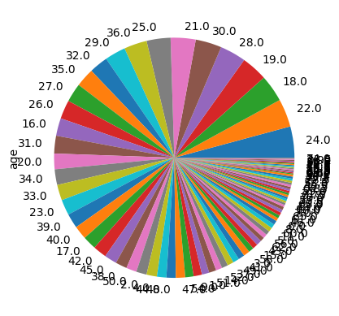
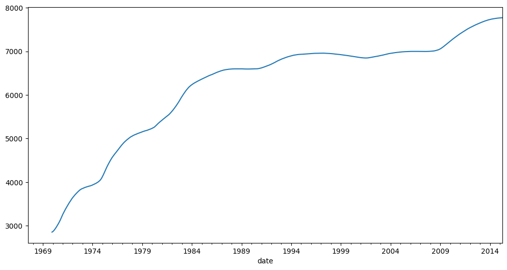
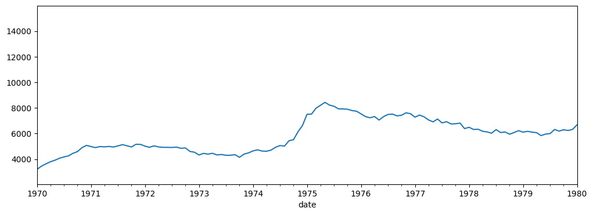
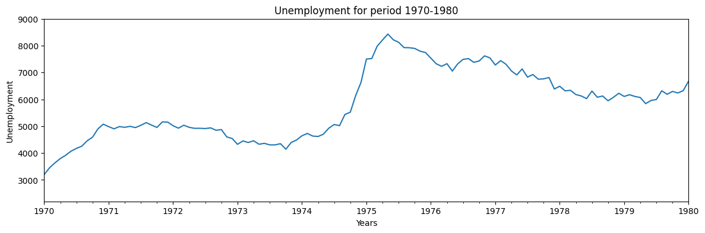
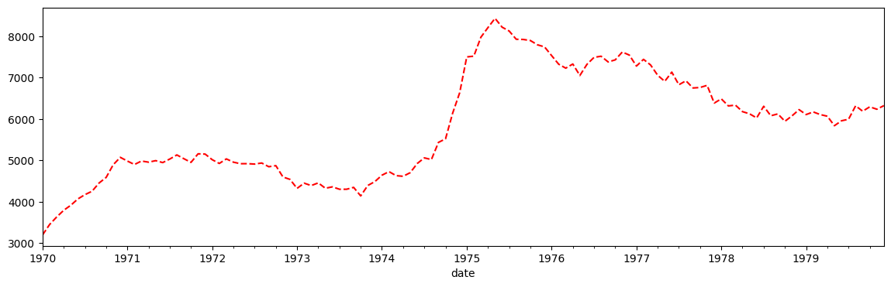
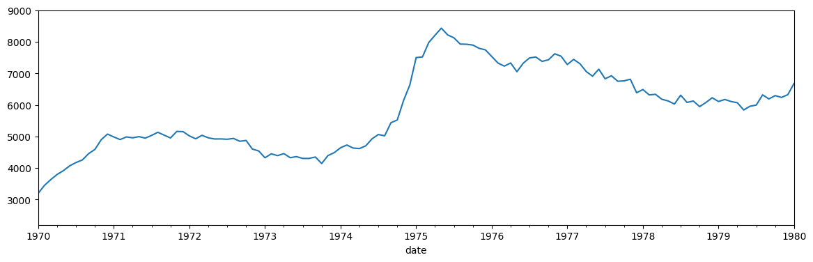

# pandas

----


----

```python
url_titanic = "https://gist.githubusercontent.com/butuzov/ed1c7f8f3affe6dd005c1ee40dc3f7f2/raw/87c7d72e009f1965263edc3431adbd4fab69f387/titanic.csv"
url_economics = "https://gist.githubusercontent.com/butuzov/ed1c7f8f3affe6dd005c1ee40dc3f7f2/raw/87c7d72e009f1965263edc3431adbd4fab69f387/economics.csv"
```

```python
import pandas as pd
import numpy as np

import matplotlib.pyplot as plt
%matplotlib inline

# Just So we can log 
# nice logging
from icecream import ic
import sys, re
def printError(e): print("Error: {}".format(e), file=sys.stderr)
    
def jupyter(*args): 
    print(*[re.sub(r",\s{1,}", ", ", i.replace(",\n", ", ")) for i in args], file=sys.stdout)
    
ic.configureOutput(prefix='ic> ', outputFunction=jupyter)

rnd = np.random.RandomState(42)
```

# Pandas

_**Talks**_:
    
* "[How to use pandas the wrong way](https://www.youtube.com/watch?v=4JwpDGrMsJE)", by Pietro Battiston  @EuroPython 2017 (
[code](https://pietrobattiston.it/python:pycon)
)
* "[Neat Analytics with Pandas Indexes](https://www.youtube.com/watch?v=WjEVJ4x2SXE&)", by Alexander Hendorf @EuroPython 2017 (
  [slides](https://www.slideshare.net/PoleSystematicParisRegion/neat-analytics-with-pandas-indexes-alexander-hendorf)
)
* "[Data Wrangling & Visualization with Pandas and Jupyter](https://github.com/alanderex/pydata-pandas-workshop)", by Alexander Hendorf @EuroPython 2018

*  "[Pandas for Data Analysis](https://www.youtube.com/watch?v=oGzU688xCUs)" by Daniel Chen, @SciPy 2017 (
  [code](https://github.com/chendaniely/scipy-2017-tutorial-pandas)
)

_**Docks:**_

* https://pandas.pydata.org/pandas-docs/stable/reference/

_**Books:**_

* [Python for Data Analysis](http://shop.oreilly.com/product/0636920023784.do)
* [Python Data Science](http://shop.oreilly.com/product/0636920034919.do)

## Getting Started

`pandas` allow us plot, explore, data. perform math on large sets of it.

### Versions and general overview

```python
# version
ic(pd.__version__)

> ic> pd.__version__: '1.5.3'

result >>> '1.5.3'
```

```python
economics = pd.read_csv(url_economics, index_col='date',parse_dates=True)
economics.head(2)
```

<div>
<style scoped>
    .dataframe tbody tr th:only-of-type {
        vertical-align: middle;
    }

    .dataframe tbody tr th {
        vertical-align: top;
    }

    .dataframe thead th {
        text-align: right;
    }
</style>
<table border="1" class="dataframe">
  <thead>
    <tr style="text-align: right;">
      <th></th>
      <th>pce</th>
      <th>pop</th>
      <th>psavert</th>
      <th>uempmed</th>
      <th>unemploy</th>
    </tr>
    <tr>
      <th>date</th>
      <th></th>
      <th></th>
      <th></th>
      <th></th>
      <th></th>
    </tr>
  </thead>
  <tbody>
    <tr>
      <th>1967-07-01</th>
      <td>507.4</td>
      <td>198712</td>
      <td>12.5</td>
      <td>4.5</td>
      <td>2944</td>
    </tr>
    <tr>
      <th>1967-08-01</th>
      <td>510.5</td>
      <td>198911</td>
      <td>12.5</td>
      <td>4.7</td>
      <td>2945</td>
    </tr>
  </tbody>
</table>
</div>

### Options

https://pandas.pydata.org/pandas-docs/stable/user_guide/options.html#available-options

```python
ic(pd.describe_option("display.max_rows"))

with pd.option_context('display.max_rows', 2):
    ic(pd.get_option("display.max_rows"))
ic(pd.get_option("display.max_rows"))
print("----"*20)
ic(pd.get_option("display.max_rows"))
ic(pd.set_option("display.max_rows", 2))
ic(pd.get_option("display.max_rows"))
print("----"*20)
ic(pd.reset_option("display.max_rows"))
ic(pd.get_option("display.max_rows"))

> display.max_rows : int
> If max_rows is exceeded, switch to truncate view. Depending on
> `large_repr`, objects are either centrally truncated or printed as
> a summary view. 'None' value means unlimited.
> 
> In case python/IPython is running in a terminal and `large_repr`
> equals 'truncate' this can be set to 0 and pandas will auto-detect
> the height of the terminal and print a truncated object which fits
> the screen height. The IPython notebook, IPython qtconsole, or
> IDLE do not run in a terminal and hence it is not possible to do
> correct auto-detection.
> [default: 60] [currently: 60]
> ic> pd.describe_option("display.max_rows"): None
> ic> pd.get_option("display.max_rows"): 2
> ic> pd.get_option("display.max_rows"): 60
> --------------------------------------------------------------------------------
> ic> pd.get_option("display.max_rows"): 60
> ic> pd.set_option("display.max_rows", 2): None
> ic> pd.get_option("display.max_rows"): 2
> --------------------------------------------------------------------------------
> ic> pd.reset_option("display.max_rows"): None
> ic> pd.get_option("display.max_rows"): 60

result >>> 60
```

## DataTypes: Series and DataFrames

Types:
* `np.bool` (`bool`) - Stored as a single byte.
* `np.int` (`int`) - Defaulted to 64 bits, Unsigned ints is alaso available (`np.uint`)
* `np.float` (`float`) - Defaulted to 64 bits.
* `np.complex` (`complex`) - Rarely seen in DA
* `np.object` (`O`, `object`) - Typically strings but is a catch- all for columns with multiple different types or other Python objects (tuples, lists, dicts, and so on).
* `np.datetime64`, `pd.Timestamp` (`datetime64`) - Specific moment in time with nanosecond precision.
* `np.timedelta64`,`pd.Timedelta` (`timedelta64`) - An amount of time, from days to nanoseconds.
* `pd.Categorical` (`Categorical`) - Specific only to pandas. Useful for object columns with relatively few unique values.

```python
ic(economics.dtypes.value_counts())

print("-"*60)

ic(economics.dtypes)

> ic> economics.dtypes.value_counts(): float64    3
> int64      2
> dtype: int64
> ------------------------------------------------------------
> ic> economics.dtypes: pce         float64
> pop           int64
> psavert     float64
> uempmed     float64
> unemploy      int64
> dtype: object

result >>> pce         float64
result >>> pop           int64
result >>> psavert     float64
result >>> uempmed     float64
result >>> unemploy      int64
result >>> dtype: object
```

### `pd.Series`

`numpy` array with labels


```python
rnd_series = pd.Series(rnd.randint(0, 10, 6))

ic(type(rnd_series))
ic(rnd_series.shape)
ic(rnd_series.index)
ic(rnd_series.value_counts(normalize=True))
ic(rnd_series.hasnans)

> ic> type(rnd_series): <class 'pandas.core.series.Series'>
> ic> rnd_series.shape: (6,)
> ic> rnd_series.index: RangeIndex(start=0, stop=6, step=1)
> ic> rnd_series.value_counts(normalize=True): 6    0.333333
> 3    0.166667
> 7    0.166667
> 4    0.166667
> 9    0.166667
> dtype: float64
> ic> rnd_series.hasnans: False

result >>> False
```

### `pd.DataFrame`


```python
economics = pd.read_csv(url_economics, index_col='date',parse_dates=True)
economics.head(2)
```

<div>
<style scoped>
    .dataframe tbody tr th:only-of-type {
        vertical-align: middle;
    }

    .dataframe tbody tr th {
        vertical-align: top;
    }

    .dataframe thead th {
        text-align: right;
    }
</style>
<table border="1" class="dataframe">
  <thead>
    <tr style="text-align: right;">
      <th></th>
      <th>pce</th>
      <th>pop</th>
      <th>psavert</th>
      <th>uempmed</th>
      <th>unemploy</th>
    </tr>
    <tr>
      <th>date</th>
      <th></th>
      <th></th>
      <th></th>
      <th></th>
      <th></th>
    </tr>
  </thead>
  <tbody>
    <tr>
      <th>1967-07-01</th>
      <td>507.4</td>
      <td>198712</td>
      <td>12.5</td>
      <td>4.5</td>
      <td>2944</td>
    </tr>
    <tr>
      <th>1967-08-01</th>
      <td>510.5</td>
      <td>198911</td>
      <td>12.5</td>
      <td>4.7</td>
      <td>2945</td>
    </tr>
  </tbody>
</table>
</div>

```python
# row
ic(economics.values[0])
ic(type(economics.values))
ic(economics.shape)
ic(economics.columns[0:4])
ic(economics.index[0])

> ic> economics.values[0]: array([5.07400e+02, 1.98712e+05, 1.25000e+01, 4.50000e+00, 2.94400e+03])
> ic> type(economics.values): <class 'numpy.ndarray'>
> ic> economics.shape: (574, 5)
> ic> economics.columns[0:4]: Index(['pce', 'pop', 'psavert', 'uempmed'], dtype='object')
> ic> economics.index[0]: Timestamp('1967-07-01 00:00:00')

result >>> Timestamp('1967-07-01 00:00:00')
```

```python
economics.info()

> <class 'pandas.core.frame.DataFrame'>
> DatetimeIndex: 574 entries, 1967-07-01 to 2015-04-01
> Data columns (total 5 columns):
> #   Column    Non-Null Count  Dtype
> ---  ------    --------------  -----
> 0   pce       574 non-null    float64
> 1   pop       574 non-null    int64
> 2   psavert   574 non-null    float64
> 3   uempmed   574 non-null    float64
> 4   unemploy  574 non-null    int64
> dtypes: float64(3), int64(2)
> memory usage: 26.9 KB
```

## Data: Generate Data (`numpy`)

`pandas` use `numpy` to generate indexes, and perform operations on matrixes

### Random data in Dataframe/Series

```python
# generating random data based on numpy generated array
pd.DataFrame(rnd.randint(0, 10, 6).reshape(-1, 6)).head()
```

<div>
<style scoped>
    .dataframe tbody tr th:only-of-type {
        vertical-align: middle;
    }

    .dataframe tbody tr th {
        vertical-align: top;
    }

    .dataframe thead th {
        text-align: right;
    }
</style>
<table border="1" class="dataframe">
  <thead>
    <tr style="text-align: right;">
      <th></th>
      <th>0</th>
      <th>1</th>
      <th>2</th>
      <th>3</th>
      <th>4</th>
      <th>5</th>
    </tr>
  </thead>
  <tbody>
    <tr>
      <th>0</th>
      <td>2</td>
      <td>6</td>
      <td>7</td>
      <td>4</td>
      <td>3</td>
      <td>7</td>
    </tr>
  </tbody>
</table>
</div>

## Data: Import and Export

* https://pandas.pydata.org/pandas-docs/stable/reference/io.html

### Import
We can import data from: `csv`, `excel`,  `excel`, `hdfs`, etc... 

```python
# Read a comma-separated values (csv) file into DataFrame.
economics = pd.read_csv(url_economics, index_col='date', parse_dates=True)
economics.head(3)
```

<div>
<style scoped>
    .dataframe tbody tr th:only-of-type {
        vertical-align: middle;
    }

    .dataframe tbody tr th {
        vertical-align: top;
    }

    .dataframe thead th {
        text-align: right;
    }
</style>
<table border="1" class="dataframe">
  <thead>
    <tr style="text-align: right;">
      <th></th>
      <th>pce</th>
      <th>pop</th>
      <th>psavert</th>
      <th>uempmed</th>
      <th>unemploy</th>
    </tr>
    <tr>
      <th>date</th>
      <th></th>
      <th></th>
      <th></th>
      <th></th>
      <th></th>
    </tr>
  </thead>
  <tbody>
    <tr>
      <th>1967-07-01</th>
      <td>507.4</td>
      <td>198712</td>
      <td>12.5</td>
      <td>4.5</td>
      <td>2944</td>
    </tr>
    <tr>
      <th>1967-08-01</th>
      <td>510.5</td>
      <td>198911</td>
      <td>12.5</td>
      <td>4.7</td>
      <td>2945</td>
    </tr>
    <tr>
      <th>1967-09-01</th>
      <td>516.3</td>
      <td>199113</td>
      <td>11.7</td>
      <td>4.6</td>
      <td>2958</td>
    </tr>
  </tbody>
</table>
</div>

### Export

```python
# excel export depends on openpyxl
#> pip install openpyxl 2>&1 1>/dev/null

> 
> [notice] A new release of pip is available: 23.3.1 -> 23.3.2
> [notice] To update, run: pip install --upgrade pip
```

```python
# Write DataFrame to a comma-separated values (csv) file.
economics.to_csv(path_or_buf="data.csv", index=False)

# and actual saving dataframe to excel
economics.to_excel("data.xlsx")
```

```python
#> unlink data.xlsx
#> unlink data.csv
```

### Export to data structures

```python
dfdict = economics.to_dict()
ic(len(dfdict))
ic(dfdict.keys())

> ic> len(dfdict): 5
> ic> dfdict.keys(): dict_keys(['pce', 'pop', 'psavert', 'uempmed', 'unemploy'])

result >>> dict_keys(['pce', 'pop', 'psavert', 'uempmed', 'unemploy'])
```

## Data: Indexing

### `pd.Index`

```python
# manualy created index
indexes=pd.Index([0,1,2,3,4,5,6])

ic(type(indexes))
ic(indexes.size)
ic(indexes.shape) 
ic(indexes.dtype)

> ic> type(indexes): <class 'pandas.core.indexes.numeric.Int64Index'>
> ic> indexes.size: 7
> ic> indexes.shape: (7,)
> ic> indexes.dtype: dtype('int64')

result >>> dtype('int64')
```

Create index and sort index on existing dataframe

```python
economics.set_index('unemploy').sort_index().head(5)
```

<div>
<style scoped>
    .dataframe tbody tr th:only-of-type {
        vertical-align: middle;
    }

    .dataframe tbody tr th {
        vertical-align: top;
    }

    .dataframe thead th {
        text-align: right;
    }
</style>
<table border="1" class="dataframe">
  <thead>
    <tr style="text-align: right;">
      <th></th>
      <th>pce</th>
      <th>pop</th>
      <th>psavert</th>
      <th>uempmed</th>
    </tr>
    <tr>
      <th>unemploy</th>
      <th></th>
      <th></th>
      <th></th>
      <th></th>
    </tr>
  </thead>
  <tbody>
    <tr>
      <th>2685</th>
      <td>577.2</td>
      <td>201621</td>
      <td>10.9</td>
      <td>4.4</td>
    </tr>
    <tr>
      <th>2686</th>
      <td>568.8</td>
      <td>201095</td>
      <td>10.4</td>
      <td>4.6</td>
    </tr>
    <tr>
      <th>2689</th>
      <td>572.3</td>
      <td>201290</td>
      <td>10.6</td>
      <td>4.8</td>
    </tr>
    <tr>
      <th>2692</th>
      <td>589.5</td>
      <td>201881</td>
      <td>9.4</td>
      <td>4.9</td>
    </tr>
    <tr>
      <th>2709</th>
      <td>544.6</td>
      <td>200208</td>
      <td>12.2</td>
      <td>4.6</td>
    </tr>
  </tbody>
</table>
</div>

and reset index

```python
economics.set_index('unemploy').reset_index().head(2)
```

<div>
<style scoped>
    .dataframe tbody tr th:only-of-type {
        vertical-align: middle;
    }

    .dataframe tbody tr th {
        vertical-align: top;
    }

    .dataframe thead th {
        text-align: right;
    }
</style>
<table border="1" class="dataframe">
  <thead>
    <tr style="text-align: right;">
      <th></th>
      <th>unemploy</th>
      <th>pce</th>
      <th>pop</th>
      <th>psavert</th>
      <th>uempmed</th>
    </tr>
  </thead>
  <tbody>
    <tr>
      <th>0</th>
      <td>2944</td>
      <td>507.4</td>
      <td>198712</td>
      <td>12.5</td>
      <td>4.5</td>
    </tr>
    <tr>
      <th>1</th>
      <td>2945</td>
      <td>510.5</td>
      <td>198911</td>
      <td>12.5</td>
      <td>4.7</td>
    </tr>
  </tbody>
</table>
</div>

### `pd.DatetimeIndex`

https://docs.scipy.org/doc/numpy/reference/arrays.datetime.html

```python
# we can use numpy generated arrys for indexes or data
np.arange('1993-01-01', '1993-01-20', dtype="datetime64[W]")

result >>> array(['1992-12-31', '1993-01-07'], dtype='datetime64[W]')
```

```python
# date generation
pd.date_range("2001-01-01", periods=3, freq="w")

result >>> DatetimeIndex(['2001-01-07', '2001-01-14', '2001-01-21'], dtype='datetime64[ns]', freq='W-SUN')
```

```python
# autoguessing date format
pd.to_datetime(['1/2/2018', 'Jan 04, 2018'])

result >>> DatetimeIndex(['2018-01-02', '2018-01-04'], dtype='datetime64[ns]', freq=None)
```

```python
# providing dateformat
pd.to_datetime(['2/1/2018', '6/1/2018'], format="%d/%m/%Y")

result >>> DatetimeIndex(['2018-01-02', '2018-01-06'], dtype='datetime64[ns]', freq=None)
```

```python
# bussines days 
pd.date_range("2018-01-02", periods=3, freq='B')

result >>> DatetimeIndex(['2018-01-02', '2018-01-03', '2018-01-04'], dtype='datetime64[ns]', freq='B')
```

Parsing dates

```python
economics = pd.read_csv(url_economics,  parse_dates=True)
economics.head(3)
```

<div>
<style scoped>
    .dataframe tbody tr th:only-of-type {
        vertical-align: middle;
    }

    .dataframe tbody tr th {
        vertical-align: top;
    }

    .dataframe thead th {
        text-align: right;
    }
</style>
<table border="1" class="dataframe">
  <thead>
    <tr style="text-align: right;">
      <th></th>
      <th>date</th>
      <th>pce</th>
      <th>pop</th>
      <th>psavert</th>
      <th>uempmed</th>
      <th>unemploy</th>
    </tr>
  </thead>
  <tbody>
    <tr>
      <th>0</th>
      <td>1967-07-01</td>
      <td>507.4</td>
      <td>198712</td>
      <td>12.5</td>
      <td>4.5</td>
      <td>2944</td>
    </tr>
    <tr>
      <th>1</th>
      <td>1967-08-01</td>
      <td>510.5</td>
      <td>198911</td>
      <td>12.5</td>
      <td>4.7</td>
      <td>2945</td>
    </tr>
    <tr>
      <th>2</th>
      <td>1967-09-01</td>
      <td>516.3</td>
      <td>199113</td>
      <td>11.7</td>
      <td>4.6</td>
      <td>2958</td>
    </tr>
  </tbody>
</table>
</div>

```python
pd.to_datetime(economics['date'], format='%Y-%m-%d').dt.strftime("%Y")[1:4]

result >>> 1    1967
result >>> 2    1967
result >>> 3    1967
result >>> Name: date, dtype: object
```

post load datetime transformation

```python
economics = pd.read_csv(url_economics)
economics['date'] = pd.to_datetime(economics['date'])
economics.set_index('date',inplace=True)
economics.head(3)
```

<div>
<style scoped>
    .dataframe tbody tr th:only-of-type {
        vertical-align: middle;
    }

    .dataframe tbody tr th {
        vertical-align: top;
    }

    .dataframe thead th {
        text-align: right;
    }
</style>
<table border="1" class="dataframe">
  <thead>
    <tr style="text-align: right;">
      <th></th>
      <th>pce</th>
      <th>pop</th>
      <th>psavert</th>
      <th>uempmed</th>
      <th>unemploy</th>
    </tr>
    <tr>
      <th>date</th>
      <th></th>
      <th></th>
      <th></th>
      <th></th>
      <th></th>
    </tr>
  </thead>
  <tbody>
    <tr>
      <th>1967-07-01</th>
      <td>507.4</td>
      <td>198712</td>
      <td>12.5</td>
      <td>4.5</td>
      <td>2944</td>
    </tr>
    <tr>
      <th>1967-08-01</th>
      <td>510.5</td>
      <td>198911</td>
      <td>12.5</td>
      <td>4.7</td>
      <td>2945</td>
    </tr>
    <tr>
      <th>1967-09-01</th>
      <td>516.3</td>
      <td>199113</td>
      <td>11.7</td>
      <td>4.6</td>
      <td>2958</td>
    </tr>
  </tbody>
</table>
</div>

### Labels

```python
tmp = pd.Series(['Oleg', 'Developer'], index=['person', 'who'])

#  loc allow to request data by named index
# iloc allow to request data by numeric index 
ic(tmp.loc['person'])
ic(tmp.iloc[1])

> ic> tmp.loc['person']: 'Oleg'
> ic> tmp.iloc[1]: 'Developer'

result >>> 'Developer'
```

```python
tmp = pd.Series(range(26), index=[x for x in 'ABCDEFGHIJKLMNOPQRSTUVWXYZ'])

ic(tmp[3:9].values)
ic(tmp["D":"I"].values)
ic(tmp.iloc[3:9].values)

> ic> tmp[3:9].values: array([3, 4, 5, 6, 7, 8])
> ic> tmp["D":"I"].values: array([3, 4, 5, 6, 7, 8])
> ic> tmp.iloc[3:9].values: array([3, 4, 5, 6, 7, 8])

result >>> array([3, 4, 5, 6, 7, 8])
```

re-labeling / re-indexing

```python
# reindexing
tmp.index = [x for x in 'GATTACAHIJKLMNOPQRSTUVWXYZ']
ic(tmp.loc['G'])

# Requesting non uniq values
try:
    tmp.loc['G':'A']
except KeyError as e:
    printError(e)

stderr> Error: "Cannot get right slice bound for non-unique label: 'A'"
```

### Index Based Access

```python
economics = pd.read_csv(url_economics, index_col=["date"], parse_dates=True)
economics.head(3)
```

<div>
<style scoped>
    .dataframe tbody tr th:only-of-type {
        vertical-align: middle;
    }

    .dataframe tbody tr th {
        vertical-align: top;
    }

    .dataframe thead th {
        text-align: right;
    }
</style>
<table border="1" class="dataframe">
  <thead>
    <tr style="text-align: right;">
      <th></th>
      <th>pce</th>
      <th>pop</th>
      <th>psavert</th>
      <th>uempmed</th>
      <th>unemploy</th>
    </tr>
    <tr>
      <th>date</th>
      <th></th>
      <th></th>
      <th></th>
      <th></th>
      <th></th>
    </tr>
  </thead>
  <tbody>
    <tr>
      <th>1967-07-01</th>
      <td>507.4</td>
      <td>198712</td>
      <td>12.5</td>
      <td>4.5</td>
      <td>2944</td>
    </tr>
    <tr>
      <th>1967-08-01</th>
      <td>510.5</td>
      <td>198911</td>
      <td>12.5</td>
      <td>4.7</td>
      <td>2945</td>
    </tr>
    <tr>
      <th>1967-09-01</th>
      <td>516.3</td>
      <td>199113</td>
      <td>11.7</td>
      <td>4.6</td>
      <td>2958</td>
    </tr>
  </tbody>
</table>
</div>

```python
# access top data using column name
economics["unemploy"].head(2)

result >>> date
result >>> 1967-07-01    2944
result >>> 1967-08-01    2945
result >>> Name: unemploy, dtype: int64
```

```python
# or using column as property
economics.unemploy.head(2)

result >>> date
result >>> 1967-07-01    2944
result >>> 1967-08-01    2945
result >>> Name: unemploy, dtype: int64
```

```python
economics.iloc[[0], :]
economics.iloc[[0,2,5,4], [0,1,2]]
```

<div>
<style scoped>
    .dataframe tbody tr th:only-of-type {
        vertical-align: middle;
    }

    .dataframe tbody tr th {
        vertical-align: top;
    }

    .dataframe thead th {
        text-align: right;
    }
</style>
<table border="1" class="dataframe">
  <thead>
    <tr style="text-align: right;">
      <th></th>
      <th>pce</th>
      <th>pop</th>
      <th>psavert</th>
    </tr>
    <tr>
      <th>date</th>
      <th></th>
      <th></th>
      <th></th>
    </tr>
  </thead>
  <tbody>
    <tr>
      <th>1967-07-01</th>
      <td>507.4</td>
      <td>198712</td>
      <td>12.5</td>
    </tr>
    <tr>
      <th>1967-09-01</th>
      <td>516.3</td>
      <td>199113</td>
      <td>11.7</td>
    </tr>
    <tr>
      <th>1967-12-01</th>
      <td>525.8</td>
      <td>199657</td>
      <td>12.1</td>
    </tr>
    <tr>
      <th>1967-11-01</th>
      <td>518.1</td>
      <td>199498</td>
      <td>12.5</td>
    </tr>
  </tbody>
</table>
</div>

```python
economics[['pce', 'pop']].head(2)
```

<div>
<style scoped>
    .dataframe tbody tr th:only-of-type {
        vertical-align: middle;
    }

    .dataframe tbody tr th {
        vertical-align: top;
    }

    .dataframe thead th {
        text-align: right;
    }
</style>
<table border="1" class="dataframe">
  <thead>
    <tr style="text-align: right;">
      <th></th>
      <th>pce</th>
      <th>pop</th>
    </tr>
    <tr>
      <th>date</th>
      <th></th>
      <th></th>
    </tr>
  </thead>
  <tbody>
    <tr>
      <th>1967-07-01</th>
      <td>507.4</td>
      <td>198712</td>
    </tr>
    <tr>
      <th>1967-08-01</th>
      <td>510.5</td>
      <td>198911</td>
    </tr>
  </tbody>
</table>
</div>

`loc` based indexing

```python
# ranges and selections
economics.loc['1967-07-01':'1967-09-01', ['pop', 'pce']].head(2)
```

<div>
<style scoped>
    .dataframe tbody tr th:only-of-type {
        vertical-align: middle;
    }

    .dataframe tbody tr th {
        vertical-align: top;
    }

    .dataframe thead th {
        text-align: right;
    }
</style>
<table border="1" class="dataframe">
  <thead>
    <tr style="text-align: right;">
      <th></th>
      <th>pop</th>
      <th>pce</th>
    </tr>
    <tr>
      <th>date</th>
      <th></th>
      <th></th>
    </tr>
  </thead>
  <tbody>
    <tr>
      <th>1967-07-01</th>
      <td>198712</td>
      <td>507.4</td>
    </tr>
    <tr>
      <th>1967-08-01</th>
      <td>198911</td>
      <td>510.5</td>
    </tr>
  </tbody>
</table>
</div>

```python
# ranges and ALL
economics.loc['1967-07-01':'1967-09-01', :].head(2)
```

<div>
<style scoped>
    .dataframe tbody tr th:only-of-type {
        vertical-align: middle;
    }

    .dataframe tbody tr th {
        vertical-align: top;
    }

    .dataframe thead th {
        text-align: right;
    }
</style>
<table border="1" class="dataframe">
  <thead>
    <tr style="text-align: right;">
      <th></th>
      <th>pce</th>
      <th>pop</th>
      <th>psavert</th>
      <th>uempmed</th>
      <th>unemploy</th>
    </tr>
    <tr>
      <th>date</th>
      <th></th>
      <th></th>
      <th></th>
      <th></th>
      <th></th>
    </tr>
  </thead>
  <tbody>
    <tr>
      <th>1967-07-01</th>
      <td>507.4</td>
      <td>198712</td>
      <td>12.5</td>
      <td>4.5</td>
      <td>2944</td>
    </tr>
    <tr>
      <th>1967-08-01</th>
      <td>510.5</td>
      <td>198911</td>
      <td>12.5</td>
      <td>4.7</td>
      <td>2945</td>
    </tr>
  </tbody>
</table>
</div>

```python
# ranges and ranges
economics.loc['1967-07-01':'1967-09-01', 'pce':'psavert'].head(2)
```

<div>
<style scoped>
    .dataframe tbody tr th:only-of-type {
        vertical-align: middle;
    }

    .dataframe tbody tr th {
        vertical-align: top;
    }

    .dataframe thead th {
        text-align: right;
    }
</style>
<table border="1" class="dataframe">
  <thead>
    <tr style="text-align: right;">
      <th></th>
      <th>pce</th>
      <th>pop</th>
      <th>psavert</th>
    </tr>
    <tr>
      <th>date</th>
      <th></th>
      <th></th>
      <th></th>
    </tr>
  </thead>
  <tbody>
    <tr>
      <th>1967-07-01</th>
      <td>507.4</td>
      <td>198712</td>
      <td>12.5</td>
    </tr>
    <tr>
      <th>1967-08-01</th>
      <td>510.5</td>
      <td>198911</td>
      <td>12.5</td>
    </tr>
  </tbody>
</table>
</div>

`iloc` based indexes

```python
# ranges and ALL
economics.iloc[0:5,:].head(2)
```

<div>
<style scoped>
    .dataframe tbody tr th:only-of-type {
        vertical-align: middle;
    }

    .dataframe tbody tr th {
        vertical-align: top;
    }

    .dataframe thead th {
        text-align: right;
    }
</style>
<table border="1" class="dataframe">
  <thead>
    <tr style="text-align: right;">
      <th></th>
      <th>pce</th>
      <th>pop</th>
      <th>psavert</th>
      <th>uempmed</th>
      <th>unemploy</th>
    </tr>
    <tr>
      <th>date</th>
      <th></th>
      <th></th>
      <th></th>
      <th></th>
      <th></th>
    </tr>
  </thead>
  <tbody>
    <tr>
      <th>1967-07-01</th>
      <td>507.4</td>
      <td>198712</td>
      <td>12.5</td>
      <td>4.5</td>
      <td>2944</td>
    </tr>
    <tr>
      <th>1967-08-01</th>
      <td>510.5</td>
      <td>198911</td>
      <td>12.5</td>
      <td>4.7</td>
      <td>2945</td>
    </tr>
  </tbody>
</table>
</div>

```python
# ranges and selection
economics.iloc[0:5,[0,3,4]].head(2)
```

<div>
<style scoped>
    .dataframe tbody tr th:only-of-type {
        vertical-align: middle;
    }

    .dataframe tbody tr th {
        vertical-align: top;
    }

    .dataframe thead th {
        text-align: right;
    }
</style>
<table border="1" class="dataframe">
  <thead>
    <tr style="text-align: right;">
      <th></th>
      <th>pce</th>
      <th>uempmed</th>
      <th>unemploy</th>
    </tr>
    <tr>
      <th>date</th>
      <th></th>
      <th></th>
      <th></th>
    </tr>
  </thead>
  <tbody>
    <tr>
      <th>1967-07-01</th>
      <td>507.4</td>
      <td>4.5</td>
      <td>2944</td>
    </tr>
    <tr>
      <th>1967-08-01</th>
      <td>510.5</td>
      <td>4.7</td>
      <td>2945</td>
    </tr>
  </tbody>
</table>
</div>

```python
# ranges and ranges
economics.iloc[0:5, 2:4].head(2)
```

<div>
<style scoped>
    .dataframe tbody tr th:only-of-type {
        vertical-align: middle;
    }

    .dataframe tbody tr th {
        vertical-align: top;
    }

    .dataframe thead th {
        text-align: right;
    }
</style>
<table border="1" class="dataframe">
  <thead>
    <tr style="text-align: right;">
      <th></th>
      <th>psavert</th>
      <th>uempmed</th>
    </tr>
    <tr>
      <th>date</th>
      <th></th>
      <th></th>
    </tr>
  </thead>
  <tbody>
    <tr>
      <th>1967-07-01</th>
      <td>12.5</td>
      <td>4.5</td>
    </tr>
    <tr>
      <th>1967-08-01</th>
      <td>12.5</td>
      <td>4.7</td>
    </tr>
  </tbody>
</table>
</div>

```python
# combining different aproaches
pd.concat([
    economics.iloc[0:1, 2:4],
    economics.iloc[6:7, 2:4],
    economics.loc['1978-07-01':'1978-09-01', ['psavert','uempmed']],
]).head(3)
```

<div>
<style scoped>
    .dataframe tbody tr th:only-of-type {
        vertical-align: middle;
    }

    .dataframe tbody tr th {
        vertical-align: top;
    }

    .dataframe thead th {
        text-align: right;
    }
</style>
<table border="1" class="dataframe">
  <thead>
    <tr style="text-align: right;">
      <th></th>
      <th>psavert</th>
      <th>uempmed</th>
    </tr>
    <tr>
      <th>date</th>
      <th></th>
      <th></th>
    </tr>
  </thead>
  <tbody>
    <tr>
      <th>1967-07-01</th>
      <td>12.5</td>
      <td>4.5</td>
    </tr>
    <tr>
      <th>1968-01-01</th>
      <td>11.7</td>
      <td>5.1</td>
    </tr>
    <tr>
      <th>1978-07-01</th>
      <td>10.3</td>
      <td>5.8</td>
    </tr>
  </tbody>
</table>
</div>

```python
# combining preselected columns with loc.
economics[['pce', 'unemploy']].loc['1967-07-01':'1969-07-01'].head(2)
```

<div>
<style scoped>
    .dataframe tbody tr th:only-of-type {
        vertical-align: middle;
    }

    .dataframe tbody tr th {
        vertical-align: top;
    }

    .dataframe thead th {
        text-align: right;
    }
</style>
<table border="1" class="dataframe">
  <thead>
    <tr style="text-align: right;">
      <th></th>
      <th>pce</th>
      <th>unemploy</th>
    </tr>
    <tr>
      <th>date</th>
      <th></th>
      <th></th>
    </tr>
  </thead>
  <tbody>
    <tr>
      <th>1967-07-01</th>
      <td>507.4</td>
      <td>2944</td>
    </tr>
    <tr>
      <th>1967-08-01</th>
      <td>510.5</td>
      <td>2945</td>
    </tr>
  </tbody>
</table>
</div>

```python
# combining preselected columns with loc.
economics[['pce', 'unemploy']].iloc[10:14].head(2)
```

<div>
<style scoped>
    .dataframe tbody tr th:only-of-type {
        vertical-align: middle;
    }

    .dataframe tbody tr th {
        vertical-align: top;
    }

    .dataframe thead th {
        text-align: right;
    }
</style>
<table border="1" class="dataframe">
  <thead>
    <tr style="text-align: right;">
      <th></th>
      <th>pce</th>
      <th>unemploy</th>
    </tr>
    <tr>
      <th>date</th>
      <th></th>
      <th></th>
    </tr>
  </thead>
  <tbody>
    <tr>
      <th>1968-05-01</th>
      <td>550.4</td>
      <td>2740</td>
    </tr>
    <tr>
      <th>1968-06-01</th>
      <td>556.8</td>
      <td>2938</td>
    </tr>
  </tbody>
</table>
</div>

### Conditional Indexes

```python
economics.loc[((economics.pce <= 630) & (economics.pce >= 600)), ['psavert', 'unemploy']].head(2)
```

<div>
<style scoped>
    .dataframe tbody tr th:only-of-type {
        vertical-align: middle;
    }

    .dataframe tbody tr th {
        vertical-align: top;
    }

    .dataframe thead th {
        text-align: right;
    }
</style>
<table border="1" class="dataframe">
  <thead>
    <tr style="text-align: right;">
      <th></th>
      <th>psavert</th>
      <th>unemploy</th>
    </tr>
    <tr>
      <th>date</th>
      <th></th>
      <th></th>
    </tr>
  </thead>
  <tbody>
    <tr>
      <th>1969-05-01</th>
      <td>10.0</td>
      <td>2713</td>
    </tr>
    <tr>
      <th>1969-06-01</th>
      <td>10.9</td>
      <td>2816</td>
    </tr>
  </tbody>
</table>
</div>

### Labeled Indexes (2)

```python
size = 10
tmp = pd.DataFrame(rnd.randint(0, 10, size**2).reshape(size, -1), 
                  index=[f"R{x:02d}" for x in range(size)],
                  columns = [f"C{x:02d}" for x in range(size)])

tmp
```

<div>
<style scoped>
    .dataframe tbody tr th:only-of-type {
        vertical-align: middle;
    }

    .dataframe tbody tr th {
        vertical-align: top;
    }

    .dataframe thead th {
        text-align: right;
    }
</style>
<table border="1" class="dataframe">
  <thead>
    <tr style="text-align: right;">
      <th></th>
      <th>C00</th>
      <th>C01</th>
      <th>C02</th>
      <th>C03</th>
      <th>C04</th>
      <th>C05</th>
      <th>C06</th>
      <th>C07</th>
      <th>C08</th>
      <th>C09</th>
    </tr>
  </thead>
  <tbody>
    <tr>
      <th>R00</th>
      <td>7</td>
      <td>2</td>
      <td>5</td>
      <td>4</td>
      <td>1</td>
      <td>7</td>
      <td>5</td>
      <td>1</td>
      <td>4</td>
      <td>0</td>
    </tr>
    <tr>
      <th>R01</th>
      <td>9</td>
      <td>5</td>
      <td>8</td>
      <td>0</td>
      <td>9</td>
      <td>2</td>
      <td>6</td>
      <td>3</td>
      <td>8</td>
      <td>2</td>
    </tr>
    <tr>
      <th>R02</th>
      <td>4</td>
      <td>2</td>
      <td>6</td>
      <td>4</td>
      <td>8</td>
      <td>6</td>
      <td>1</td>
      <td>3</td>
      <td>8</td>
      <td>1</td>
    </tr>
    <tr>
      <th>R03</th>
      <td>9</td>
      <td>8</td>
      <td>9</td>
      <td>4</td>
      <td>1</td>
      <td>3</td>
      <td>6</td>
      <td>7</td>
      <td>2</td>
      <td>0</td>
    </tr>
    <tr>
      <th>R04</th>
      <td>3</td>
      <td>1</td>
      <td>7</td>
      <td>3</td>
      <td>1</td>
      <td>5</td>
      <td>5</td>
      <td>9</td>
      <td>3</td>
      <td>5</td>
    </tr>
    <tr>
      <th>R05</th>
      <td>1</td>
      <td>9</td>
      <td>1</td>
      <td>9</td>
      <td>3</td>
      <td>7</td>
      <td>6</td>
      <td>8</td>
      <td>7</td>
      <td>4</td>
    </tr>
    <tr>
      <th>R06</th>
      <td>1</td>
      <td>4</td>
      <td>7</td>
      <td>9</td>
      <td>8</td>
      <td>8</td>
      <td>0</td>
      <td>8</td>
      <td>6</td>
      <td>8</td>
    </tr>
    <tr>
      <th>R07</th>
      <td>7</td>
      <td>0</td>
      <td>7</td>
      <td>7</td>
      <td>2</td>
      <td>0</td>
      <td>7</td>
      <td>2</td>
      <td>2</td>
      <td>0</td>
    </tr>
    <tr>
      <th>R08</th>
      <td>4</td>
      <td>9</td>
      <td>6</td>
      <td>9</td>
      <td>8</td>
      <td>6</td>
      <td>8</td>
      <td>7</td>
      <td>1</td>
      <td>0</td>
    </tr>
    <tr>
      <th>R09</th>
      <td>6</td>
      <td>6</td>
      <td>7</td>
      <td>4</td>
      <td>2</td>
      <td>7</td>
      <td>5</td>
      <td>2</td>
      <td>0</td>
      <td>2</td>
    </tr>
  </tbody>
</table>
</div>

```python
# rows not found.
tmp['C05':'C09']
```

<div>
<style scoped>
    .dataframe tbody tr th:only-of-type {
        vertical-align: middle;
    }

    .dataframe tbody tr th {
        vertical-align: top;
    }

    .dataframe thead th {
        text-align: right;
    }
</style>
<table border="1" class="dataframe">
  <thead>
    <tr style="text-align: right;">
      <th></th>
      <th>C00</th>
      <th>C01</th>
      <th>C02</th>
      <th>C03</th>
      <th>C04</th>
      <th>C05</th>
      <th>C06</th>
      <th>C07</th>
      <th>C08</th>
      <th>C09</th>
    </tr>
  </thead>
  <tbody>
  </tbody>
</table>
</div>

```python
# but as column its ok!
tmp['C05']

result >>> R00    7
result >>> R01    2
result >>> R02    6
result >>> R03    3
result >>> R04    5
result >>> R05    7
result >>> R06    8
result >>> R07    0
result >>> R08    6
result >>> R09    7
result >>> Name: C05, dtype: int64
```

```python
tmp['R05':'R06']
```

<div>
<style scoped>
    .dataframe tbody tr th:only-of-type {
        vertical-align: middle;
    }

    .dataframe tbody tr th {
        vertical-align: top;
    }

    .dataframe thead th {
        text-align: right;
    }
</style>
<table border="1" class="dataframe">
  <thead>
    <tr style="text-align: right;">
      <th></th>
      <th>C00</th>
      <th>C01</th>
      <th>C02</th>
      <th>C03</th>
      <th>C04</th>
      <th>C05</th>
      <th>C06</th>
      <th>C07</th>
      <th>C08</th>
      <th>C09</th>
    </tr>
  </thead>
  <tbody>
    <tr>
      <th>R05</th>
      <td>1</td>
      <td>9</td>
      <td>1</td>
      <td>9</td>
      <td>3</td>
      <td>7</td>
      <td>6</td>
      <td>8</td>
      <td>7</td>
      <td>4</td>
    </tr>
    <tr>
      <th>R06</th>
      <td>1</td>
      <td>4</td>
      <td>7</td>
      <td>9</td>
      <td>8</td>
      <td>8</td>
      <td>0</td>
      <td>8</td>
      <td>6</td>
      <td>8</td>
    </tr>
  </tbody>
</table>
</div>

### MultiIndex

```python
pdlen = 20

tmp = pd.DataFrame(
    {
        'city'     : [x for x in ['Paris', 'London', 'Berlin', 'Manchester', 'Kyiv']*10][:pdlen],
        'category' : rnd.randint(0, 7, pdlen),
        'price'    : rnd.randint(10, 300, pdlen),
        'rating'   : rnd.randint(0, 5, pdlen),
    }
)

tmp['country'] = tmp['city'].map({
    'Paris':'FR', 
    'London':'UK', 
    'Berlin':'DE', 
    'Manchester':'US', 
    'Kyiv':'UA',
})

tmp.head(5)
```

<div>
<style scoped>
    .dataframe tbody tr th:only-of-type {
        vertical-align: middle;
    }

    .dataframe tbody tr th {
        vertical-align: top;
    }

    .dataframe thead th {
        text-align: right;
    }
</style>
<table border="1" class="dataframe">
  <thead>
    <tr style="text-align: right;">
      <th></th>
      <th>city</th>
      <th>category</th>
      <th>price</th>
      <th>rating</th>
      <th>country</th>
    </tr>
  </thead>
  <tbody>
    <tr>
      <th>0</th>
      <td>Paris</td>
      <td>4</td>
      <td>72</td>
      <td>4</td>
      <td>FR</td>
    </tr>
    <tr>
      <th>1</th>
      <td>London</td>
      <td>6</td>
      <td>240</td>
      <td>0</td>
      <td>UK</td>
    </tr>
    <tr>
      <th>2</th>
      <td>Berlin</td>
      <td>5</td>
      <td>250</td>
      <td>4</td>
      <td>DE</td>
    </tr>
    <tr>
      <th>3</th>
      <td>Manchester</td>
      <td>2</td>
      <td>61</td>
      <td>3</td>
      <td>US</td>
    </tr>
    <tr>
      <th>4</th>
      <td>Kyiv</td>
      <td>0</td>
      <td>105</td>
      <td>3</td>
      <td>UA</td>
    </tr>
  </tbody>
</table>
</div>

```python
tmp = tmp.groupby(['country', 'city', 'category']).mean()
tmp
```

<div>
<style scoped>
    .dataframe tbody tr th:only-of-type {
        vertical-align: middle;
    }

    .dataframe tbody tr th {
        vertical-align: top;
    }

    .dataframe thead th {
        text-align: right;
    }
</style>
<table border="1" class="dataframe">
  <thead>
    <tr style="text-align: right;">
      <th></th>
      <th></th>
      <th></th>
      <th>price</th>
      <th>rating</th>
    </tr>
    <tr>
      <th>country</th>
      <th>city</th>
      <th>category</th>
      <th></th>
      <th></th>
    </tr>
  </thead>
  <tbody>
    <tr>
      <th rowspan="4" valign="top">DE</th>
      <th rowspan="4" valign="top">Berlin</th>
      <th>0</th>
      <td>22.0</td>
      <td>0.0</td>
    </tr>
    <tr>
      <th>3</th>
      <td>293.0</td>
      <td>3.0</td>
    </tr>
    <tr>
      <th>5</th>
      <td>250.0</td>
      <td>4.0</td>
    </tr>
    <tr>
      <th>6</th>
      <td>246.0</td>
      <td>3.0</td>
    </tr>
    <tr>
      <th rowspan="3" valign="top">FR</th>
      <th rowspan="3" valign="top">Paris</th>
      <th>1</th>
      <td>252.0</td>
      <td>2.0</td>
    </tr>
    <tr>
      <th>4</th>
      <td>151.5</td>
      <td>3.5</td>
    </tr>
    <tr>
      <th>6</th>
      <td>38.0</td>
      <td>3.0</td>
    </tr>
    <tr>
      <th rowspan="4" valign="top">UA</th>
      <th rowspan="4" valign="top">Kyiv</th>
      <th>0</th>
      <td>105.0</td>
      <td>3.0</td>
    </tr>
    <tr>
      <th>2</th>
      <td>179.0</td>
      <td>0.0</td>
    </tr>
    <tr>
      <th>5</th>
      <td>180.0</td>
      <td>1.0</td>
    </tr>
    <tr>
      <th>6</th>
      <td>196.0</td>
      <td>0.0</td>
    </tr>
    <tr>
      <th rowspan="3" valign="top">UK</th>
      <th rowspan="3" valign="top">London</th>
      <th>1</th>
      <td>167.5</td>
      <td>1.5</td>
    </tr>
    <tr>
      <th>2</th>
      <td>45.0</td>
      <td>0.0</td>
    </tr>
    <tr>
      <th>6</th>
      <td>240.0</td>
      <td>0.0</td>
    </tr>
    <tr>
      <th rowspan="3" valign="top">US</th>
      <th rowspan="3" valign="top">Manchester</th>
      <th>2</th>
      <td>61.0</td>
      <td>3.0</td>
    </tr>
    <tr>
      <th>4</th>
      <td>75.0</td>
      <td>4.0</td>
    </tr>
    <tr>
      <th>6</th>
      <td>160.5</td>
      <td>1.0</td>
    </tr>
  </tbody>
</table>
</div>

```python
# show all indexes and levels
ic(tmp.index)
ic(tmp.index.levels)
print("-"*70)
ic(tmp.index.names)
ic(tmp.index.values)
print("-"*70)
ic(tmp.index.get_level_values(2))
print("-"*70)
ic(tmp.loc["UA"])
print("-"*70)
ic(tmp.loc["UA", "Kyiv"].max())
ic(tmp.loc["UA", "Kyiv", 0:4])

> ic> tmp.index: MultiIndex([('DE', 'Berlin', 0), ('DE', 'Berlin', 3), ('DE', 'Berlin', 5), ('DE', 'Berlin', 6), ('FR', 'Paris', 1), ('FR', 'Paris', 4), ('FR', 'Paris', 6), ('UA', 'Kyiv', 0), ('UA', 'Kyiv', 2), ('UA', 'Kyiv', 5), ('UA', 'Kyiv', 6), ('UK', 'London', 1), ('UK', 'London', 2), ('UK', 'London', 6), ('US', 'Manchester', 2), ('US', 'Manchester', 4), ('US', 'Manchester', 6)], names=['country', 'city', 'category'])
> ic> tmp.index.levels: FrozenList([['DE', 'FR', 'UA', 'UK', 'US'], ['Berlin', 'Kyiv', 'London', 'Manchester', 'Paris'], [0, 1, 2, 3, 4, 5, 6]])
> ----------------------------------------------------------------------
> ic> tmp.index.names: FrozenList(['country', 'city', 'category'])
> ic> tmp.index.values: array([('DE', 'Berlin', 0), ('DE', 'Berlin', 3), ('DE', 'Berlin', 5), ('DE', 'Berlin', 6), ('FR', 'Paris', 1), ('FR', 'Paris', 4), ('FR', 'Paris', 6), ('UA', 'Kyiv', 0), ('UA', 'Kyiv', 2), ('UA', 'Kyiv', 5), ('UA', 'Kyiv', 6), ('UK', 'London', 1), ('UK', 'London', 2), ('UK', 'London', 6), ('US', 'Manchester', 2), ('US', 'Manchester', 4), ('US', 'Manchester', 6)], dtype=object)
> ----------------------------------------------------------------------
> ic> tmp.index.get_level_values(2): Int64Index([0, 3, 5, 6, 1, 4, 6, 0, 2, 5, 6, 1, 2, 6, 2, 4, 6], dtype='int64', name='category')
> ----------------------------------------------------------------------
> ic> tmp.loc["UA"]:                price  rating
> city category
> Kyiv 0         105.0     3.0
> 2         179.0     0.0
> 5         180.0     1.0
> 6         196.0     0.0
> ----------------------------------------------------------------------
> ic> tmp.loc["UA", "Kyiv"].max(): price     196.0
> rating      3.0
> dtype: float64
> ic> tmp.loc["UA", "Kyiv", 0:4]:                        price  rating
> country city category
> UA      Kyiv 0         105.0     3.0
> 2         179.0     0.0
```

<div>
<style scoped>
    .dataframe tbody tr th:only-of-type {
        vertical-align: middle;
    }

    .dataframe tbody tr th {
        vertical-align: top;
    }

    .dataframe thead th {
        text-align: right;
    }
</style>
<table border="1" class="dataframe">
  <thead>
    <tr style="text-align: right;">
      <th></th>
      <th></th>
      <th></th>
      <th>price</th>
      <th>rating</th>
    </tr>
    <tr>
      <th>country</th>
      <th>city</th>
      <th>category</th>
      <th></th>
      <th></th>
    </tr>
  </thead>
  <tbody>
    <tr>
      <th rowspan="2" valign="top">UA</th>
      <th rowspan="2" valign="top">Kyiv</th>
      <th>0</th>
      <td>105.0</td>
      <td>3.0</td>
    </tr>
    <tr>
      <th>2</th>
      <td>179.0</td>
      <td>0.0</td>
    </tr>
  </tbody>
</table>
</div>

```python
# without inplace=True it will return new dataframe
tmp.rename(index={'UA':'ЮА'}, columns={'price':'Precio'}, inplace=True)
tmp
```

<div>
<style scoped>
    .dataframe tbody tr th:only-of-type {
        vertical-align: middle;
    }

    .dataframe tbody tr th {
        vertical-align: top;
    }

    .dataframe thead th {
        text-align: right;
    }
</style>
<table border="1" class="dataframe">
  <thead>
    <tr style="text-align: right;">
      <th></th>
      <th></th>
      <th></th>
      <th>Precio</th>
      <th>rating</th>
    </tr>
    <tr>
      <th>country</th>
      <th>city</th>
      <th>category</th>
      <th></th>
      <th></th>
    </tr>
  </thead>
  <tbody>
    <tr>
      <th rowspan="4" valign="top">DE</th>
      <th rowspan="4" valign="top">Berlin</th>
      <th>0</th>
      <td>22.0</td>
      <td>0.0</td>
    </tr>
    <tr>
      <th>3</th>
      <td>293.0</td>
      <td>3.0</td>
    </tr>
    <tr>
      <th>5</th>
      <td>250.0</td>
      <td>4.0</td>
    </tr>
    <tr>
      <th>6</th>
      <td>246.0</td>
      <td>3.0</td>
    </tr>
    <tr>
      <th rowspan="3" valign="top">FR</th>
      <th rowspan="3" valign="top">Paris</th>
      <th>1</th>
      <td>252.0</td>
      <td>2.0</td>
    </tr>
    <tr>
      <th>4</th>
      <td>151.5</td>
      <td>3.5</td>
    </tr>
    <tr>
      <th>6</th>
      <td>38.0</td>
      <td>3.0</td>
    </tr>
    <tr>
      <th rowspan="4" valign="top">ЮА</th>
      <th rowspan="4" valign="top">Kyiv</th>
      <th>0</th>
      <td>105.0</td>
      <td>3.0</td>
    </tr>
    <tr>
      <th>2</th>
      <td>179.0</td>
      <td>0.0</td>
    </tr>
    <tr>
      <th>5</th>
      <td>180.0</td>
      <td>1.0</td>
    </tr>
    <tr>
      <th>6</th>
      <td>196.0</td>
      <td>0.0</td>
    </tr>
    <tr>
      <th rowspan="3" valign="top">UK</th>
      <th rowspan="3" valign="top">London</th>
      <th>1</th>
      <td>167.5</td>
      <td>1.5</td>
    </tr>
    <tr>
      <th>2</th>
      <td>45.0</td>
      <td>0.0</td>
    </tr>
    <tr>
      <th>6</th>
      <td>240.0</td>
      <td>0.0</td>
    </tr>
    <tr>
      <th rowspan="3" valign="top">US</th>
      <th rowspan="3" valign="top">Manchester</th>
      <th>2</th>
      <td>61.0</td>
      <td>3.0</td>
    </tr>
    <tr>
      <th>4</th>
      <td>75.0</td>
      <td>4.0</td>
    </tr>
    <tr>
      <th>6</th>
      <td>160.5</td>
      <td>1.0</td>
    </tr>
  </tbody>
</table>
</div>

### `pd.Index` as Sets

```python
# intersection
ic(pd.Index([1,2,3,4]) & pd.Index([3,4,5,6]))

# union
ic(pd.Index([1,2,3,4]) | pd.Index([3,4,5,6]))

# symetric difference
ic(pd.Index([1,2,3,4]) ^ pd.Index([3,4,5,6]))

stderr> /var/folders/7j/8x_gv0vs7f33q1cxc5cyhl3r0000gn/T/ipykernel_29394/1864070959.py:2: FutureWarning: Index.__and__ operating as a set operation is deprecated, in the future this will be a logical operation matching Series.__and__.  Use index.intersection(other) instead.
stderr> ic(pd.Index([1,2,3,4]) & pd.Index([3,4,5,6]))
stderr> /var/folders/7j/8x_gv0vs7f33q1cxc5cyhl3r0000gn/T/ipykernel_29394/1864070959.py:5: FutureWarning: Index.__or__ operating as a set operation is deprecated, in the future this will be a logical operation matching Series.__or__.  Use index.union(other) instead.
stderr> ic(pd.Index([1,2,3,4]) | pd.Index([3,4,5,6]))
stderr> /var/folders/7j/8x_gv0vs7f33q1cxc5cyhl3r0000gn/T/ipykernel_29394/1864070959.py:8: FutureWarning: Index.__xor__ operating as a set operation is deprecated, in the future this will be a logical operation matching Series.__xor__.  Use index.symmetric_difference(other) instead.
stderr> ic(pd.Index([1,2,3,4]) ^ pd.Index([3,4,5,6]))


result >>> Int64Index([1, 2, 5, 6], dtype='int64')
```

### Index Aligment

```python
# source data area and population
data_area = { 'Alaska': 1723337,  'Texas': 695662, 'California': 423967}
data_ppls = { 'California': 38332521, 'Texas': 26448193, 'New York': 19651127}

area = pd.Series(data_area, name='area')
ppls = pd.Series(data_ppls, name='ppls')

# Index aligment
ic(ppls/area)

> ic> ppls/area: Alaska              NaN
> California    90.413926
> New York            NaN
> Texas         38.018740
> dtype: float64

result >>> Alaska              NaN
result >>> California    90.413926
result >>> New York            NaN
result >>> Texas         38.018740
result >>> dtype: float64
```

One more example

```python
A = pd.Series([2, 4, 6], index=[0, 1, 2]) 
B = pd.Series([1, 3, 5], index=[1, 2, 3]) 

ic(A+B)

> ic> A+B: 0    NaN
> 1    5.0
> 2    9.0
> 3    NaN
> dtype: float64

result >>> 0    NaN
result >>> 1    5.0
result >>> 2    9.0
result >>> 3    NaN
result >>> dtype: float64
```

using functions methods (`.add()` instead `+` ) we can fill nan values

```python
# using function we can fill nan values
ic(A.add(B, fill_value=100))

> ic> A.add(B, fill_value=100): 0    102.0
> 1      5.0
> 2      9.0
> 3    105.0
> dtype: float64

result >>> 0    102.0
result >>> 1      5.0
result >>> 2      9.0
result >>> 3    105.0
result >>> dtype: float64
```

```python
economics = pd.read_csv(url_economics, index_col='date',parse_dates=True)

ic(economics.unemploy.idxmin())
ic(economics.unemploy.min())
ic(np.argmin(economics.unemploy))
print("-"*60)
ic(economics.unemploy.idxmax())
ic(economics.unemploy.max())
ic(np.argmax(economics.unemploy))

> ic> economics.unemploy.idxmin(): Timestamp('1968-12-01 00:00:00')
> ic> economics.unemploy.min(): 2685
> ic> np.argmin(economics.unemploy): 17
> ------------------------------------------------------------
> ic> economics.unemploy.idxmax(): Timestamp('2009-10-01 00:00:00')
> ic> economics.unemploy.max(): 15352
> ic> np.argmax(economics.unemploy): 507

result >>> 507
```

## Data: Handling Data

### Handling Missing Data

```python
titanic = pd.read_csv(url_titanic, keep_default_na=False)
titanic['age'][4:7].head()

result >>> 4    35.0
result >>> 5        
result >>> 6    54.0
result >>> Name: age, dtype: object
```

```python
# Additional strings to recognize as NA/NaN. 
# If dict passed, specific per-column NA values. 
# By default the following values are interpreted as 
# NaN: ‘’, ‘#N/A’, ‘#N/A N/A’, ‘#NA’, ‘-1.#IND’, ‘-1.#QNAN’, ‘-NaN’, 
# ‘-nan’, ‘1.#IND’, ‘1.#QNAN’, ‘N/A’, ‘NA’, ‘NULL’, ‘NaN’, ‘n/a’, ‘nan’, ‘null’.
titanic = pd.read_csv(url_titanic, na_values=[35.0])
titanic['age'][4:7].head()

result >>> 4     NaN
result >>> 5     NaN
result >>> 6    54.0
result >>> Name: age, dtype: float64
```

```python
titanic = pd.read_csv(url_titanic, keep_default_na=True)
titanic['age'][4:7].head()

result >>> 4    35.0
result >>> 5     NaN
result >>> 6    54.0
result >>> Name: age, dtype: float64
```

```python
ic(titanic['age'].hasnans)
ic(titanic['age'].isnull().sum())
ic(titanic['age'].dropna().hasnans)
ic(titanic['age'].dropna().isnull().sum())
ic(titanic['age'].notnull().sum())
ic(np.count_nonzero(titanic['age'].isnull()))

> ic> titanic['age'].hasnans: True
> ic> titanic['age'].isnull().sum(): 177
> ic> titanic['age'].dropna().hasnans: False
> ic> titanic['age'].dropna().isnull().sum(): 0
> ic> titanic['age'].notnull().sum(): 714
> ic> np.count_nonzero(titanic['age'].isnull()): 177

result >>> 177
```

```python
titanic.age.value_counts(dropna=True).plot.pie()
```



getting rid of `nan`s

```python
ages = pd.DataFrame()

ages['fillna(0)']      = titanic['age'].fillna(0)
ages['fillna - ffill'] = titanic['age'].fillna(method='ffill')
ages['fillna - bfill'] = titanic['age'].fillna(method='bfill')
ages['dropna']         = titanic['age'].dropna(inplace=False )
ages['interpolate']    = titanic['age'].interpolate()
ages['min']            = titanic['age'].fillna(titanic['age'].min())
ages['mean']           = titanic['age'].fillna(titanic['age'].mean())
ages[4:7]
```

<div>
<style scoped>
    .dataframe tbody tr th:only-of-type {
        vertical-align: middle;
    }

    .dataframe tbody tr th {
        vertical-align: top;
    }

    .dataframe thead th {
        text-align: right;
    }
</style>
<table border="1" class="dataframe">
  <thead>
    <tr style="text-align: right;">
      <th></th>
      <th>fillna(0)</th>
      <th>fillna - ffill</th>
      <th>fillna - bfill</th>
      <th>dropna</th>
      <th>interpolate</th>
      <th>min</th>
      <th>mean</th>
    </tr>
  </thead>
  <tbody>
    <tr>
      <th>4</th>
      <td>35.0</td>
      <td>35.0</td>
      <td>35.0</td>
      <td>35.0</td>
      <td>35.0</td>
      <td>35.00</td>
      <td>35.000000</td>
    </tr>
    <tr>
      <th>5</th>
      <td>0.0</td>
      <td>35.0</td>
      <td>54.0</td>
      <td>NaN</td>
      <td>44.5</td>
      <td>0.42</td>
      <td>29.699118</td>
    </tr>
    <tr>
      <th>6</th>
      <td>54.0</td>
      <td>54.0</td>
      <td>54.0</td>
      <td>54.0</td>
      <td>54.0</td>
      <td>54.00</td>
      <td>54.000000</td>
    </tr>
  </tbody>
</table>
</div>

### Melting/Mergin/Concating Data

```python
titanic = pd.read_csv(url_titanic, keep_default_na=True)
titanic.head(3)
```

<div>
<style scoped>
    .dataframe tbody tr th:only-of-type {
        vertical-align: middle;
    }

    .dataframe tbody tr th {
        vertical-align: top;
    }

    .dataframe thead th {
        text-align: right;
    }
</style>
<table border="1" class="dataframe">
  <thead>
    <tr style="text-align: right;">
      <th></th>
      <th>survived</th>
      <th>pclass</th>
      <th>sex</th>
      <th>age</th>
      <th>sibsp</th>
      <th>parch</th>
      <th>fare</th>
      <th>embarked</th>
      <th>class</th>
      <th>who</th>
      <th>adult_male</th>
      <th>deck</th>
      <th>embark_town</th>
      <th>alive</th>
      <th>alone</th>
    </tr>
  </thead>
  <tbody>
    <tr>
      <th>0</th>
      <td>0</td>
      <td>3</td>
      <td>male</td>
      <td>22.0</td>
      <td>1</td>
      <td>0</td>
      <td>7.2500</td>
      <td>S</td>
      <td>Third</td>
      <td>man</td>
      <td>True</td>
      <td>NaN</td>
      <td>Southampton</td>
      <td>no</td>
      <td>False</td>
    </tr>
    <tr>
      <th>1</th>
      <td>1</td>
      <td>1</td>
      <td>female</td>
      <td>38.0</td>
      <td>1</td>
      <td>0</td>
      <td>71.2833</td>
      <td>C</td>
      <td>First</td>
      <td>woman</td>
      <td>False</td>
      <td>C</td>
      <td>Cherbourg</td>
      <td>yes</td>
      <td>False</td>
    </tr>
    <tr>
      <th>2</th>
      <td>1</td>
      <td>3</td>
      <td>female</td>
      <td>26.0</td>
      <td>0</td>
      <td>0</td>
      <td>7.9250</td>
      <td>S</td>
      <td>Third</td>
      <td>woman</td>
      <td>False</td>
      <td>NaN</td>
      <td>Southampton</td>
      <td>yes</td>
      <td>True</td>
    </tr>
  </tbody>
</table>
</div>

Renaming columns and indexes

```python
titanic.rename(columns={'sex':'gender'}, inplace=True)
titanic.head(3)
```

<div>
<style scoped>
    .dataframe tbody tr th:only-of-type {
        vertical-align: middle;
    }

    .dataframe tbody tr th {
        vertical-align: top;
    }

    .dataframe thead th {
        text-align: right;
    }
</style>
<table border="1" class="dataframe">
  <thead>
    <tr style="text-align: right;">
      <th></th>
      <th>survived</th>
      <th>pclass</th>
      <th>gender</th>
      <th>age</th>
      <th>sibsp</th>
      <th>parch</th>
      <th>fare</th>
      <th>embarked</th>
      <th>class</th>
      <th>who</th>
      <th>adult_male</th>
      <th>deck</th>
      <th>embark_town</th>
      <th>alive</th>
      <th>alone</th>
    </tr>
  </thead>
  <tbody>
    <tr>
      <th>0</th>
      <td>0</td>
      <td>3</td>
      <td>male</td>
      <td>22.0</td>
      <td>1</td>
      <td>0</td>
      <td>7.2500</td>
      <td>S</td>
      <td>Third</td>
      <td>man</td>
      <td>True</td>
      <td>NaN</td>
      <td>Southampton</td>
      <td>no</td>
      <td>False</td>
    </tr>
    <tr>
      <th>1</th>
      <td>1</td>
      <td>1</td>
      <td>female</td>
      <td>38.0</td>
      <td>1</td>
      <td>0</td>
      <td>71.2833</td>
      <td>C</td>
      <td>First</td>
      <td>woman</td>
      <td>False</td>
      <td>C</td>
      <td>Cherbourg</td>
      <td>yes</td>
      <td>False</td>
    </tr>
    <tr>
      <th>2</th>
      <td>1</td>
      <td>3</td>
      <td>female</td>
      <td>26.0</td>
      <td>0</td>
      <td>0</td>
      <td>7.9250</td>
      <td>S</td>
      <td>Third</td>
      <td>woman</td>
      <td>False</td>
      <td>NaN</td>
      <td>Southampton</td>
      <td>yes</td>
      <td>True</td>
    </tr>
  </tbody>
</table>
</div>

droping columns

```python
titanic.drop('embarked', axis=1, errors="ignore", inplace=True)
titanic.drop('who', axis=1, errors="ignore", inplace=True)
titanic.drop(['adult_male', 'alone'], axis=1, errors="ignore", inplace=True) 
titanic.drop(['parch', 'deck'], axis=1, errors="ignore", inplace=True)
titanic.head(3)
```

<div>
<style scoped>
    .dataframe tbody tr th:only-of-type {
        vertical-align: middle;
    }

    .dataframe tbody tr th {
        vertical-align: top;
    }

    .dataframe thead th {
        text-align: right;
    }
</style>
<table border="1" class="dataframe">
  <thead>
    <tr style="text-align: right;">
      <th></th>
      <th>survived</th>
      <th>pclass</th>
      <th>gender</th>
      <th>age</th>
      <th>sibsp</th>
      <th>fare</th>
      <th>class</th>
      <th>embark_town</th>
      <th>alive</th>
    </tr>
  </thead>
  <tbody>
    <tr>
      <th>0</th>
      <td>0</td>
      <td>3</td>
      <td>male</td>
      <td>22.0</td>
      <td>1</td>
      <td>7.2500</td>
      <td>Third</td>
      <td>Southampton</td>
      <td>no</td>
    </tr>
    <tr>
      <th>1</th>
      <td>1</td>
      <td>1</td>
      <td>female</td>
      <td>38.0</td>
      <td>1</td>
      <td>71.2833</td>
      <td>First</td>
      <td>Cherbourg</td>
      <td>yes</td>
    </tr>
    <tr>
      <th>2</th>
      <td>1</td>
      <td>3</td>
      <td>female</td>
      <td>26.0</td>
      <td>0</td>
      <td>7.9250</td>
      <td>Third</td>
      <td>Southampton</td>
      <td>yes</td>
    </tr>
  </tbody>
</table>
</div>

```python
# fares 
titanic = titanic.groupby(['class', 'embark_town', 'gender'])['age'].mean().reset_index()
titanic
```

<div>
<style scoped>
    .dataframe tbody tr th:only-of-type {
        vertical-align: middle;
    }

    .dataframe tbody tr th {
        vertical-align: top;
    }

    .dataframe thead th {
        text-align: right;
    }
</style>
<table border="1" class="dataframe">
  <thead>
    <tr style="text-align: right;">
      <th></th>
      <th>class</th>
      <th>embark_town</th>
      <th>gender</th>
      <th>age</th>
    </tr>
  </thead>
  <tbody>
    <tr>
      <th>0</th>
      <td>First</td>
      <td>Cherbourg</td>
      <td>female</td>
      <td>36.052632</td>
    </tr>
    <tr>
      <th>1</th>
      <td>First</td>
      <td>Cherbourg</td>
      <td>male</td>
      <td>40.111111</td>
    </tr>
    <tr>
      <th>2</th>
      <td>First</td>
      <td>Queenstown</td>
      <td>female</td>
      <td>33.000000</td>
    </tr>
    <tr>
      <th>3</th>
      <td>First</td>
      <td>Queenstown</td>
      <td>male</td>
      <td>44.000000</td>
    </tr>
    <tr>
      <th>4</th>
      <td>First</td>
      <td>Southampton</td>
      <td>female</td>
      <td>32.704545</td>
    </tr>
    <tr>
      <th>5</th>
      <td>First</td>
      <td>Southampton</td>
      <td>male</td>
      <td>41.897188</td>
    </tr>
    <tr>
      <th>6</th>
      <td>Second</td>
      <td>Cherbourg</td>
      <td>female</td>
      <td>19.142857</td>
    </tr>
    <tr>
      <th>7</th>
      <td>Second</td>
      <td>Cherbourg</td>
      <td>male</td>
      <td>25.937500</td>
    </tr>
    <tr>
      <th>8</th>
      <td>Second</td>
      <td>Queenstown</td>
      <td>female</td>
      <td>30.000000</td>
    </tr>
    <tr>
      <th>9</th>
      <td>Second</td>
      <td>Queenstown</td>
      <td>male</td>
      <td>57.000000</td>
    </tr>
    <tr>
      <th>10</th>
      <td>Second</td>
      <td>Southampton</td>
      <td>female</td>
      <td>29.719697</td>
    </tr>
    <tr>
      <th>11</th>
      <td>Second</td>
      <td>Southampton</td>
      <td>male</td>
      <td>30.875889</td>
    </tr>
    <tr>
      <th>12</th>
      <td>Third</td>
      <td>Cherbourg</td>
      <td>female</td>
      <td>14.062500</td>
    </tr>
    <tr>
      <th>13</th>
      <td>Third</td>
      <td>Cherbourg</td>
      <td>male</td>
      <td>25.016800</td>
    </tr>
    <tr>
      <th>14</th>
      <td>Third</td>
      <td>Queenstown</td>
      <td>female</td>
      <td>22.850000</td>
    </tr>
    <tr>
      <th>15</th>
      <td>Third</td>
      <td>Queenstown</td>
      <td>male</td>
      <td>28.142857</td>
    </tr>
    <tr>
      <th>16</th>
      <td>Third</td>
      <td>Southampton</td>
      <td>female</td>
      <td>23.223684</td>
    </tr>
    <tr>
      <th>17</th>
      <td>Third</td>
      <td>Southampton</td>
      <td>male</td>
      <td>26.574766</td>
    </tr>
  </tbody>
</table>
</div>

pivoting data

```python
titanic.pivot_table(index=['class','gender'],columns='embark_town',values='age').reset_index().head(3)
```

<div>
<style scoped>
    .dataframe tbody tr th:only-of-type {
        vertical-align: middle;
    }

    .dataframe tbody tr th {
        vertical-align: top;
    }

    .dataframe thead th {
        text-align: right;
    }
</style>
<table border="1" class="dataframe">
  <thead>
    <tr style="text-align: right;">
      <th>embark_town</th>
      <th>class</th>
      <th>gender</th>
      <th>Cherbourg</th>
      <th>Queenstown</th>
      <th>Southampton</th>
    </tr>
  </thead>
  <tbody>
    <tr>
      <th>0</th>
      <td>First</td>
      <td>female</td>
      <td>36.052632</td>
      <td>33.0</td>
      <td>32.704545</td>
    </tr>
    <tr>
      <th>1</th>
      <td>First</td>
      <td>male</td>
      <td>40.111111</td>
      <td>44.0</td>
      <td>41.897188</td>
    </tr>
    <tr>
      <th>2</th>
      <td>Second</td>
      <td>female</td>
      <td>19.142857</td>
      <td>30.0</td>
      <td>29.719697</td>
    </tr>
  </tbody>
</table>
</div>

melting data

```python
pd.melt(titanic, id_vars=['class', 'gender']).head(3)
```

<div>
<style scoped>
    .dataframe tbody tr th:only-of-type {
        vertical-align: middle;
    }

    .dataframe tbody tr th {
        vertical-align: top;
    }

    .dataframe thead th {
        text-align: right;
    }
</style>
<table border="1" class="dataframe">
  <thead>
    <tr style="text-align: right;">
      <th></th>
      <th>class</th>
      <th>gender</th>
      <th>variable</th>
      <th>value</th>
    </tr>
  </thead>
  <tbody>
    <tr>
      <th>0</th>
      <td>First</td>
      <td>female</td>
      <td>embark_town</td>
      <td>Cherbourg</td>
    </tr>
    <tr>
      <th>1</th>
      <td>First</td>
      <td>male</td>
      <td>embark_town</td>
      <td>Cherbourg</td>
    </tr>
    <tr>
      <th>2</th>
      <td>First</td>
      <td>female</td>
      <td>embark_town</td>
      <td>Queenstown</td>
    </tr>
  </tbody>
</table>
</div>

```python
# todo - cover 
# unstack()
# stack()
```

### Common Math operations over the DataFrames/Series

```python
economics = pd.read_csv(url_economics, index_col='date',parse_dates=True)
```

```python
economics.info()

> <class 'pandas.core.frame.DataFrame'>
> DatetimeIndex: 574 entries, 1967-07-01 to 2015-04-01
> Data columns (total 5 columns):
> #   Column    Non-Null Count  Dtype
> ---  ------    --------------  -----
> 0   pce       574 non-null    float64
> 1   pop       574 non-null    int64
> 2   psavert   574 non-null    float64
> 3   uempmed   574 non-null    float64
> 4   unemploy  574 non-null    int64
> dtypes: float64(3), int64(2)
> memory usage: 26.9 KB
```

```python
economics.describe()
```

<div>
<style scoped>
    .dataframe tbody tr th:only-of-type {
        vertical-align: middle;
    }

    .dataframe tbody tr th {
        vertical-align: top;
    }

    .dataframe thead th {
        text-align: right;
    }
</style>
<table border="1" class="dataframe">
  <thead>
    <tr style="text-align: right;">
      <th></th>
      <th>pce</th>
      <th>pop</th>
      <th>psavert</th>
      <th>uempmed</th>
      <th>unemploy</th>
    </tr>
  </thead>
  <tbody>
    <tr>
      <th>count</th>
      <td>574.000000</td>
      <td>574.000000</td>
      <td>574.000000</td>
      <td>574.000000</td>
      <td>574.000000</td>
    </tr>
    <tr>
      <th>mean</th>
      <td>4843.510453</td>
      <td>257189.381533</td>
      <td>7.936585</td>
      <td>8.610105</td>
      <td>7771.557491</td>
    </tr>
    <tr>
      <th>std</th>
      <td>3579.287206</td>
      <td>36730.801593</td>
      <td>3.124394</td>
      <td>4.108112</td>
      <td>2641.960571</td>
    </tr>
    <tr>
      <th>min</th>
      <td>507.400000</td>
      <td>198712.000000</td>
      <td>1.900000</td>
      <td>4.000000</td>
      <td>2685.000000</td>
    </tr>
    <tr>
      <th>25%</th>
      <td>1582.225000</td>
      <td>224896.000000</td>
      <td>5.500000</td>
      <td>6.000000</td>
      <td>6284.000000</td>
    </tr>
    <tr>
      <th>50%</th>
      <td>3953.550000</td>
      <td>253060.000000</td>
      <td>7.700000</td>
      <td>7.500000</td>
      <td>7494.000000</td>
    </tr>
    <tr>
      <th>75%</th>
      <td>7667.325000</td>
      <td>290290.750000</td>
      <td>10.500000</td>
      <td>9.100000</td>
      <td>8691.000000</td>
    </tr>
    <tr>
      <th>max</th>
      <td>12161.500000</td>
      <td>320887.000000</td>
      <td>17.000000</td>
      <td>25.200000</td>
      <td>15352.000000</td>
    </tr>
  </tbody>
</table>
</div>

```python
economics.pce.mean()

result >>> 4843.510452961673
```

```python
economics.pce = economics.pce * 2
economics.head()
```

<div>
<style scoped>
    .dataframe tbody tr th:only-of-type {
        vertical-align: middle;
    }

    .dataframe tbody tr th {
        vertical-align: top;
    }

    .dataframe thead th {
        text-align: right;
    }
</style>
<table border="1" class="dataframe">
  <thead>
    <tr style="text-align: right;">
      <th></th>
      <th>pce</th>
      <th>pop</th>
      <th>psavert</th>
      <th>uempmed</th>
      <th>unemploy</th>
    </tr>
    <tr>
      <th>date</th>
      <th></th>
      <th></th>
      <th></th>
      <th></th>
      <th></th>
    </tr>
  </thead>
  <tbody>
    <tr>
      <th>1967-07-01</th>
      <td>1014.8</td>
      <td>198712</td>
      <td>12.5</td>
      <td>4.5</td>
      <td>2944</td>
    </tr>
    <tr>
      <th>1967-08-01</th>
      <td>1021.0</td>
      <td>198911</td>
      <td>12.5</td>
      <td>4.7</td>
      <td>2945</td>
    </tr>
    <tr>
      <th>1967-09-01</th>
      <td>1032.6</td>
      <td>199113</td>
      <td>11.7</td>
      <td>4.6</td>
      <td>2958</td>
    </tr>
    <tr>
      <th>1967-10-01</th>
      <td>1025.8</td>
      <td>199311</td>
      <td>12.5</td>
      <td>4.9</td>
      <td>3143</td>
    </tr>
    <tr>
      <th>1967-11-01</th>
      <td>1036.2</td>
      <td>199498</td>
      <td>12.5</td>
      <td>4.7</td>
      <td>3066</td>
    </tr>
  </tbody>
</table>
</div>

```python
cs = economics.pce.cumsum()
ic(cs.head(1))
ic(cs.tail(1))

> ic> cs.head(1): date
> 1967-07-01    1014.8
> Name: pce, dtype: float64
> ic> cs.tail(1): date
> 2015-04-01    5560350.0
> Name: pce, dtype: float64

result >>> date
result >>> 2015-04-01    5560350.0
result >>> Name: pce, dtype: float64
```

### Math operations over the DataFrames/Series

Using aplly over column data

```python
titanic = pd.read_csv(url_titanic, keep_default_na=True)
titanic.head(3)
```

<div>
<style scoped>
    .dataframe tbody tr th:only-of-type {
        vertical-align: middle;
    }

    .dataframe tbody tr th {
        vertical-align: top;
    }

    .dataframe thead th {
        text-align: right;
    }
</style>
<table border="1" class="dataframe">
  <thead>
    <tr style="text-align: right;">
      <th></th>
      <th>survived</th>
      <th>pclass</th>
      <th>sex</th>
      <th>age</th>
      <th>sibsp</th>
      <th>parch</th>
      <th>fare</th>
      <th>embarked</th>
      <th>class</th>
      <th>who</th>
      <th>adult_male</th>
      <th>deck</th>
      <th>embark_town</th>
      <th>alive</th>
      <th>alone</th>
    </tr>
  </thead>
  <tbody>
    <tr>
      <th>0</th>
      <td>0</td>
      <td>3</td>
      <td>male</td>
      <td>22.0</td>
      <td>1</td>
      <td>0</td>
      <td>7.2500</td>
      <td>S</td>
      <td>Third</td>
      <td>man</td>
      <td>True</td>
      <td>NaN</td>
      <td>Southampton</td>
      <td>no</td>
      <td>False</td>
    </tr>
    <tr>
      <th>1</th>
      <td>1</td>
      <td>1</td>
      <td>female</td>
      <td>38.0</td>
      <td>1</td>
      <td>0</td>
      <td>71.2833</td>
      <td>C</td>
      <td>First</td>
      <td>woman</td>
      <td>False</td>
      <td>C</td>
      <td>Cherbourg</td>
      <td>yes</td>
      <td>False</td>
    </tr>
    <tr>
      <th>2</th>
      <td>1</td>
      <td>3</td>
      <td>female</td>
      <td>26.0</td>
      <td>0</td>
      <td>0</td>
      <td>7.9250</td>
      <td>S</td>
      <td>Third</td>
      <td>woman</td>
      <td>False</td>
      <td>NaN</td>
      <td>Southampton</td>
      <td>yes</td>
      <td>True</td>
    </tr>
  </tbody>
</table>
</div>

```python
def my_mean(vector):
    return vector * 5

titanic.rename(columns={'fare':'1912_£'}, inplace=True)
titanic['1912_$'] = titanic['1912_£'].apply(my_mean)

titanic.loc[:, ['class', '1912_£', '1912_$']].head(5)
```

<div>
<style scoped>
    .dataframe tbody tr th:only-of-type {
        vertical-align: middle;
    }

    .dataframe tbody tr th {
        vertical-align: top;
    }

    .dataframe thead th {
        text-align: right;
    }
</style>
<table border="1" class="dataframe">
  <thead>
    <tr style="text-align: right;">
      <th></th>
      <th>class</th>
      <th>1912_£</th>
      <th>1912_$</th>
    </tr>
  </thead>
  <tbody>
    <tr>
      <th>0</th>
      <td>Third</td>
      <td>7.2500</td>
      <td>36.2500</td>
    </tr>
    <tr>
      <th>1</th>
      <td>First</td>
      <td>71.2833</td>
      <td>356.4165</td>
    </tr>
    <tr>
      <th>2</th>
      <td>Third</td>
      <td>7.9250</td>
      <td>39.6250</td>
    </tr>
    <tr>
      <th>3</th>
      <td>First</td>
      <td>53.1000</td>
      <td>265.5000</td>
    </tr>
    <tr>
      <th>4</th>
      <td>Third</td>
      <td>8.0500</td>
      <td>40.2500</td>
    </tr>
  </tbody>
</table>
</div>

### Grouped Calculations

```python
df = pd.read_csv(url_economics, parse_dates=['date'])
ic(df['date'].dtypes)

> ic> df['date'].dtypes: dtype('<M8[ns]')

result >>> dtype('<M8[ns]')
```

```python
df.groupby('date')['pce', 'unemploy'].mean().head(10)

> /var/folders/7j/8x_gv0vs7f33q1cxc5cyhl3r0000gn/T/ipykernel_29394/3677347823.py:1: FutureWarning: Indexing with multiple keys (implicitly converted to a tuple of keys) will be deprecated, use a list instead.
> df.groupby('date')['pce', 'unemploy'].mean().head(10)
```

<div>
<style scoped>
    .dataframe tbody tr th:only-of-type {
        vertical-align: middle;
    }

    .dataframe tbody tr th {
        vertical-align: top;
    }

    .dataframe thead th {
        text-align: right;
    }
</style>
<table border="1" class="dataframe">
  <thead>
    <tr style="text-align: right;">
      <th></th>
      <th>pce</th>
      <th>unemploy</th>
    </tr>
    <tr>
      <th>date</th>
      <th></th>
      <th></th>
    </tr>
  </thead>
  <tbody>
    <tr>
      <th>1967-07-01</th>
      <td>507.4</td>
      <td>2944.0</td>
    </tr>
    <tr>
      <th>1967-08-01</th>
      <td>510.5</td>
      <td>2945.0</td>
    </tr>
    <tr>
      <th>1967-09-01</th>
      <td>516.3</td>
      <td>2958.0</td>
    </tr>
    <tr>
      <th>1967-10-01</th>
      <td>512.9</td>
      <td>3143.0</td>
    </tr>
    <tr>
      <th>1967-11-01</th>
      <td>518.1</td>
      <td>3066.0</td>
    </tr>
    <tr>
      <th>1967-12-01</th>
      <td>525.8</td>
      <td>3018.0</td>
    </tr>
    <tr>
      <th>1968-01-01</th>
      <td>531.5</td>
      <td>2878.0</td>
    </tr>
    <tr>
      <th>1968-02-01</th>
      <td>534.2</td>
      <td>3001.0</td>
    </tr>
    <tr>
      <th>1968-03-01</th>
      <td>544.9</td>
      <td>2877.0</td>
    </tr>
    <tr>
      <th>1968-04-01</th>
      <td>544.6</td>
      <td>2709.0</td>
    </tr>
  </tbody>
</table>
</div>

```python
df.groupby(by=df['date'].dt.strftime('%Y'))['unemploy', 'uempmed'].mean().reset_index().head(3)

> /var/folders/7j/8x_gv0vs7f33q1cxc5cyhl3r0000gn/T/ipykernel_29394/1916814624.py:1: FutureWarning: Indexing with multiple keys (implicitly converted to a tuple of keys) will be deprecated, use a list instead.
> df.groupby(by=df['date'].dt.strftime('%Y'))['unemploy', 'uempmed'].mean().reset_index().head(3)
```

<div>
<style scoped>
    .dataframe tbody tr th:only-of-type {
        vertical-align: middle;
    }

    .dataframe tbody tr th {
        vertical-align: top;
    }

    .dataframe thead th {
        text-align: right;
    }
</style>
<table border="1" class="dataframe">
  <thead>
    <tr style="text-align: right;">
      <th></th>
      <th>date</th>
      <th>unemploy</th>
      <th>uempmed</th>
    </tr>
  </thead>
  <tbody>
    <tr>
      <th>0</th>
      <td>1967</td>
      <td>3012.333333</td>
      <td>4.700000</td>
    </tr>
    <tr>
      <th>1</th>
      <td>1968</td>
      <td>2797.416667</td>
      <td>4.500000</td>
    </tr>
    <tr>
      <th>2</th>
      <td>1969</td>
      <td>2830.166667</td>
      <td>4.441667</td>
    </tr>
  </tbody>
</table>
</div>

```python
df.groupby(by=df['date'].dt.strftime('%Y'))['unemploy', 'uempmed'].first().reset_index().head(3)

> /var/folders/7j/8x_gv0vs7f33q1cxc5cyhl3r0000gn/T/ipykernel_29394/2747298252.py:1: FutureWarning: Indexing with multiple keys (implicitly converted to a tuple of keys) will be deprecated, use a list instead.
> df.groupby(by=df['date'].dt.strftime('%Y'))['unemploy', 'uempmed'].first().reset_index().head(3)
```

<div>
<style scoped>
    .dataframe tbody tr th:only-of-type {
        vertical-align: middle;
    }

    .dataframe tbody tr th {
        vertical-align: top;
    }

    .dataframe thead th {
        text-align: right;
    }
</style>
<table border="1" class="dataframe">
  <thead>
    <tr style="text-align: right;">
      <th></th>
      <th>date</th>
      <th>unemploy</th>
      <th>uempmed</th>
    </tr>
  </thead>
  <tbody>
    <tr>
      <th>0</th>
      <td>1967</td>
      <td>2944</td>
      <td>4.5</td>
    </tr>
    <tr>
      <th>1</th>
      <td>1968</td>
      <td>2878</td>
      <td>5.1</td>
    </tr>
    <tr>
      <th>2</th>
      <td>1969</td>
      <td>2718</td>
      <td>4.4</td>
    </tr>
  </tbody>
</table>
</div>

```python
df.groupby(by=df['date'].dt.strftime('%Y'))['unemploy', 'uempmed'].last().reset_index().head(3)

> /var/folders/7j/8x_gv0vs7f33q1cxc5cyhl3r0000gn/T/ipykernel_29394/3124120651.py:1: FutureWarning: Indexing with multiple keys (implicitly converted to a tuple of keys) will be deprecated, use a list instead.
> df.groupby(by=df['date'].dt.strftime('%Y'))['unemploy', 'uempmed'].last().reset_index().head(3)
```

<div>
<style scoped>
    .dataframe tbody tr th:only-of-type {
        vertical-align: middle;
    }

    .dataframe tbody tr th {
        vertical-align: top;
    }

    .dataframe thead th {
        text-align: right;
    }
</style>
<table border="1" class="dataframe">
  <thead>
    <tr style="text-align: right;">
      <th></th>
      <th>date</th>
      <th>unemploy</th>
      <th>uempmed</th>
    </tr>
  </thead>
  <tbody>
    <tr>
      <th>0</th>
      <td>1967</td>
      <td>3018</td>
      <td>4.8</td>
    </tr>
    <tr>
      <th>1</th>
      <td>1968</td>
      <td>2685</td>
      <td>4.4</td>
    </tr>
    <tr>
      <th>2</th>
      <td>1969</td>
      <td>2884</td>
      <td>4.6</td>
    </tr>
  </tbody>
</table>
</div>

### Joins

```python
size = 6
df_square = pd.DataFrame(rnd.randint(0, 10, size**2).reshape(size, -1), 
                  index=[f"R{x:02d}" for x in range(size)],
                  columns = [f"C{x:02d}" for x in range(size)])

df_square
```

<div>
<style scoped>
    .dataframe tbody tr th:only-of-type {
        vertical-align: middle;
    }

    .dataframe tbody tr th {
        vertical-align: top;
    }

    .dataframe thead th {
        text-align: right;
    }
</style>
<table border="1" class="dataframe">
  <thead>
    <tr style="text-align: right;">
      <th></th>
      <th>C00</th>
      <th>C01</th>
      <th>C02</th>
      <th>C03</th>
      <th>C04</th>
      <th>C05</th>
    </tr>
  </thead>
  <tbody>
    <tr>
      <th>R00</th>
      <td>2</td>
      <td>6</td>
      <td>5</td>
      <td>7</td>
      <td>8</td>
      <td>4</td>
    </tr>
    <tr>
      <th>R01</th>
      <td>0</td>
      <td>2</td>
      <td>9</td>
      <td>7</td>
      <td>5</td>
      <td>7</td>
    </tr>
    <tr>
      <th>R02</th>
      <td>8</td>
      <td>3</td>
      <td>0</td>
      <td>0</td>
      <td>9</td>
      <td>3</td>
    </tr>
    <tr>
      <th>R03</th>
      <td>6</td>
      <td>1</td>
      <td>2</td>
      <td>0</td>
      <td>4</td>
      <td>0</td>
    </tr>
    <tr>
      <th>R04</th>
      <td>7</td>
      <td>0</td>
      <td>0</td>
      <td>1</td>
      <td>1</td>
      <td>5</td>
    </tr>
    <tr>
      <th>R05</th>
      <td>6</td>
      <td>4</td>
      <td>0</td>
      <td>0</td>
      <td>2</td>
      <td>1</td>
    </tr>
  </tbody>
</table>
</div>

```python
df_line = pd.Series(rnd.randint(0, 10, size), index=[f"R{x+3:02d}" for x in range(size)])
df_line.name="C06"
df_line

result >>> R03    4
result >>> R04    9
result >>> R05    5
result >>> R06    6
result >>> R07    3
result >>> R08    6
result >>> Name: C06, dtype: int64
```

```python
df_square['C06'] = df_line
df_square
```

<div>
<style scoped>
    .dataframe tbody tr th:only-of-type {
        vertical-align: middle;
    }

    .dataframe tbody tr th {
        vertical-align: top;
    }

    .dataframe thead th {
        text-align: right;
    }
</style>
<table border="1" class="dataframe">
  <thead>
    <tr style="text-align: right;">
      <th></th>
      <th>C00</th>
      <th>C01</th>
      <th>C02</th>
      <th>C03</th>
      <th>C04</th>
      <th>C05</th>
      <th>C06</th>
    </tr>
  </thead>
  <tbody>
    <tr>
      <th>R00</th>
      <td>2</td>
      <td>6</td>
      <td>5</td>
      <td>7</td>
      <td>8</td>
      <td>4</td>
      <td>NaN</td>
    </tr>
    <tr>
      <th>R01</th>
      <td>0</td>
      <td>2</td>
      <td>9</td>
      <td>7</td>
      <td>5</td>
      <td>7</td>
      <td>NaN</td>
    </tr>
    <tr>
      <th>R02</th>
      <td>8</td>
      <td>3</td>
      <td>0</td>
      <td>0</td>
      <td>9</td>
      <td>3</td>
      <td>NaN</td>
    </tr>
    <tr>
      <th>R03</th>
      <td>6</td>
      <td>1</td>
      <td>2</td>
      <td>0</td>
      <td>4</td>
      <td>0</td>
      <td>4.0</td>
    </tr>
    <tr>
      <th>R04</th>
      <td>7</td>
      <td>0</td>
      <td>0</td>
      <td>1</td>
      <td>1</td>
      <td>5</td>
      <td>9.0</td>
    </tr>
    <tr>
      <th>R05</th>
      <td>6</td>
      <td>4</td>
      <td>0</td>
      <td>0</td>
      <td>2</td>
      <td>1</td>
      <td>5.0</td>
    </tr>
  </tbody>
</table>
</div>

clean up data

```python
df_square.drop('C06', axis=1, errors="ignore", inplace=True)
```

```python
df_square.join(pd.DataFrame(df_line), how="inner")
```

<div>
<style scoped>
    .dataframe tbody tr th:only-of-type {
        vertical-align: middle;
    }

    .dataframe tbody tr th {
        vertical-align: top;
    }

    .dataframe thead th {
        text-align: right;
    }
</style>
<table border="1" class="dataframe">
  <thead>
    <tr style="text-align: right;">
      <th></th>
      <th>C00</th>
      <th>C01</th>
      <th>C02</th>
      <th>C03</th>
      <th>C04</th>
      <th>C05</th>
      <th>C06</th>
    </tr>
  </thead>
  <tbody>
    <tr>
      <th>R03</th>
      <td>6</td>
      <td>1</td>
      <td>2</td>
      <td>0</td>
      <td>4</td>
      <td>0</td>
      <td>4</td>
    </tr>
    <tr>
      <th>R04</th>
      <td>7</td>
      <td>0</td>
      <td>0</td>
      <td>1</td>
      <td>1</td>
      <td>5</td>
      <td>9</td>
    </tr>
    <tr>
      <th>R05</th>
      <td>6</td>
      <td>4</td>
      <td>0</td>
      <td>0</td>
      <td>2</td>
      <td>1</td>
      <td>5</td>
    </tr>
  </tbody>
</table>
</div>

```python
df_square.join(pd.DataFrame(df_line), how="outer")
```

<div>
<style scoped>
    .dataframe tbody tr th:only-of-type {
        vertical-align: middle;
    }

    .dataframe tbody tr th {
        vertical-align: top;
    }

    .dataframe thead th {
        text-align: right;
    }
</style>
<table border="1" class="dataframe">
  <thead>
    <tr style="text-align: right;">
      <th></th>
      <th>C00</th>
      <th>C01</th>
      <th>C02</th>
      <th>C03</th>
      <th>C04</th>
      <th>C05</th>
      <th>C06</th>
    </tr>
  </thead>
  <tbody>
    <tr>
      <th>R00</th>
      <td>2.0</td>
      <td>6.0</td>
      <td>5.0</td>
      <td>7.0</td>
      <td>8.0</td>
      <td>4.0</td>
      <td>NaN</td>
    </tr>
    <tr>
      <th>R01</th>
      <td>0.0</td>
      <td>2.0</td>
      <td>9.0</td>
      <td>7.0</td>
      <td>5.0</td>
      <td>7.0</td>
      <td>NaN</td>
    </tr>
    <tr>
      <th>R02</th>
      <td>8.0</td>
      <td>3.0</td>
      <td>0.0</td>
      <td>0.0</td>
      <td>9.0</td>
      <td>3.0</td>
      <td>NaN</td>
    </tr>
    <tr>
      <th>R03</th>
      <td>6.0</td>
      <td>1.0</td>
      <td>2.0</td>
      <td>0.0</td>
      <td>4.0</td>
      <td>0.0</td>
      <td>4.0</td>
    </tr>
    <tr>
      <th>R04</th>
      <td>7.0</td>
      <td>0.0</td>
      <td>0.0</td>
      <td>1.0</td>
      <td>1.0</td>
      <td>5.0</td>
      <td>9.0</td>
    </tr>
    <tr>
      <th>R05</th>
      <td>6.0</td>
      <td>4.0</td>
      <td>0.0</td>
      <td>0.0</td>
      <td>2.0</td>
      <td>1.0</td>
      <td>5.0</td>
    </tr>
    <tr>
      <th>R06</th>
      <td>NaN</td>
      <td>NaN</td>
      <td>NaN</td>
      <td>NaN</td>
      <td>NaN</td>
      <td>NaN</td>
      <td>6.0</td>
    </tr>
    <tr>
      <th>R07</th>
      <td>NaN</td>
      <td>NaN</td>
      <td>NaN</td>
      <td>NaN</td>
      <td>NaN</td>
      <td>NaN</td>
      <td>3.0</td>
    </tr>
    <tr>
      <th>R08</th>
      <td>NaN</td>
      <td>NaN</td>
      <td>NaN</td>
      <td>NaN</td>
      <td>NaN</td>
      <td>NaN</td>
      <td>6.0</td>
    </tr>
  </tbody>
</table>
</div>

```python
df_square.join(pd.DataFrame(df_line), how="left")
```

<div>
<style scoped>
    .dataframe tbody tr th:only-of-type {
        vertical-align: middle;
    }

    .dataframe tbody tr th {
        vertical-align: top;
    }

    .dataframe thead th {
        text-align: right;
    }
</style>
<table border="1" class="dataframe">
  <thead>
    <tr style="text-align: right;">
      <th></th>
      <th>C00</th>
      <th>C01</th>
      <th>C02</th>
      <th>C03</th>
      <th>C04</th>
      <th>C05</th>
      <th>C06</th>
    </tr>
  </thead>
  <tbody>
    <tr>
      <th>R00</th>
      <td>2</td>
      <td>6</td>
      <td>5</td>
      <td>7</td>
      <td>8</td>
      <td>4</td>
      <td>NaN</td>
    </tr>
    <tr>
      <th>R01</th>
      <td>0</td>
      <td>2</td>
      <td>9</td>
      <td>7</td>
      <td>5</td>
      <td>7</td>
      <td>NaN</td>
    </tr>
    <tr>
      <th>R02</th>
      <td>8</td>
      <td>3</td>
      <td>0</td>
      <td>0</td>
      <td>9</td>
      <td>3</td>
      <td>NaN</td>
    </tr>
    <tr>
      <th>R03</th>
      <td>6</td>
      <td>1</td>
      <td>2</td>
      <td>0</td>
      <td>4</td>
      <td>0</td>
      <td>4.0</td>
    </tr>
    <tr>
      <th>R04</th>
      <td>7</td>
      <td>0</td>
      <td>0</td>
      <td>1</td>
      <td>1</td>
      <td>5</td>
      <td>9.0</td>
    </tr>
    <tr>
      <th>R05</th>
      <td>6</td>
      <td>4</td>
      <td>0</td>
      <td>0</td>
      <td>2</td>
      <td>1</td>
      <td>5.0</td>
    </tr>
  </tbody>
</table>
</div>

```python
df_square.join(pd.DataFrame(df_line), how="right")
```

<div>
<style scoped>
    .dataframe tbody tr th:only-of-type {
        vertical-align: middle;
    }

    .dataframe tbody tr th {
        vertical-align: top;
    }

    .dataframe thead th {
        text-align: right;
    }
</style>
<table border="1" class="dataframe">
  <thead>
    <tr style="text-align: right;">
      <th></th>
      <th>C00</th>
      <th>C01</th>
      <th>C02</th>
      <th>C03</th>
      <th>C04</th>
      <th>C05</th>
      <th>C06</th>
    </tr>
  </thead>
  <tbody>
    <tr>
      <th>R03</th>
      <td>6.0</td>
      <td>1.0</td>
      <td>2.0</td>
      <td>0.0</td>
      <td>4.0</td>
      <td>0.0</td>
      <td>4</td>
    </tr>
    <tr>
      <th>R04</th>
      <td>7.0</td>
      <td>0.0</td>
      <td>0.0</td>
      <td>1.0</td>
      <td>1.0</td>
      <td>5.0</td>
      <td>9</td>
    </tr>
    <tr>
      <th>R05</th>
      <td>6.0</td>
      <td>4.0</td>
      <td>0.0</td>
      <td>0.0</td>
      <td>2.0</td>
      <td>1.0</td>
      <td>5</td>
    </tr>
    <tr>
      <th>R06</th>
      <td>NaN</td>
      <td>NaN</td>
      <td>NaN</td>
      <td>NaN</td>
      <td>NaN</td>
      <td>NaN</td>
      <td>6</td>
    </tr>
    <tr>
      <th>R07</th>
      <td>NaN</td>
      <td>NaN</td>
      <td>NaN</td>
      <td>NaN</td>
      <td>NaN</td>
      <td>NaN</td>
      <td>3</td>
    </tr>
    <tr>
      <th>R08</th>
      <td>NaN</td>
      <td>NaN</td>
      <td>NaN</td>
      <td>NaN</td>
      <td>NaN</td>
      <td>NaN</td>
      <td>6</td>
    </tr>
  </tbody>
</table>
</div>

### Sorting values and indexes

```python
economics = pd.read_csv(url_economics, index_col='date',parse_dates=True)
economics.sort_values(by='unemploy', ascending=False).head(3)
```

<div>
<style scoped>
    .dataframe tbody tr th:only-of-type {
        vertical-align: middle;
    }

    .dataframe tbody tr th {
        vertical-align: top;
    }

    .dataframe thead th {
        text-align: right;
    }
</style>
<table border="1" class="dataframe">
  <thead>
    <tr style="text-align: right;">
      <th></th>
      <th>pce</th>
      <th>pop</th>
      <th>psavert</th>
      <th>uempmed</th>
      <th>unemploy</th>
    </tr>
    <tr>
      <th>date</th>
      <th></th>
      <th></th>
      <th></th>
      <th></th>
      <th></th>
    </tr>
  </thead>
  <tbody>
    <tr>
      <th>2009-10-01</th>
      <td>9924.6</td>
      <td>308189</td>
      <td>5.4</td>
      <td>18.9</td>
      <td>15352</td>
    </tr>
    <tr>
      <th>2010-04-01</th>
      <td>10106.9</td>
      <td>309191</td>
      <td>5.6</td>
      <td>22.1</td>
      <td>15325</td>
    </tr>
    <tr>
      <th>2009-11-01</th>
      <td>9946.1</td>
      <td>308418</td>
      <td>5.7</td>
      <td>19.8</td>
      <td>15219</td>
    </tr>
  </tbody>
</table>
</div>

```python
economics.sort_index(ascending=False).head(3)
```

<div>
<style scoped>
    .dataframe tbody tr th:only-of-type {
        vertical-align: middle;
    }

    .dataframe tbody tr th {
        vertical-align: top;
    }

    .dataframe thead th {
        text-align: right;
    }
</style>
<table border="1" class="dataframe">
  <thead>
    <tr style="text-align: right;">
      <th></th>
      <th>pce</th>
      <th>pop</th>
      <th>psavert</th>
      <th>uempmed</th>
      <th>unemploy</th>
    </tr>
    <tr>
      <th>date</th>
      <th></th>
      <th></th>
      <th></th>
      <th></th>
      <th></th>
    </tr>
  </thead>
  <tbody>
    <tr>
      <th>2015-04-01</th>
      <td>12158.9</td>
      <td>320887</td>
      <td>5.6</td>
      <td>11.7</td>
      <td>8549</td>
    </tr>
    <tr>
      <th>2015-03-01</th>
      <td>12161.5</td>
      <td>320707</td>
      <td>5.2</td>
      <td>12.2</td>
      <td>8575</td>
    </tr>
    <tr>
      <th>2015-02-01</th>
      <td>12095.9</td>
      <td>320534</td>
      <td>5.7</td>
      <td>13.1</td>
      <td>8705</td>
    </tr>
  </tbody>
</table>
</div>

## Time Series Analisis

```python
economics = pd.read_csv(url_economics, index_col='date',parse_dates=True)
economics.head(2)
```

<div>
<style scoped>
    .dataframe tbody tr th:only-of-type {
        vertical-align: middle;
    }

    .dataframe tbody tr th {
        vertical-align: top;
    }

    .dataframe thead th {
        text-align: right;
    }
</style>
<table border="1" class="dataframe">
  <thead>
    <tr style="text-align: right;">
      <th></th>
      <th>pce</th>
      <th>pop</th>
      <th>psavert</th>
      <th>uempmed</th>
      <th>unemploy</th>
    </tr>
    <tr>
      <th>date</th>
      <th></th>
      <th></th>
      <th></th>
      <th></th>
      <th></th>
    </tr>
  </thead>
  <tbody>
    <tr>
      <th>1967-07-01</th>
      <td>507.4</td>
      <td>198712</td>
      <td>12.5</td>
      <td>4.5</td>
      <td>2944</td>
    </tr>
    <tr>
      <th>1967-08-01</th>
      <td>510.5</td>
      <td>198911</td>
      <td>12.5</td>
      <td>4.7</td>
      <td>2945</td>
    </tr>
  </tbody>
</table>
</div>

```python
economics.index

result >>> DatetimeIndex(['1967-07-01', '1967-08-01', '1967-09-01', '1967-10-01',
result >>>                '1967-11-01', '1967-12-01', '1968-01-01', '1968-02-01',
result >>>                '1968-03-01', '1968-04-01',
result >>>                ...
result >>>                '2014-07-01', '2014-08-01', '2014-09-01', '2014-10-01',
result >>>                '2014-11-01', '2014-12-01', '2015-01-01', '2015-02-01',
result >>>                '2015-03-01', '2015-04-01'],
result >>>               dtype='datetime64[ns]', name='date', length=574, freq=None)
```

**TIME SERIES OFFSET ALIASES**


ALIAS  | DESCRIPTION
-------|-------------------------------------------------------
B      | business day frequency
C      | custom business day frequency (experimental)
D      | calendar day frequency
W      | weekly frequency
M      | month end frequency
SM     | semi-month end frequency (15th and end of month)
BM     | business month end frequency
CBM    | custom business month end frequency
MS     | month start frequency
SMS    | semi-month start frequency (1st and 15th)
BMS    | business month start frequency
CBMS   | custom business month start frequency
Q      | quarter end frequency
BQ     | business quarter endfrequency
QS     | quarter start frequency
BQS    | business quarter start frequency
A      | year end frequency
BA     | business year end frequency
AS     | year start frequency
BAS    | business year start frequency
BH     | business hour frequency
H      | hourly frequency
T, min | minutely frequency
S      | secondly frequency
L, ms  | milliseconds
U, us  | microseconds
N      | nanoseconds

### Time Resampling

```python
# yearly
economics.resample(rule='A').mean().head(3)
```

<div>
<style scoped>
    .dataframe tbody tr th:only-of-type {
        vertical-align: middle;
    }

    .dataframe tbody tr th {
        vertical-align: top;
    }

    .dataframe thead th {
        text-align: right;
    }
</style>
<table border="1" class="dataframe">
  <thead>
    <tr style="text-align: right;">
      <th></th>
      <th>pce</th>
      <th>pop</th>
      <th>psavert</th>
      <th>uempmed</th>
      <th>unemploy</th>
    </tr>
    <tr>
      <th>date</th>
      <th></th>
      <th></th>
      <th></th>
      <th></th>
      <th></th>
    </tr>
  </thead>
  <tbody>
    <tr>
      <th>1967-12-31</th>
      <td>515.166667</td>
      <td>199200.333333</td>
      <td>12.300000</td>
      <td>4.700000</td>
      <td>3012.333333</td>
    </tr>
    <tr>
      <th>1968-12-31</th>
      <td>557.458333</td>
      <td>200663.750000</td>
      <td>11.216667</td>
      <td>4.500000</td>
      <td>2797.416667</td>
    </tr>
    <tr>
      <th>1969-12-31</th>
      <td>604.483333</td>
      <td>202648.666667</td>
      <td>10.741667</td>
      <td>4.441667</td>
      <td>2830.166667</td>
    </tr>
  </tbody>
</table>
</div>

```python
economics.resample(rule='A').first().head(3)
```

<div>
<style scoped>
    .dataframe tbody tr th:only-of-type {
        vertical-align: middle;
    }

    .dataframe tbody tr th {
        vertical-align: top;
    }

    .dataframe thead th {
        text-align: right;
    }
</style>
<table border="1" class="dataframe">
  <thead>
    <tr style="text-align: right;">
      <th></th>
      <th>pce</th>
      <th>pop</th>
      <th>psavert</th>
      <th>uempmed</th>
      <th>unemploy</th>
    </tr>
    <tr>
      <th>date</th>
      <th></th>
      <th></th>
      <th></th>
      <th></th>
      <th></th>
    </tr>
  </thead>
  <tbody>
    <tr>
      <th>1967-12-31</th>
      <td>507.4</td>
      <td>198712</td>
      <td>12.5</td>
      <td>4.5</td>
      <td>2944</td>
    </tr>
    <tr>
      <th>1968-12-31</th>
      <td>531.5</td>
      <td>199808</td>
      <td>11.7</td>
      <td>5.1</td>
      <td>2878</td>
    </tr>
    <tr>
      <th>1969-12-31</th>
      <td>584.2</td>
      <td>201760</td>
      <td>10.0</td>
      <td>4.4</td>
      <td>2718</td>
    </tr>
  </tbody>
</table>
</div>

```python
# custom resampling function

def total(entry):
    if len(entry):
        return entry.sum()

economics.unemploy.resample(rule='A').apply(total).head(2)

result >>> date
result >>> 1967-12-31    18074
result >>> 1968-12-31    33569
result >>> Freq: A-DEC, Name: unemploy, dtype: int64
```

### Time/Data Shifting

http://pandas.pydata.org/pandas-docs/stable/generated/pandas.DataFrame.shift.html

```python
economics.unemploy.shift(1).head(2)

result >>> date
result >>> 1967-07-01       NaN
result >>> 1967-08-01    2944.0
result >>> Name: unemploy, dtype: float64
```

```python
# Shift everything forward one month
economics.unemploy.shift(periods=2, freq='M').head()

result >>> date
result >>> 1967-08-31    2944
result >>> 1967-09-30    2945
result >>> 1967-10-31    2958
result >>> 1967-11-30    3143
result >>> 1967-12-31    3066
result >>> Name: unemploy, dtype: int64
```

### Rolling and Expanding

A common process with time series is to create data based off of a rolling mean. The idea is to divide the data into "windows" of time, and then calculate an aggregate function for each window. In this way we obtain a simple moving average. 

```python
economics.unemploy.plot(figsize=(12,6)).autoscale(axis='x',tight=True)
economics.unemploy.rolling(window=14).mean().plot()
# economics.unemploy.rolling(window=30).max().plot()
# economics.unemploy.rolling(window=30).min().plot()
```


Instead of calculating values for a rolling window of dates, what if you wanted to take into account everything from the start of the time series up to each point in time? For example, instead of considering the average over the last 7 days, we would consider all prior data in our expanding set of averages.

```python
economics.unemploy.expanding(min_periods=30).mean().plot(figsize=(12,6))
```



<div class="alert alert-info">Read more at <a href="TimeSeriesAnalysis.ipynb">TimeSeriesAnalysis.ipynb</a>
</div>   

## Visualization

* https://pandas.pydata.org/pandas-docs/stable/reference/api/pandas.DataFrame.plot.html
* https://matplotlib.org/

<div class="alert alert-info">Read more at <a href="visualization.ipynb">visualization.ipynb</a>
</div>   

```python
import matplotlib.pyplot as plt
%matplotlib inline
```

```python
economics = pd.read_csv(url_economics, index_col='date',parse_dates=True)
economics.head(2)
```

<div>
<style scoped>
    .dataframe tbody tr th:only-of-type {
        vertical-align: middle;
    }

    .dataframe tbody tr th {
        vertical-align: top;
    }

    .dataframe thead th {
        text-align: right;
    }
</style>
<table border="1" class="dataframe">
  <thead>
    <tr style="text-align: right;">
      <th></th>
      <th>pce</th>
      <th>pop</th>
      <th>psavert</th>
      <th>uempmed</th>
      <th>unemploy</th>
    </tr>
    <tr>
      <th>date</th>
      <th></th>
      <th></th>
      <th></th>
      <th></th>
      <th></th>
    </tr>
  </thead>
  <tbody>
    <tr>
      <th>1967-07-01</th>
      <td>507.4</td>
      <td>198712</td>
      <td>12.5</td>
      <td>4.5</td>
      <td>2944</td>
    </tr>
    <tr>
      <th>1967-08-01</th>
      <td>510.5</td>
      <td>198911</td>
      <td>12.5</td>
      <td>4.7</td>
      <td>2945</td>
    </tr>
  </tbody>
</table>
</div>

```python
# ploting all data for a range of x values (date index)
_ = economics.unemploy.plot(
    figsize=(12,4),  
    xlim=['1970', '1980'],
)
```



```python
# or we can specify what column we want to plot
ax = economics['unemploy'].plot(
    figsize=(14,4), 
    xlim=['1970', '1980'],
    ylim=[2200, 9000],
    title="Unemployment for period 1970-1980"
)
_ = ax.set(ylabel="Unemployment", xlabel="Years")

# this will make data to fit, no matter what we set in x
# ax.autoscale(axis='x',tight=True)
```



```python
# x as slicing
economics['unemploy']['1970':'1979'].plot(figsize=(14,4), ls='--',c='r').autoscale(axis='x',tight=True)
```



```python
# or providing argument
_ = economics['unemploy'].plot(figsize=(14,4), xlim=['1970','1980'], ylim=[2200, 9000])
```



### X-Ticks

https://matplotlib.org/api/dates_api.html

### Date Formatting
Formatting follows the Python datetime [**strftime**](http://strftime.org/) codes. 

The following examples are based on `datetime.datetime(2001, 2, 3, 16, 5, 6)` :

CODE | MEANING                                              | EXAMPLE
-----| -----------------------------------------------------|--------------
`%Y` | Year with century as a decimal number                | 2001
`%y` | Year without century as a zero-padded decimal number | 01
`%m` | Month as a zero-padded decimal number                | 02
`%B` | Month as locale’s full name                          | February
`%b` | Month as locale’s abbreviated name                   | Feb
`%d` | Day of the month as a zero-padded decimal number     | 03
`%A` | Weekday as locale’s full name                        | Saturday
`%a` | Weekday as locale’s abbreviated name                 | Sat
`%H` | Hour (24-hour clock) as a zero-padded decimal number | 16
`%I` | Hour (12-hour clock) as a zero-padded decimal number | 04
`%p` | Locale’s equivalent of either AM or PM               | PM
`%M` | Minute as a zero-padded decimal number               | 05
`%S` | Second as a zero-padded decimal number               | 06

----

CODE  | MEANING                                | EXAMPLE
------| ---------------------------------------|--------------
`%#m` | Month as a decimal number. (Windows)   | 2 
`%-m` | Month as a decimal number. (Mac/Linux) | 2 
`%#x` | Long date                              | Saturday, February 03, 2001 
`%#c` | Long date and time                     | Saturday, February 03, 2001 16:05:06 
</table>  
    

```python
from datetime import datetime
datetime(2001, 2, 3, 16, 5, 6).strftime("%A, %B %d, %Y  %I:%M:%S %p")

result >>> 'Saturday, February 03, 2001  04:05:06 PM'
```

```python
from matplotlib import dates
```

```python
# TODO - find better example so i can use month or weekend formatter.
# using Date Locator's
```

## Miscellaneous

### Loops 

```python
# series 
s = pd.Series(range(10000))
# list
l = list(s)
```

Panda's Time Series

```python
%timeit -n 1 -r 1 [s.iloc[i] for i in range(len(s))]

> 21.4 ms ± 0 ns per loop (mean ± std. dev. of 1 run, 1 loop each)
```

Python's list

```python
%timeit -n 1 -r 1 [l[i] for i in range(len(l))]

> 189 µs ± 0 ns per loop (mean ± std. dev. of 1 run, 1 loop each)
```

Pandas - accesing lst element

```python
%timeit -n 1 -r 1 s.iloc[-1:]

> 53.8 µs ± 0 ns per loop (mean ± std. dev. of 1 run, 1 loop each)
```

List - accesing lst element

```python
%timeit -n 1 -r 1 l[-1:]

> 375 ns ± 0 ns per loop (mean ± std. dev. of 1 run, 1 loop each)
```