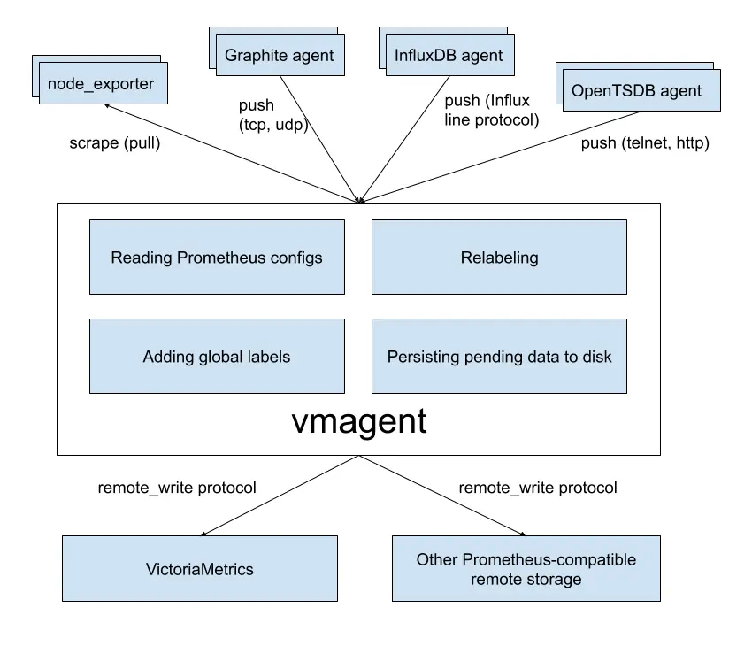

# VictoriaMetrics

VictoriaMetrics is a high-performance time-series database that is well-suited for Kubernetes monitoring and analytics. It offers several advantages over [Prometheus](../prometheus/), including:

- Superior scalability and performance
- Long-term storage capabilities
- Seamless integration with Kubernetes
- Anomaly detection

## Reading

- [VictoriaMetrics - A Comprehensive Guide](https://medium.com/@seifeddinerajhi/victoriametrics-a-comprehensive-guide-comparing-it-to-prometheus-and-implementing-kubernetes-03eb8feb0cc2)

## `vmagent`

`vmagent` is a tiny agent which helps you collect metrics from various sources, [relabel and filter the collected metrics](https://docs.victoriametrics.com/vmagent.html#relabeling) and store them in VictoriaMetrics or any other storage systems via Prometheus remote_write protocol or via VictoriaMetrics remote_write protocol.

