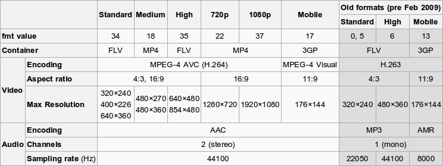

# `ffmpeg`

Based on personal experience & this HN thread https://news.ycombinator.com/item?id=26746537

## Videos

### Video to GIF

```shell
# https://github.com/silvansky/macscripts/blob/master/togif.sh
_togif.sh <input.mp4> <output.gif> <width> <fps>_
```
or

```shell
filters="fps=$4,scale=$3:-1:flags=lanczos"
ffmpeg -v warning -i $1 -vf "%filters%,palettegen" -y palette.png
ffmpeg -v warning -i $1 -i palette.png -lavfi "$filters% \[x\]; \[x\]\[1:v\] paletteuse" -y $2
unlink palette.png
```

### Resize / Autoscale

```shell
# autoscale to WxH with black bands:
ffmpeg -i example.mp4  -vf "scale=W:H:force_original_aspect_ratio=decrease,pad=W:H:(ow-iw)/2:(oh-ih)/2" out.mp4

# target size:
ffmpeg -i example.mp4 -s 1920x1080 out.mp4

# aspect ratio without recompressing:
ffmpeg -i example.mp4 -aspect 16:9 out.mp4
```


### Concatenation

_files.txt_ format: `file 'filepath'`

```
# concatenate mp4 without recompressing:
ffmpeg -f concat -safe 0 -i files.txt -c copy -movflags +faststart
```

### Rotating

Rotation Types (`-vf`)

  * `0` - 90CounterCLockwise and Vertical Flip (default)
  * `1` - 90Clockwise
  * `2` - 90CounterClockwise
  * `3` - 90Clockwise and Vertical Flip

  ```shell
  # rotating video
  ffmpeg -i example.mp4 -vf "transpose=1" out.mp4

  # rotate without recompressing:
  ffmpeg -i example.mp4 -metadata:s:v rotate="90" out.mp4
  ```

## Audio

```shell

# Extract audio from a video (simple)
ffmpeg -i my_input_video_file.mp4 my_output_audio_only.wav
# Extract sound from video to mp3
ffmpeg -i example.mp4  -vn -ar 44100 -ac 2 -ab 192k -f mp3 sound.mp3
# audio aac two channels:
ffmpeg -i input.mp4 -c:a aac -b:a 160k -ac 2 out.mp4
# ringtone
ffmpeg -i input.mp4  -ac 1 -b:a 128k -f mp4 -c:a aac -t 29.99 -y out.m4r"
```

### Create video list into audiobook

  https://gist.github.com/butuzov/fa7d456ebc3ec0493c0a10b73800bf42#comments


## Streams

### Extract specific video and audio stream

  `ffmpeg -i "path\to\my_input_video_file.mp4" -map 0:0 -c copy video.mp4 -map 0:1 -c copy audio0.m4a -map 0:2 -c copy audio1.m4a`

## Convert

```shell
# to H.264
ffmpeg -i example.mp4 -c:v libx264 -preset medium -crf 22 out.mp4

# Convert 10-bit H.265 to 10-bit H.264
ffmpeg -i input.mp4-c:v libx264 -crf 18 -c:a copy output.mkv

#  Convert 10-bit H.265 to 8-bit H.264
ffmpeg -i input -c:v libx264 -crf 18 -vf format=yuv420p -c:a copy output.mkv

# to h.265
ffmpeg -i example.mp4 -c:v libx265 -preset medium -crf 26 out.mp4

# Convert 10-bit H.265 to 8-bit H.265
ffmpeg -i input -c:v libx265 -vf format=yuv420p -c:a copy output.mkv
```


### Timers

```shell
# Skip time
ffmpeg -i example.mp4 -ss 00:05:00 out.mp4

# Stop after
ffmpeg -i example.mp4 -t 00:05:00 out.mp4

# Approx fast seek (place before input file):
ffmpeg -i example.mp4 -ss 00:05:00 -noaccurate_seek out.mp4
```

### Mass Convert
```for file in *.mp4; do ffmpeg -i "$file" "out/$file"; done```

### `h264`:
```ffmpeg -i example.mp4 -c:v libx264 -preset medium -crf 22 out.mp4 ```

### `h265`:
```ffmpeg -i example.mp4 -c:v libx265 -preset medium -crf 26 out.mp4 ```

### No recompress

```ffmpeg -i example.mp4 -c copy out.mp4 ```

### Convert with Presets

* ultrafast
* superfast
* faster
* fast
* medium
* slow
* slower
* veryslow

```shell
# web fast start:
ffmpeg -i example.mp4 -movflags +faststart out.mp4
```


## Misc

### Youtube Supported Formats



### Get jpeg snapshot

```
ffmpeg -i example.mp4 -vframes 1 -q:v 2 dest.jpg out.mp4
```

### Metadata

```shell
# global metadata
ffmpeg -i example.mp4 -metadata title="xx" out.mp4
ffmpeg -i example.mp4 -metadata description="xx" out.mp4
ffmpeg -i example.mp4 -metadata comment="xx" out.mp4
# info
ffprobe -v quiet -print_format xml -show_format -show_streams "filepath" > file.xml
```

### Disposition

If override which sub track is default, use "-default_mode infer_no_subs"

```shell
# clear disposition (default sub):
ffmpeg -i example.mp4 -disposition:s 0 out.mp4

# default or forced disposition:
ffmpeg -i example.mp4 -disposition:s forced out.mp4

# track metadata (audio):
ffmpeg -i example.mp4 -metadata:s:a title="xx" out.mp4

# track metadata (video):
ffmpeg -i example.mp4 -metadata:s:v title="xx" out.mp4
```
