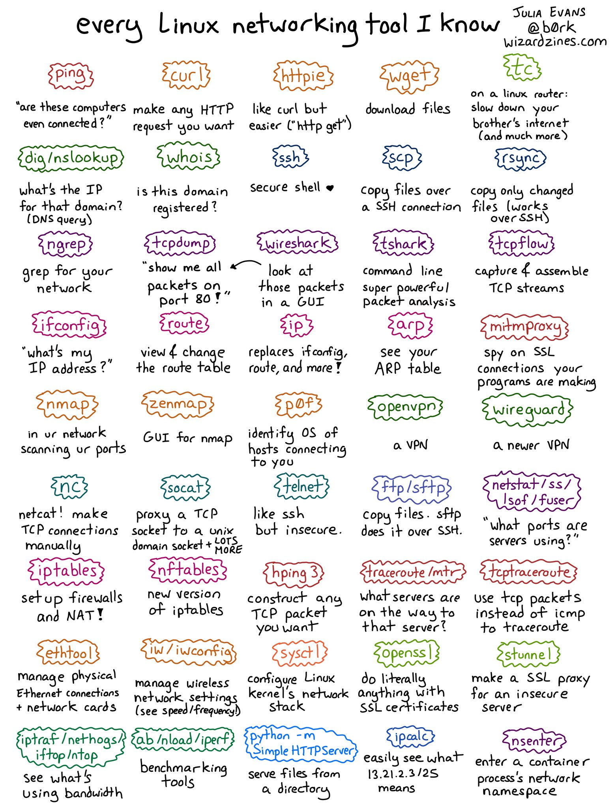
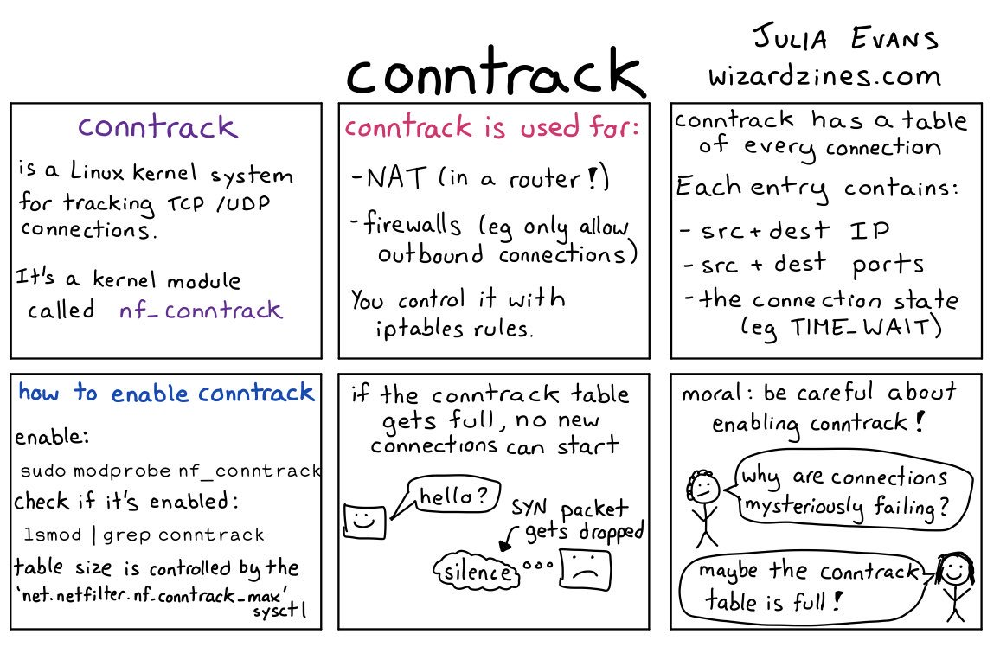

<!-- menu: Networking -->
# Network Shell Commands

* [arpwatch](https://linux.die.net/man/8/arpwatch) - Ethernet Activity Monitor.
* [bmon](https://github.com/tgraf/bmon) - bandwidth monitor and rate estimator.
* [bwm-ng](https://www.gropp.org/?id=projects&amp;sub=bwm-ng) - live network bandwidth monitor.
* [curl](./#curl) - transferring data with URLs.
* [httpie.org](https://httpie.org/)
* [darkstat](https://unix4lyfe.org/darkstat/) – captures network traffic, usage statistics.
* [dhclient](https://linux.die.net/man/8/dhclient) -  – Dynamic Hostµ Configuration Protocol Client
* [dig](https://linux.die.net/man/1/dig) - query DNS servers for information.
* [dstat](https://github.com/dagwieers/dstat) - replacement for vmstat, iostat, mpstat, netstat and ifstat.
* [ethtool](https://mirrors.edge.kernel.org/pub/software/network/ethtool/) - utility for controlling network drivers and hardware.
* [gated](https://www.oreilly.com/library/view/linux-in-a/0596000251/re101.html) -  – gateway routing daemon.
* [host](https://linux.die.net/man/1/host) -  – DNS lookup utility.
* [hping](http://www.hping.org/) -  – TCP/IP packet assembler/analyzer.
* [ibmonitor](http://ibmonitor.sourceforge.net/) - shows bandwidth and total data transferred.
* [ifstat](http://gael.roualland.free.fr/ifstat/) - &nbsp;report network interfaces bandwidth.
* [iftop](http://www.ex-parrot.com/pdw/iftop/) - &nbsp;– display bandwidth usage.
* [ip](https://access.redhat.com/sites/default/files/attachments/rh_ip_command_cheatsheet_1214_jcs_print.pdf) - &nbsp;(PDF file) –&nbsp;a&nbsp;command&nbsp;with more features that ifconfig (net-tools).
* [ipcalc] - ipnetwork calculator.
* [iperf3](https://github.com/esnet/iperf) -  – network bandwidth measurement tool. (above screenshot <a href="https://stacklinux.com/" target="_blank" rel="noopener">Stacklinux VPS</a>)
* [iproute2](https://wiki.linuxfoundation.org/networking/iproute2) - collection of utilities for controlling&nbsp;TCP/IP.
* [iptables](https://netfilter.org/) -  – take control of network traffic.
* [IPTraf](http://iptraf.seul.org/) - &nbsp;– An IP Network Monitor.
* [iputils](https://wiki.linuxfoundation.org/networking/iputils) - set of small useful utilities for Linux networking.
* [iw](https://wireless.wiki.kernel.org/en/users/documentation/iw) - nl80211&nbsp;based CLI configuration utility for wireless devices.
* [jwhois](https://www.gnu.org/software/jwhois/) - &nbsp;(whois) –&nbsp;client for the whois service.
* [“lsof -i”](https://www.novell.com/coolsolutions/tip/18078.html) -  – reveal information about your network sockets.
* [mtr](http://www.bitwizard.nl/mtr/) - network diagnostic tool.
* [mosh](https://mosh.org/)
* [net-tools](http://net-tools.sourceforge.net/) - tool, iptunnel and ipmaddr.
* [ncat](https://nmap.org/ncat/) - improved re-implementation of the venerable netcat.
* [netcat](http://nc110.sourceforge.net/) -  – networking utility for reading/writing network connections.
* [nethogs](https://github.com/raboof/nethogs) - a small ‘net top’ tool.
* [Netperf](https://github.com/HewlettPackard/netperf) - &nbsp;– Network bandwidth Testing.
* [netsniff-ng](http://netsniff-ng.org/) -  – Swiss army knife for daily Linux network plumbing.
* [netstat](http://net-tools.sourceforge.net/man/netstat.8.html) -  – Print network connections, routing tables, statistics, etc.
* [netwatch](http://www.slctech.org/~mackay/NETWATCH/netwatch.html) - monitoring Network Connections.
* [ngrep](https://github.com/jpr5/ngrep/) - grep applied to the network layer.
* [nload](https://linux.die.net/man/1/nload) -  – display network usage.
* [nmap](https://nmap.org/) - network discovery and security auditing.
* [nmcli](https://developer.gnome.org/NetworkManager/stable/nmcli.html) - a command-line tool for controlling NetworkManager and reporting network status.
* [nmtui](https://access.redhat.com/documentation/en-US/Red_Hat_Enterprise_Linux/7/html/Networking_Guide/sec-Networking_Config_Using_nmtui.html) - provides a text interface to configure networking by controlling NetworkManager.
* [nslookup](https://en.wikipedia.org/wiki/Nslookup) - query Internet name servers interactively.
* [ping](https://en.wikipedia.org/wiki/Ping_(networking_utility)) - send icmp echo_request to network hosts.
* [route](https://en.wikipedia.org/wiki/Route_(command)) - show / manipulate the IP routing table.
* [slurm](https://github.com/mattthias/slurm) -  – network load monitor.
* [snort](https://www.snort.org/) -  – Network Intrusion Detection and Prevention System.
* [smokeping](https://oss.oetiker.ch/smokeping/) - &nbsp;keeps track of your network latency.
* [socat](http://www.dest-unreach.org/socat/) - establishes two bidirectional byte streams and transfers data between them.
* [speedometer](http://excess.org/speedometer/) - Measure and display the rate of data across a network.
* [speedtest-cli](https://github.com/sivel/speedtest-cli) -  – test internet bandwidth using speedtest.net
* [ss](http://linux-ip.net/gl/ss/) - utility to investigate sockets.
* [ssh](https://www.ssh.com/ssh/) - &nbsp;secure system administration and file transfers over insecure networks.
* [tcpdump](https://www.tcpdump.org/) - command-line packet analyzer.
* [tcptrack](https://github.com/bchretien/tcptrack) -  – Displays information about tcp connections on a network interface.
* [telnet](https://www.unix.com/man-page/linux/1/telnet/) - user interface to the TELNET protocol.
* [tracepath](https://linux.die.net/man/8/tracepath) - very similar function to traceroute.
* [traceroute](http://traceroute.sourceforge.net/) - print the route packets trace to network host.
* [vnStat](https://humdi.net/vnstat/) - &nbsp;– network traffic monitor.
* [websocat](https://github.com/vi/websocat) - &nbsp;– Connection forwarder from/to web sockets to/from usual sockets, in style of socat.
* [wget](../other/wget/) - &nbsp;retrieving files using HTTP, HTTPS, FTP and FTPS.
* [Wireless Tools for Linux](https://hewlettpackard.github.io/wireless-tools/Tools.html) - iwconfig,&nbsp;iwlist,&nbsp;iwspy,&nbsp;iwpriv and&nbsp;ifrename.
* [Wireshark](https://www.wireshark.org/) - network protocol analyzer.
 



## `TODO`: `conntrack`



## `curl`

Transfer a URL.

- `go` https://mholt.github.io/curl-to-go/
- `python` https://pypi.org/project/requests-to-curl/

`curl`  is  a  tool  to  transfer  data from or to a server, using one of the supported protocols (DICT, FILE, FTP, FTPS, GOPHER, HTTP, HTTPS, IMAP, IMAPS, LDAP, LDAPS, POP3, POP3S, RTMP, RTSP, SCP, SFTP, SMB, SMBS, SMTP, SMTPS,  TELNET  and TFTP). The command is designed to work without user interaction.
 


```bash
# aliased curl download
dl="curl -LO $URL"

# save files as
curl -L $URL -o $FILE

# keep it silent
curl -Ls $URL -o $FILE
```

## `iptables`


## `mrt`

A network diagnostic tool

```bash
mrt
mrt --udp
mrt --tcp
mrt --sctp
```

## `TODO`: `nc`


## `TODO`: `traceroute`

## `TODO`: `tshark`

Wireshark CLI


## `TODO`: `tc`


## `TODO`: `socat`

Proxy any two things 


## `ss`


## `ssh` Secure Shell

SSH, also known as Secure Shell or Secure Socket Shell, is a network protocol that gives users, particularly system administrators, a secure way to access a computer over an unsecured network.

### `ssh`

```bash
# ssh into <hostname> using <user> and its private key (-i)
ssh <user>@<hostname> -i ~/.ssh/id_rsa
# ssh and run command & exit!
ssh <user>@<hostname>  uname -a
# ssh and run command (with quotes) & exit!
ssh <user>@<hostname>  'echo "This is cool"'
# opens secret tunnel!
ssh <user>@<hostname> -Nfl 3000:localhost:8080
# bastion ssh
ssh <user>@<hostname> "ssh <user>@<internal.hostname> 'echo 1'"
```

### `ssh-keygen`

Authentication key generation, management and conversion

```bash
# Removes keys from hostname
ssh-keygen -R <hostname>
# Generates Keys
ssh-keygen -t ed25519 -C "example@example.com" -f ./infra/ssh_key
```

### `ssh-copy-id`

Copy public key onto host.

```bash
ssh-copy-id -i ~/.ssh/id_rsa.pub <user>@<hostname>
# if no ssh-copy-id - we can use this shortcut.
cat ~/.ssh/id_rsa.pub | ssh <user>@<hostname> 'cat >> ~/.ssh/authorized_keys'
```


### `ssh-agent`

The ssh-agent is a helper program that keeps track of users' identity keys and their passphrases.

```shell
# If ssh-agent is not automatically started at login, it can be started manually with the command
eval `ssh-agent`
#The easiest way to check is to check the value of the SSH_AGENT_SOCK environment variable.
# If it is set, then the agent is presumably running. It can be checked by
echo $SSH_AGENT_SOCK
```

### `ssh-add`

To add an arbitrary private key, give the path of the key file as an argument to `ssh-add`

```shell
ssh-add ~/.ssh/id_rsa
```

### `scp`

`scp` is a program for copying files between computers.

```shell
# scp [options] <user>@<src-host>:dir/file <user>@<dst-host>:dir/file
ssh <user>@<hostname> "scp <user>@<internal.hostname>:~/src.tar.gz ~/dst.tar.gz"
# The bandwidth is specified in Kbit/sec - so this is 1mb per sec (its 20 mb persec by default)
scp -l 8000 <user>@<hostname>:/home/user/* .
# copy todo.txt into /home/user
scp ~/todo.txt <user>@<hostname>:/home/user/
# recursive copy
scp -r ~/dir <user>@<hostname>:~/dir

```

### `pscp` (windows)

`pscp` is a shell command that works almost on Windows Shell the same way that scp works on Linux or Mac OS X


### `sshd_config`

The `sshd_config` file is an ASCII text based file where the different configuration options of the SSH server are indicated and configured with keyword/argument pairs. Arguments that contain spaces are to be enclosed in double quotes (").

```conf
Port                   2278                    # port
PermitRootLogin        no                      # no root login
PasswordAuthentication no                      # turn off - passwords
PubkeyAuthentication   yes                     # turn on  - ssh keys only
AuthorizedKeysFile     %h/.ssh/authorized_keys # Public Keys location
```


- [ssh.com: What is SSH (Secure Shell)](https://www.ssh.com/academy/ssh)
- [ssh.com: How to Configure the OpenSSH Server?](https://www.ssh.com/academy/ssh/sshd_config)
