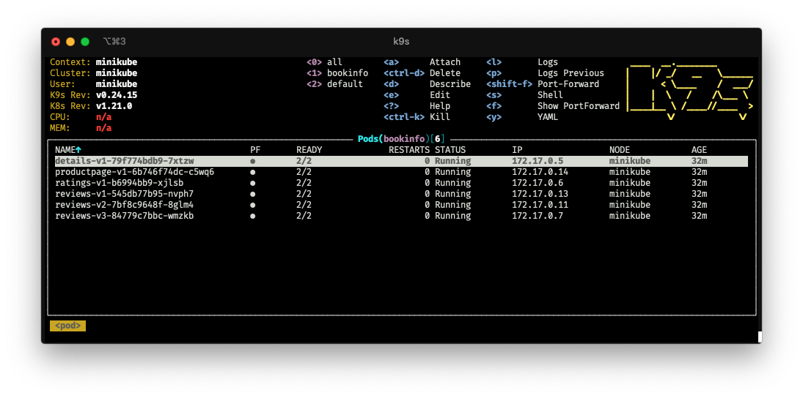
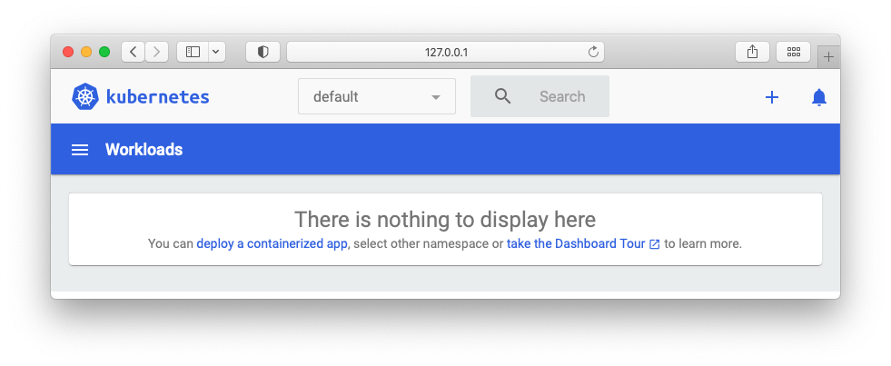
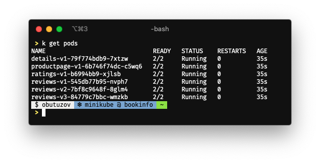
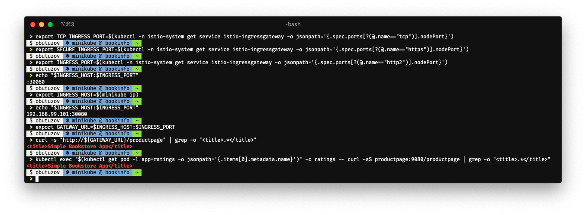
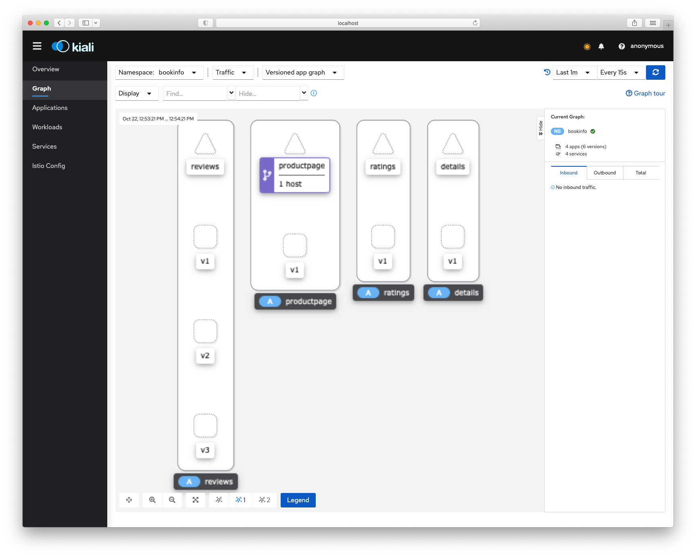
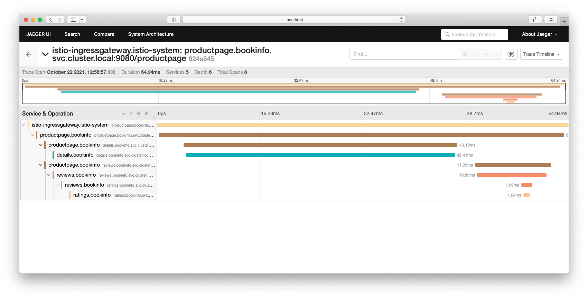

# Setting up environment

<h1>Table of Contents<span class="tocSkip"></span></h1>
<div class="toc"><ul class="toc-item"><li><span><a href="#Setup-local-Kubernetes-instance" data-toc-modified-id="Setup-local-Kubernetes-instance-1"><span class="toc-item-num">1&nbsp;&nbsp;</span>Setup local Kubernetes instance</a></span></li><li><span><a href="#Install-k8S-Client-k9s" data-toc-modified-id="Install-k8S-Client-k9s-2"><span class="toc-item-num">2&nbsp;&nbsp;</span>Install <code>k8S</code> Client <code>k9s</code></a></span></li><li><span><a href="#Install-Kubernetes-Dashboard" data-toc-modified-id="Install-Kubernetes-Dashboard-3"><span class="toc-item-num">3&nbsp;&nbsp;</span>Install Kubernetes Dashboard</a></span></li><li><span><a href="#Install-Istio" data-toc-modified-id="Install-Istio-4"><span class="toc-item-num">4&nbsp;&nbsp;</span>Install Istio</a></span><ul class="toc-item"><li><span><a href="#Deploy-Bookinfo" data-toc-modified-id="Deploy-Bookinfo-4.1"><span class="toc-item-num">4.1&nbsp;&nbsp;</span>Deploy <a href="https://istio.io/latest/docs/examples/bookinfo/" target="_blank">Bookinfo</a></a></span></li><li><span><a href="#Enable-Kiali" data-toc-modified-id="Enable-Kiali-4.2"><span class="toc-item-num">4.2&nbsp;&nbsp;</span>Enable <a href="https://istio.io/latest/docs/ops/integrations/kiali/" target="_blank"><code>Kiali</code></a></a></span></li><li><span><a href="#Configure-Jaegar-tracing" data-toc-modified-id="Configure-Jaegar-tracing-4.3"><span class="toc-item-num">4.3&nbsp;&nbsp;</span>Configure <a href="https://istio.io/docs/tasks/observability/distributed-tracing/jaeger/" target="_blank">Jaegar</a> tracing</a></span></li></ul></li><li><span><a href="#Reading" data-toc-modified-id="Reading-5"><span class="toc-item-num">5&nbsp;&nbsp;</span>Reading</a></span></li></ul></div>

## Setup local Kubernetes instance 

```
> minikube start
😄  minikube v1.22.0 on Darwin 10.15.7
❗  Kubernetes 1.21.0 has a known performance issue on cluster startup. It might take 2 to 3 minutes for a cluster to start.
❗  For more information, see: https://github.com/kubernetes/kubeadm/issues/2395
🆕  Kubernetes 1.21.2 is now available. If you would like to upgrade, specify: --kubernetes-version=v1.21.2
🎉  minikube 1.23.2 is available! Download it: https://github.com/kubernetes/minikube/releases/tag/v1.23.2
💡  To disable this notice, run: 'minikube config set WantUpdateNotification false'

✨  Using the virtualbox driver based on existing profile
👍  Starting control plane node minikube in cluster minikube
🔄  Restarting existing virtualbox VM for "minikube" ...
🐳  Preparing Kubernetes v1.21.0 on Docker 20.10.6 ...
🔎  Verifying Kubernetes components...
    ▪ Using image gcr.io/k8s-minikube/storage-provisioner:v5
    ▪ Using image kubernetesui/dashboard:v2.1.0
    ▪ Using image kubernetesui/metrics-scraper:v1.0.4
🌟  Enabled addons: storage-provisioner, default-storageclass, dashboard
🏄  Done! kubectl is now configured to use "minikube" cluster and "default" namespace by default
```

## Install `k8S` Client `k9s`

```shell
> brew install k9s
==> Downloading https://ghcr.io/v2/homebrew/core/k9s/manifests/0.24.15_1
######################################################################## 100.0%
==> Downloading https://ghcr.io/v2/homebrew/core/k9s/blobs/sha256:19e1a184b7f609
==> Downloading from https://pkg-containers.githubusercontent.com/ghcr1/blobs/sh
######################################################################## 100.0%
==> Pouring k9s--0.24.15_1.catalina.bottle.tar.gz
==> Caveats
Bash completion has been installed to:
  /usr/local/etc/bash_completion.d
==> Summary
🍺  /usr/local/Cellar/k9s/0.24.15_1: 9 files, 64.9MB
```



## Install Kubernetes Dashboard

```
minikube dashboard
```



## Install Istio

```
> brew isntall instioctl
...
> istioctl install --set profile=demo
This will install the Istio 1.11.3 demo profile with ["Istio core" "Istiod" "Ingress gateways" "Egress gateways"] components into the cluster. Proceed? (y/N) y
✔ Istio core installed
✔ Istiod installed
✔ Ingress gateways installed
✔ Egress gateways installed
✔ Installation complete
Thank you for installing Istio 1.11.  Please take a few minutes to tell us about your install/upgrade experience!  https://forms.gle/kWULBRjUv7hHci7T6


 > kubectl get pods -n istio-system
NAME                                   READY   STATUS    RESTARTS   AGE
istio-egressgateway-7ddb45fcdf-2l7qz   1/1     Running   0          2m14s
istio-ingressgateway-f7cdcd7dc-s8m6w   1/1     Running   0          2m14s
istiod-788ff675dd-mgwpg                1/1     Running   0          1m14s

```

### Deploy [Bookinfo](https://istio.io/latest/docs/examples/bookinfo/)


1. `kubectl create namespace bookinfo`
1. `kuse ns bookinfo` (switch to bookinfo namespace) 
1. `kubectl label namespace bookinfo istio-injection=enabled`
1. `kubectl apply -f https://raw.githubusercontent.com/istio/istio/release-1.11/samples/bookinfo/platform/kube/bookinfo.yaml -n bookinfo`




5. [expose gateway](https://istio.io/latest/docs/tasks/traffic-management/ingress/ingress-control/#determining-the-ingress-ip-and-ports)
   - 5.0. `kubectl apply -f https://raw.githubusercontent.com/istio/istio/release-1.11/samples/bookinfo/networking/bookinfo-gateway.yaml`
   - 5.1. `kubectl get gateway`
   - 5.2. `kubectl get svc istio-ingressgateway -n istio-system`


```shell
> export INGRESS_PORT=$(kubectl -n istio-system get service istio-ingressgateway -o jsonpath='{.spec.ports[?(@.name=="http2")].nodePort}')
> export SECURE_INGRESS_PORT=$(kubectl -n istio-system get service istio-ingressgateway -o jsonpath='{.spec.ports[?(@.name=="https")].nodePort}')
> export TCP_INGRESS_PORT=$(kubectl -n istio-system get service istio-ingressgateway -o jsonpath='{.spec.ports[?(@.name=="tcp")].nodePort}')
> export INGRESS_HOST=$(minikube ip)
```



### Enable [`Kiali`](https://istio.io/latest/docs/ops/integrations/kiali/) 

```shell
> k apply -f https://raw.githubusercontent.com/istio/istio/release-1.11/samples/addons/kiali.yaml
serviceaccount/kiali created
configmap/kiali created
clusterrole.rbac.authorization.k8s.io/kiali-viewer created
clusterrole.rbac.authorization.k8s.io/kiali created
clusterrolebinding.rbac.authorization.k8s.io/kiali created
role.rbac.authorization.k8s.io/kiali-controlplane created
rolebinding.rbac.authorization.k8s.io/kiali-controlplane created
service/kiali created
deployment.apps/kiali created

> k apply -f https://raw.githubusercontent.com/istio/istio/release-1.11/samples/addons/prometheus.yaml
serviceaccount/prometheus created
configmap/prometheus created
clusterrole.rbac.authorization.k8s.io/prometheus created
clusterrolebinding.rbac.authorization.k8s.io/prometheus created
service/prometheus created
deployment.apps/prometheus created

> k get pods -n istio-system
NAME                                   READY   STATUS    RESTARTS   AGE
istio-egressgateway-7ddb45fcdf-2l7qz   1/1     Running   6          9m34s
istio-ingressgateway-f7cdcd7dc-s8m6w   1/1     Running   6          9m34s
istiod-788ff675dd-mgwpg                1/1     Running   6          9m34s
kiali-fd9f88575-gdhvj                  1/1     Running   0          4m16s
prometheus-77b49cb997-bwwnc            2/2     Running   0          63s

```


https://istio.io/latest/docs/tasks/observability/kiali/

```
istioctl dashboard kiali
```



### Configure [Jaegar](https://istio.io/docs/tasks/observability/distributed-tracing/jaeger/) tracing

```shell
# install  https://istio.io/latest/docs/ops/integrations/jaeger/
> kubectl apply -f https://raw.githubusercontent.com/istio/istio/release-1.11/samples/addons/jaeger.yaml
deployment.apps/jaeger created
service/tracing created
service/zipkin created
service/jaeger-collector created
# guide at https://istio.io/latest/docs/tasks/observability/distributed-tracing/jaeger/
> for i in $(seq 1 100); do curl -s -o /dev/null "http://$GATEWAY_URL/productpage"; done
> istioctl dashboard jaeger
```



## Reading 

- https://istio.io/latest/about/service-mesh/
- https://docs.microsoft.com/en-us/azure/architecture/patterns/sidecar
- https://docs.microsoft.com/en-us/azure/architecture/patterns/ambassador