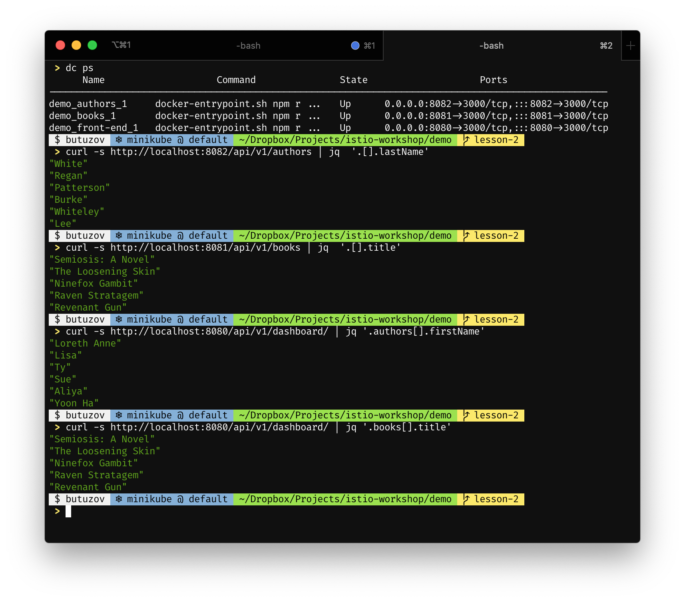
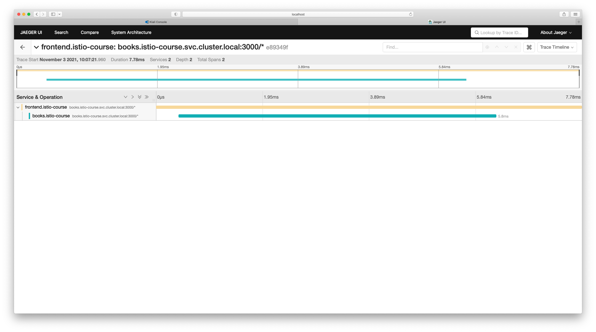
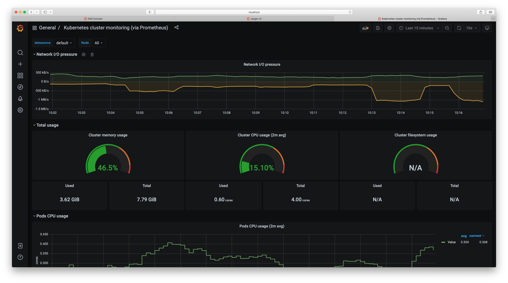
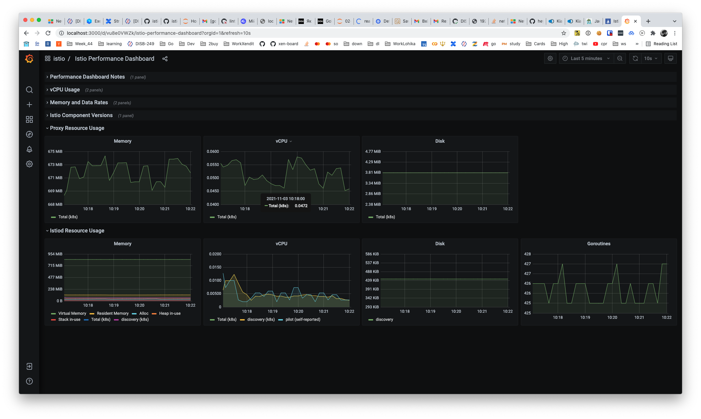
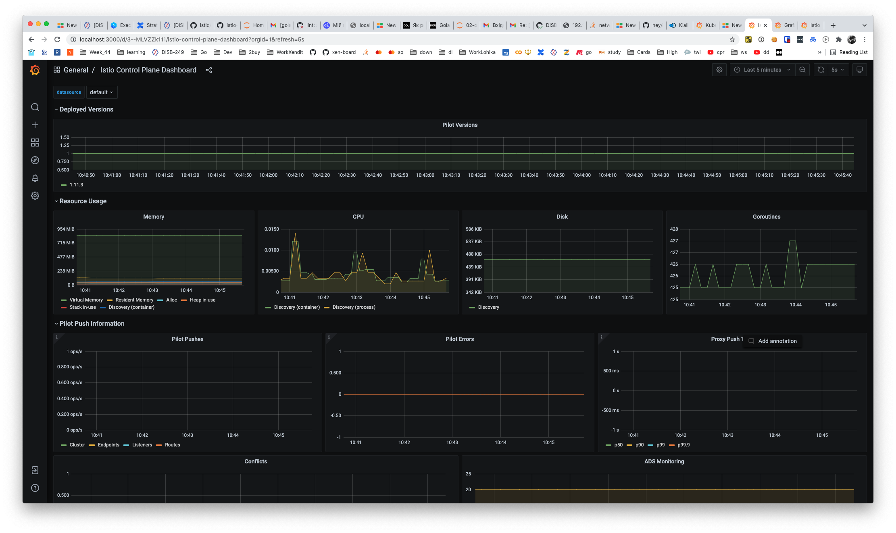

<h1>Logging, Monitoring &amp; Traicing<span class="tocSkip"></span></h1>
<div class="toc"><ul class="toc-item"><li><span><a href="#Demo-Deployment" data-toc-modified-id="Demo-Deployment-1"><span class="toc-item-num">1&nbsp;&nbsp;</span>Demo Deployment</a></span><ul class="toc-item"><li><span><a href="#v1---TypeScript" data-toc-modified-id="v1---TypeScript-1.1"><span class="toc-item-num">1.1&nbsp;&nbsp;</span><code>v1</code> - TypeScript</a></span></li><li><span><a href="#v2---Go" data-toc-modified-id="v2---Go-1.2"><span class="toc-item-num">1.2&nbsp;&nbsp;</span><code>v2</code> - Go</a></span></li><li><span><a href="#docker-compose.yaml" data-toc-modified-id="docker-compose.yaml-1.3"><span class="toc-item-num">1.3&nbsp;&nbsp;</span><code>docker-compose.yaml</code></a></span></li></ul></li><li><span><a href="#Deploying-Application-to-the-local-kubernetes-cluster" data-toc-modified-id="Deploying-Application-to-the-local-kubernetes-cluster-2"><span class="toc-item-num">2&nbsp;&nbsp;</span>Deploying Application to the local kubernetes cluster</a></span></li><li><span><a href="#Observability-with-Istio" data-toc-modified-id="Observability-with-Istio-3"><span class="toc-item-num">3&nbsp;&nbsp;</span>Observability with Istio</a></span><ul class="toc-item"><li><span><a href="#Kiali" data-toc-modified-id="Kiali-3.1"><span class="toc-item-num">3.1&nbsp;&nbsp;</span><a href="https://istio.io/latest/docs/ops/integrations/kiali/" target="_blank">Kiali</a></a></span></li><li><span><a href="#Jaeger" data-toc-modified-id="Jaeger-3.2"><span class="toc-item-num">3.2&nbsp;&nbsp;</span><a href="https://istio.io/latest/docs/ops/integrations/jaeger/" target="_blank">Jaeger</a></a></span></li><li><span><a href="#Grafana" data-toc-modified-id="Grafana-3.3"><span class="toc-item-num">3.3&nbsp;&nbsp;</span><a href="https://istio.io/latest/docs/ops/integrations/grafana/" target="_blank">Grafana</a></a></span></li></ul></li><li><span><a href="#Reading" data-toc-modified-id="Reading-4"><span class="toc-item-num">4&nbsp;&nbsp;</span>Reading</a></span></li></ul></div>

## Demo Deployment

We are working with a microservice basd application written in **typescript** with next architecture, with a goal in mind to improve it (we will switch to **go** based microservices while learnig istio).


### `v1` - TypeScript


We going to use legacy microservices written in typescript on first itteration of our start up, but we can't deploy it, so we will change it a bit so our developers can start working, now!

**`Docekrfile`**

Changing existing Dockerfiles so build env can be self containd.

```diff
- ENV NODE_ENV production
...

- ADD package*.json /home/node/
- Add dist/ /home/node/dist/
+ ADD . /home/node/
+ RUN npm install && npm run build
+ ENV NODE_ENV production
```

Also: all microservice applciations are now supports custom to be run on custom port.

**`frontend`** service

minor tweaks to frontend service so we can can customize URL of dependand services later if needed.

```diff
- export const authorsBaseUrl = 'http://authors:3000/api/v1';
- export const booksBaseUrl ='http://books:3000/api/v1';
+ export const authorsBaseUrl = process.env.URL_BASE_AUTHORS || 'http://authors:3000/api/v1';
+ export const booksBaseUrl = process.env.URL_BASE_BOOKS || 'http://books:3000/api/v1';

```

**Pros**: 
- build proccess self containd
- can be easily demoed with docker-compse for a local style development.

**Cons**:
- Bigger image with additional artifacts

### `v2` - Go

We have rewrite out microservices with Go(lang)?, this help our team (me /s) to move faster, and make changes with more confidience.

**Pros**:
- smaller images
- fast on track development

**Cons**:
- none

###  `docker-compose.yaml`

```yaml
version: '3.7'

services:

  authors:
    image: butuzov/authors:v1
    build:
      context: ./services/authors/v1
      dockerfile: Dockerfile
    ports: [ 8082:3000 ]
    environment:
      PORT: 3000

  books:
    image: butuzov/books:v1
    build:
      context: ./services/books/v1
      dockerfile: Dockerfile
    ports: [ 8081:3000 ]
    environment:
      PORT: 3000

  front-end:
    image: butuzov/frontend:v1
    build:
      context: ./services/frontend/v1
      dockerfile: Dockerfile
    ports: [ 8080:3000 ]
    environment:
      PORT: 3000
      URL_BASE_AUTHORS: http://authors:3000/api/v1
      URL_BASE_BOOKS: http://books:3000/api/v1
    restart: on-failure
    depends_on:
    - "books"
    - "authors"

```


**Testing local artifacts**

In order to provide fast feedback loop to our developers (me) we going to use `docker-compose.yaml` for a images testing.

```shell
docker-compose up -d
docker-compose ps
curl -s http://localhost:8082/api/v1/authors | jq  '.[].lastName'
curl -s http://localhost:8081/api/v1/books | jq  '.[].title'
curl -s http://localhost:8080/api/v1/dashboard/ | jq '.authors[].firstName'
curl -s http://localhost:8080/api/v1/dashboard/ | jq '.books[].title'
```



Having docker-compose will laso allow up to shortcut local images created using `docker-compose build...` command

## Deploying Application to the local kubernetes cluster

```shell
./build-and-publish-images.sh
# as result 6 images published to docker hub.
# (typescript) butuzov/demoapp-authors:v1
# (go)         butuzov/demoapp-authors:v2
# (typescript) butuzov/demoapp-books:v1
# (go)         butuzov/demoapp-books:v2
# (typescript) butuzov/emoapp-frontend:v1
# (go)         butuzov/emoapp-frontend:v2
```

Deploying resources to Kubernetes

```shell
> k apply -f k8s/namespace.yaml
namespace/istio-course created
> k label namespace istio-course istio-injection=enabled
namespace/istio-course labeled
> k apply -f k8s/deployments/ 
service/authors created
serviceaccount/servicemesh-authors created
deployment.apps/authors-v1 created
deployment.apps/authors-v2 created
service/books created
serviceaccount/servicemesh-books created
deployment.apps/books-v1 created
deployment.apps/books-v2 created
service/frontend created
serviceaccount/servicemesh-frontend created
deployment.apps/frontend-v1 created
deployment.apps/frontend-v2 created
> k get pods,deployments,svc
NAME                               READY   STATUS    RESTARTS   AGE
pod/authors-v1-6c87dd847-wzkd2     2/2     Running   0          3m54s
pod/authors-v2-b95b8fc4f-llvh4     2/2     Running   0          3m53s
pod/books-v1-586bff9c8f-kzksd      2/2     Running   0          3m52s
pod/books-v2-69d6c56c99-bgkxx      2/2     Running   0          3m53s
pod/frontend-v1-598f55fdd7-8pz6p   2/2     Running   0          3m52s
pod/frontend-v2-b97dcd96f-l8cth    2/2     Running   0          3m52s

NAME                          READY   UP-TO-DATE   AVAILABLE   AGE
deployment.apps/authors-v1    1/1     1            1           3m54s
deployment.apps/authors-v2    1/1     1            1           3m54s
deployment.apps/books-v1      1/1     1            1           3m53s
deployment.apps/books-v2      1/1     1            1           3m53s
deployment.apps/frontend-v1   1/1     1            1           3m53s
deployment.apps/frontend-v2   1/1     1            1           3m53s

NAME               TYPE           CLUSTER-IP      EXTERNAL-IP   PORT(S)          AGE
service/authors    LoadBalancer   10.110.18.98    <pending>     3000:30051/TCP   3m54s
service/books      LoadBalancer   10.111.195.13   <pending>     3000:30667/TCP   3m54s
service/frontend   LoadBalancer   10.108.74.203   <pending>     3000:30791/TCP   3m53s
```

Adding Gateway

```bash
 > k apply -f k8s/gateway/course-ingress-controller.yml
Warning: networking.k8s.io/v1beta1 Ingress is deprecated in v1.19+, unavailable in v1.22+; use networking.k8s.io/v1 Ingress
ingress.networking.k8s.io/course-istio-gateway created

 > kubectl get ingress
NAME                   CLASS    HOSTS   ADDRESS   PORTS   AGE
course-istio-gateway   <none>   *                 80      29s
 > k apply -f k8s/gateway/course-gateway-controller.yml
gateway.networking.istio.io/course-frontend-gateway created
virtualservice.networking.istio.io/course-istio created
 > k get gateway
NAME                      AGE
course-frontend-gateway   6s
```

```shell
> export INGRESS_PORT=$(kubectl -n istio-system get service istio-ingressgateway -o jsonpath='{.spec.ports[?(@.name=="http2")].nodePort}')
> export INGRESS_HOST=$(minikube ip)
```

command

```
curl -s http://192.168.99.101:30080/frontend-catalog/api/v1/dashboard/
```

output 

```json
{"authors":[{"Id":"1","FirstName":"Loreth Anne","LastName":"White","Born":"South Africa"},{"Id":"2","FirstName":"Lisa","LastName":"Regan","Born":"USA"},{"Id":"3","FirstName":"Ty","LastName":"Patterson","Born":"USA"},{"Id":"4","FirstName":"Sue","LastName":"Burke","Born":"USA"},{"Id":"5","FirstName":"Aliya","LastName":"Whiteley","Born":"UK"},{"Id":"6","FirstName":"Yoon Ha","LastName":"Lee","Born":"USA"}],"books":[{"title":"Ninefox Gambit","authorId":"6","genres":["Novel","Science Fiction"]},{"title":"Raven Stratagem","authorId":"6","genres":["Science Fiction","Fantasy Fiction"]},{"title":"Revenant Gun","authorId":"6","genres":["Science Fiction","Adventure fiction"]},{"title":"Semiosis: A Novel","authorId":"South Africa","genres":["Novel","Science Fiction","Space opera","Hard science fiction"]},{"title":"The Loosening Skin","authorId":"5","genres":["Science Fiction"]}]}
```

## Observability with Istio

### [Kiali](https://istio.io/latest/docs/ops/integrations/kiali/)

```
k apply -f https://raw.githubusercontent.com/istio/istio/release-1.11/samples/addons/kiali.yaml
istioctl dashboard kiali &
hey http://192.168.99.101:30080/frontend-catalog/api/v1/dashboard/  
```


### [Jaeger](https://istio.io/latest/docs/ops/integrations/jaeger/)

```
k apply -f https://raw.githubusercontent.com/istio/istio/release-1.11/samples/addons/jaeger.yaml
istioctl dashboard jaeger &
http://localhost:16686
```




### [Grafana](https://istio.io/latest/docs/ops/integrations/grafana/)

```
k apply -f https://raw.githubusercontent.com/istio/istio/release-1.11/samples/addons/grafana.yaml
istioctl dashboard grafana &
http://localhost:3000
```








## Reading

1.	[Istio telemetry](https://istio.io/docs/tasks/observability/) 
2.	[Istio monitoring](https://istio.io/docs/tasks/observability/metrics/using-istio-dashboard/)
3.	[Kiali](https://kiali.io/docs/architecture/architecture/)
4.	[OpenTracing](https://opentracing.io/docs/overview/)