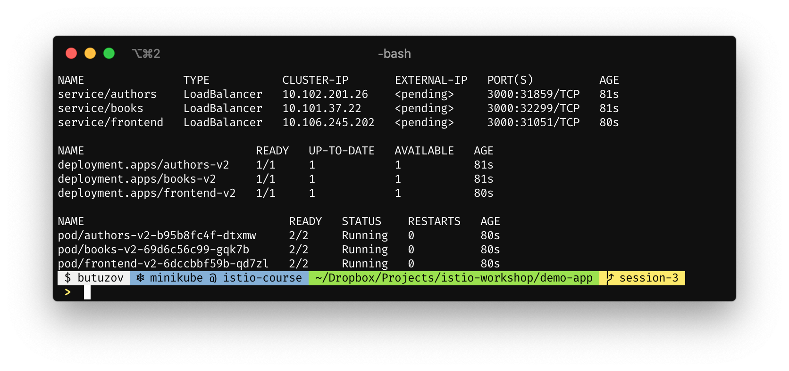
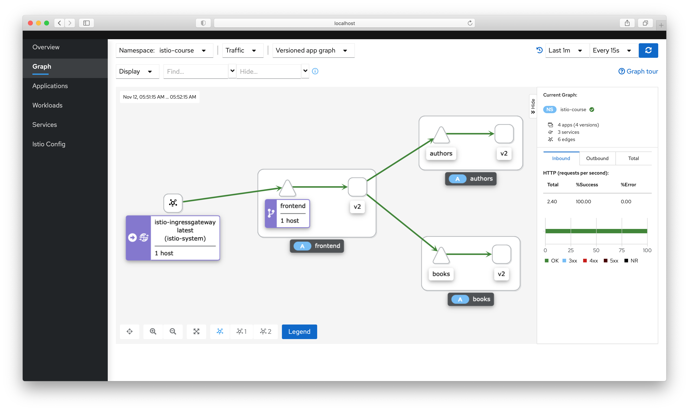
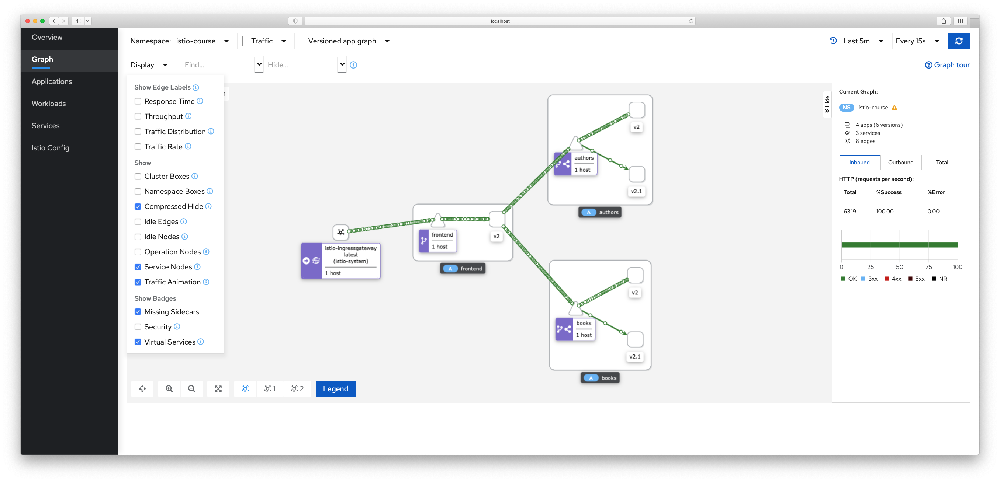
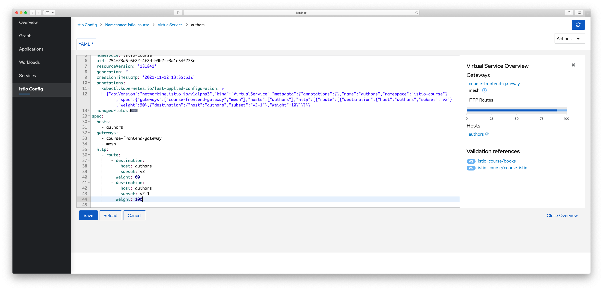
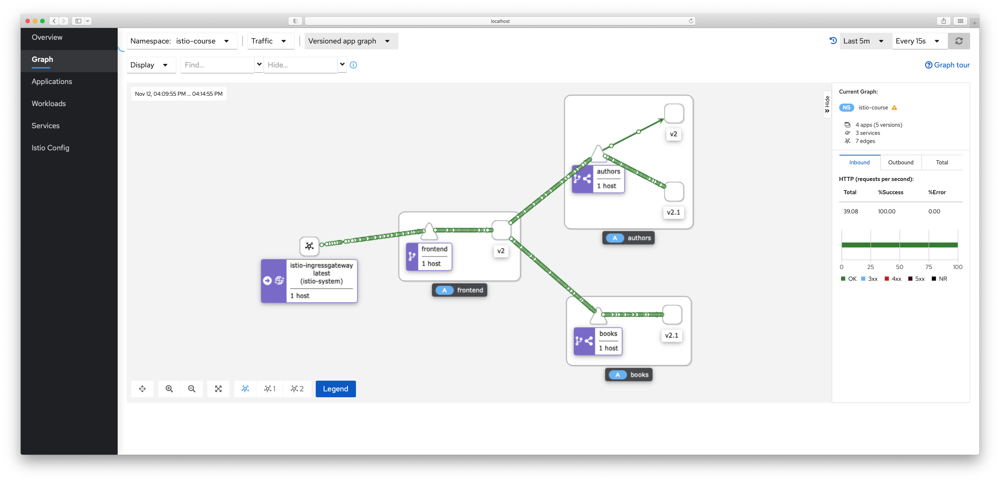
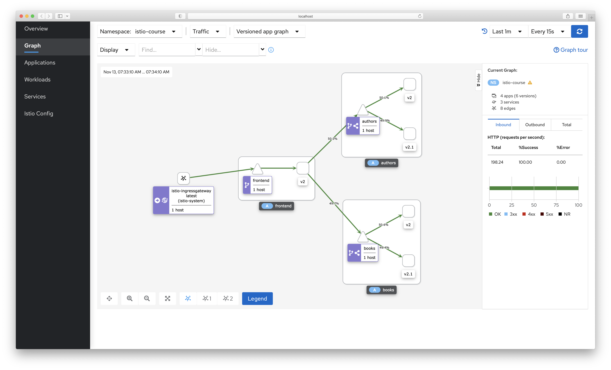
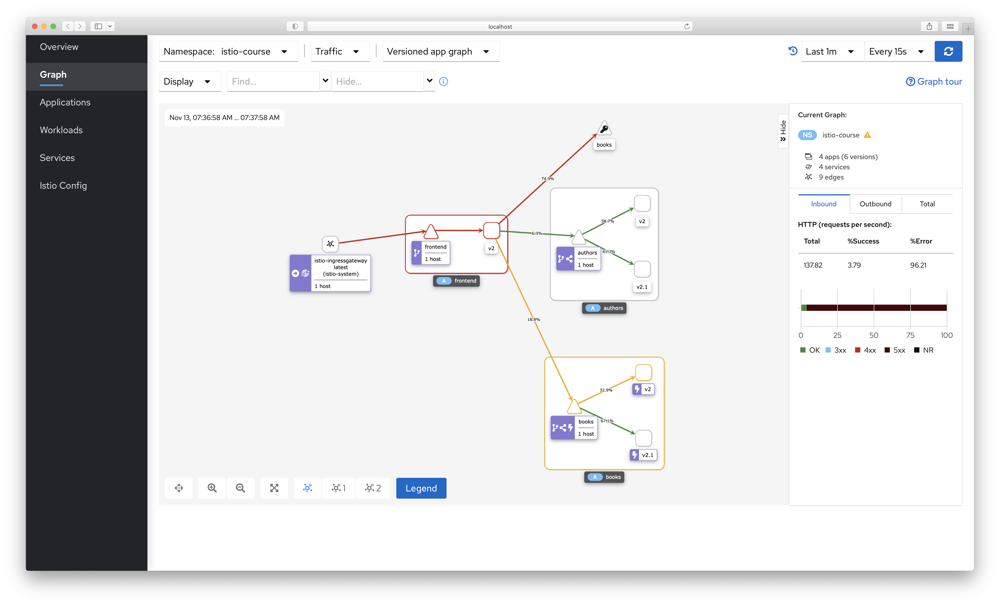

<h1>Traffic management<span class="tocSkip"></span></h1>
<div class="toc"><ul class="toc-item"><li><span><a href="#What-are-we-starting-with?" data-toc-modified-id="What-are-we-starting-with?-1">What are we starting with?</a></span></li><li><span><a href="#New-Version" data-toc-modified-id="New-Version-2">New Version</a></span></li><li><span><a href="#Canary-deployment" data-toc-modified-id="Canary-deployment-3">Canary deployment</a></span><ul class="toc-item"><li><span><a href="#Creating-DestinationRules" data-toc-modified-id="Creating-DestinationRules-3.1">Creating <code>DestinationRule</code>s</a></span></li><li><span><a href="#Creating-VirtualServices" data-toc-modified-id="Creating-VirtualServices-3.2">Creating <code>VirtualService</code>s</a></span></li></ul></li><li><span><a href="#Feature-Flags" data-toc-modified-id="Feature-Flags-4">Feature Flags</a></span><ul class="toc-item"><li><span><a href="#Results-of-traffic-splitting" data-toc-modified-id="Results-of-traffic-splitting-4.1">Results of traffic splitting</a></span></li></ul></li><li><span><a href="#Service-Resiliency" data-toc-modified-id="Service-Resiliency-5">Service Resiliency</a></span><ul class="toc-item"><li><span><a href="#Before-Circuit-Bracker" data-toc-modified-id="Before-Circuit-Bracker-5.1">Before Circuit Bracker</a></span></li><li><span><a href="#After-Circuit-Bracker" data-toc-modified-id="After-Circuit-Bracker-5.2">After Circuit Bracker</a></span></li></ul></li><li><span><a href="#TL/DR" data-toc-modified-id="TL/DR-6">TL/DR</a></span></li></ul></div>

# Traffic management

##  What are we starting with?

We do have now a simple deployment of `Go` based images (`v2` from the `Session-2`) 

```
k get services,deployments,pods -n istio-course
```




Export Istio's ingress `ip:host`


```
> export INGRESS_HOST=$(minikube ip)
> export INGRESS_PORT=$(kubectl -n istio-system get service istio-ingressgateway \
    -o jsonpath='{.spec.ports[?> (@.name=="http2")].nodePort}')  
> export GW="${INGRESS_HOST}:${INGRESS_PORT}"
> hey -z 10s http://192.168.99.101:30080/frontend-catalog/api/v1/dashboard/
```




## New Version

Change response of the `author` and `book` service by adding version (add any new fields) for client-side recognition

1. `books:v2.1`
  1. Struct change
    ```diff
    + Description string   `json:"description,omitempty"`
    ```
   2. Data Updated. 
    
    
2. `authors:v2.1`
  1. Struct change
    ```diff
    + AmazonID  string `json="amazon_id,omitempty"`
    ```
   2. Data Updated. 

## Canary deployment

Updating and Deploying services

```
k appply -f demo-app/session-3/author.yaml
k appply -f demo-app/session-3/book.yaml
```

### Creating `DestinationRule`s

```yaml
apiVersion: networking.istio.io/v1alpha3
kind: DestinationRule
metadata:
  name: books
spec:
  host: books
  trafficPolicy:
    loadBalancer:
      simple: RANDOM
  subsets:
  - name: v2
    labels:
      version: v2
    trafficPolicy:
      loadBalancer:
        simple: ROUND_ROBIN
  - name: v2-1
    labels:
      version: v2.1
    trafficPolicy:
      loadBalancer:
        simple: LEAST_CONN
```

And similar one for the `authors` service

### Creating `VirtualService`s

The actual canary split will be like this for both services:

```yaml
apiVersion: networking.istio.io/v1alpha3
kind: VirtualService
metadata:
  name: books
spec:
  hosts:
  - books
  gateways:
  - course-frontend-gateway
  - mesh
  http:
  - route:
    - destination:
        host: books
        subset: v2
      weight: 90
    - destination:
        host: books
        subset: v2-1
      weight: 10
```

1. [x] Change service version in response to return v2.1
1. [x] Create Kubernetes Deployment to deploy version 22.1
1. [x]  Create the VirtualService to route 10% of the incoming requests to the v2.1 and 90% to v2
1. [x] Create the VirtualService to route 50% of the incoming requests to the v2.1 and 50% to v2
1. [x] Create the VirtualService to route 100% of the incoming requests to the v2.1 and 0% to v2
1.	Read: https://istio.io/blog/2017/0.1-canary/



<center> v2.1 (10%) vs v2 (90%) </center>


<center> v2.1 (10%) vs v2 (90%) </center>


<center> v2.1 (100%) vs v2 (0% - in progress) </center>

```
k delete deployment.apps/authors-v2
k delete deployment.apps/book-v2
```

## Feature Flags


* [x] Change service version in response to adding your name (modify the code)
* [x] Create Kubernetes Deployment to deploy a new version

```
> k get services,deployments,pods -n istio-course
NAME               TYPE           CLUSTER-IP       EXTERNAL-IP   PORT(S)          AGE
service/authors    LoadBalancer   10.104.115.63    <pending>     3000:31386/TCP   111m
service/books      LoadBalancer   10.103.232.163   <pending>     3000:31711/TCP   111m
service/frontend   LoadBalancer   10.110.111.156   <pending>     3000:31340/TCP   111m

NAME                            READY   UP-TO-DATE   AVAILABLE   AGE
deployment.apps/authors-v2      1/1     1            1           111m
deployment.apps/authors-v2-1    1/1     1            1           81m
deployment.apps/books-v2        1/1     1            1           111m
deployment.apps/books-v2-1      1/1     1            1           3m23s
deployment.apps/frontend-v2     1/1     1            1           111m
deployment.apps/frontend-v2.1   0/1     1            0           16s

NAME                                 READY   STATUS    RESTARTS   AGE
pod/authors-v2-1-747674b655-nx62t    2/2     Running   0          75m
pod/authors-v2-5477cbf85f-b8k7m      2/2     Running   0          75m
pod/books-v2-1-bb5fc9ccc-h4pbb       2/2     Running   0          3m23s
pod/books-v2-5fb8dd548f-qf9hr        2/2     Running   0          48m
pod/frontend-v2-6dccbbf59b-vnlpk     2/2     Running   0          111m
pod/frontend-v2-85c94557b6-s747x     1/2     Running   0          16s
pod/frontend-v2.1-849cc896cd-hzb4v   1/2     Running   0          16s

```


We adding our feature flag and enabling us to use new `poc` frontend to see end services with a new API contract.

```yaml
apiVersion: networking.istio.io/v1alpha3
kind: VirtualService
metadata:
  name: course-istio
spec:
  hosts:
  - "*"
  gateways:
  - course-frontend-gateway
  http:
  - name: "feature flag"
    match:
    - headers:
        developer:
          exact: oleg
      uri:
        prefix: /frontend-catalog/api/v1/
    rewrite:
        uri: /api/v1/
    route:
    - destination:
        host: frontend
        subset: v2-1
        port:
          number: 3000

  - name: "default"
    match:
    - uri:
        prefix: /frontend-catalog/api/v1/
    rewrite:
        uri: /api/v1/
    route:
    - destination:
        host: frontend
        subset: v2
        port:
          number: 3000

```

### Results of traffic splitting

**v2** requests

```bash
> curl -s http://$GW/frontend-catalog/api/v1/dashboard/ \
    | jq ".books[1] |  {title: .title, description: .description}"
{
  "title": "The Loosening Skin",
  "description": null
}

> curl -s http://192.168.99.101:30080/frontend-catalog/api/v1/dashboard/ \
    | jq ".authors[1] |  {lastNmae: .LastName, description: .AmazonID}"
{
  "lastNmae": "White",
  "description": null
}
```

**v2.1** requests (with a "header" match)

```bash
> curl -s http://$GW/frontend-catalog/api/v1/dashboard/ -H "developer: oleg"  \ 
    | jq ".books[1] |  {title: .title, description: .description}"
{
  "title": "The Loosening Skin",
  "description": "Now you can keep your skin forever"
}

> curl -s http://192.168.99.101:30080/frontend-catalog/api/v1/dashboard/ -H "developer: oleg" \
    | jq ".authors[1] |  {lastNmae: .LastName, description: .AmazonID}"

{
  "lastNmae": "White",
  "description": "B001HMNJRG"
}

```

https://istio.io/latest/docs/reference/config/networking/virtual-service/#HTTPMatchRequest

## Service Resiliency

1.	[x] Create `DestinationRule` to load balance all incoming requests to the `author` service by using `RANDOM` algorithm and including circuit breaking.
2.	[x] Create `DestinationRule` to load balance all incoming requests to the `books` service by using `ROUND_ROBIN` algorithm and including circuit breaking.
3.	Read:
    1.	https://istio.io/docs/tasks/traffic-management/circuit-breaking/
    1.	https://istio.io/docs/concepts/traffic-management/ (Load Balancing)


### Before Circuit Bracker

We reset values for even traffic splitting  (`v2` - `50%`, `v2.1` - `50%`)

```bash
> hey -z 1m http://192.168.99.101:30080/frontend-catalog/api/v1/dashboard/

Summary:
  Total:	60.0975 secs
  Slowest:	1.2231 secs
  Fastest:	0.0264 secs
  Average:	0.2442 secs
  Requests/sec:	204.6176

  Total data:	10821360 bytes
  Size/request:	880 bytes

Response time histogram:
  0.026 [1]     |
  0.146 [2000]  |■■■■■■■■■■■■■
  0.266 [6231]  |■■■■■■■■■■■■■■■■■■■■■■■■■■■■■■■■■■■■■■■■
  0.385 [2899]  |■■■■■■■■■■■■■■■■■■■
  0.505 [799]   |■■■■■
  0.625 [216]   |■
  0.744 [67]    |
  0.864 [24]    |
  0.984 [31]    |
  1.103 [28]    |
  1.223 [1]     |


Latency distribution:
  10% in 0.1268 secs
  25% in 0.1679 secs
  50% in 0.2233 secs
  75% in 0.2920 secs
  90% in 0.3801 secs
  95% in 0.4493 secs
  99% in 0.6556 secs

Details (average, fastest, slowest):
  DNS+dialup:	0.0000 secs, 0.0264 secs, 1.2231 secs
  DNS-lookup:	0.0000 secs, 0.0000 secs, 0.0000 secs
  req write:	0.0000 secs, 0.0000 secs, 0.0029 secs
  resp wait:	0.2441 secs, 0.0263 secs, 1.2231 secs
  resp read:	0.0000 secs, 0.0000 secs, 0.0060 secs

Status code distribution:
  [200]	12297 responses
```




### After Circuit Bracker

We are updating both `authors` and `books` with the next settings

```yaml
apiVersion: networking.istio.io/v1alpha3
kind: DestinationRule
metadata:
  name: books
spec:
  host: books
  trafficPolicy:
    loadBalancer:
      simple: ROUND_ROBIN
    connectionPool:
      tcp:
        maxConnections: 1
      http:
        http1MaxPendingRequests: 1
        maxRequestsPerConnection: 1
    outlierDetection:
      consecutive5xxErrors: 1
      interval: 1s
      baseEjectionTime: 3m
      maxEjectionPercent: 100
  subsets:
  - name: v2
    labels:
      version: v2
  - name: v2-1
    labels:
      version: v2.1
---
apiVersion: networking.istio.io/v1alpha3
kind: DestinationRule
metadata:
  name: authors
spec:
  host: authors
  trafficPolicy:
    loadBalancer:
      simple: RANDOM
    connectionPool:
      tcp:
        maxConnections: 1
      http:
        http1MaxPendingRequests: 1
        maxRequestsPerConnection: 1
    outlierDetection:
      consecutive5xxErrors: 1
      interval: 1s
      baseEjectionTime: 3m
      maxEjectionPercent: 100
  subsets:
  - name: v2
    labels:
      version: v2
    # trafficPolicy:
    #   loadBalancer:
    #     simple: ROUND_ROBIN
  - name: v2-1
    labels:
      version: v2.1
    # trafficPolicy:
    #   loadBalancer:
    #     simple: LEAST_CONN
```

Lets stress the system

```bash
> hey -z 1m http://192.168.99.101:30080/frontend-catalog/api/v1/dashboard/

Summary:
  Total:	60.2021 secs
  Slowest:	0.8955 secs
  Fastest:	0.0013 secs
  Average:	0.1202 secs
  Requests/sec:	415.3673

  Total data:	1728284 bytes
  Size/request:	69 bytes

Response time histogram:
  0.001 [1]     |
  0.091 [14391] |■■■■■■■■■■■■■■■■■■■■■■■■■■■■■■■■■■■■■■■■
  0.180 [4912]  |■■■■■■■■■■■■■■
  0.270 [2715]  |■■■■■■■■
  0.359 [1725]  |■■■■■
  0.448 [777]   |■■
  0.538 [270]   |■
  0.627 [131]   |
  0.717 [67]    |
  0.806 [8]     |
  0.895 [9]     |


Latency distribution:
  10% in 0.0296 secs
  25% in 0.0489 secs
  50% in 0.0791 secs
  75% in 0.1577 secs
  90% in 0.2920 secs
  95% in 0.3630 secs
  99% in 0.5214 secs

Details (average, fastest, slowest):
  DNS+dialup:	0.0000 secs, 0.0013 secs, 0.8955 secs
  DNS-lookup:	0.0000 secs, 0.0000 secs, 0.0000 secs
  req write:	0.0000 secs, 0.0000 secs, 0.0019 secs
  resp wait:	0.1201 secs, 0.0012 secs, 0.8954 secs
  resp read:	0.0000 secs, 0.0000 secs, 0.0015 secs

Status code distribution:
  [200]	286 responses
  [500]	24720 responses
```



=================================================================================================

## TL/DR

* in `Canary deployment` we have deployed `books` and `authors` services with new fields and new data. We splitted traffic with  gradual updates between old and new services.
* in the `Feature Flag` we have deployed frontend service that can understand response of the new `authors` and `books`. using feature flag `developer: oleg` we test service in production env.
* in the `Service Resiliency` we have added Circuit Bracker and added different types of
`loadBalancers` to our deployments.