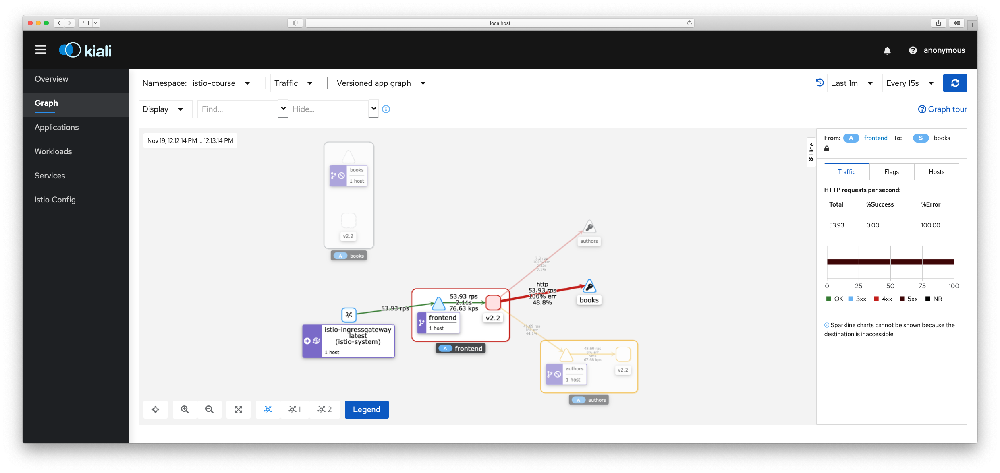
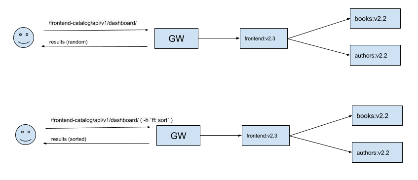

<h1>Testing<span class="tocSkip"></span></h1>
<div class="toc"><ul class="toc-item"><li><span><a href="#Introduction" data-toc-modified-id="Introduction-1"><span class="toc-item-num">1&nbsp;&nbsp;</span>Introduction</a></span></li><li><span><a href="#Tasks:" data-toc-modified-id="Tasks:-2"><span class="toc-item-num">2&nbsp;&nbsp;</span>Tasks:</a></span></li><li><span><a href="#Injections" data-toc-modified-id="Injections-3"><span class="toc-item-num">3&nbsp;&nbsp;</span>Injections</a></span><ul class="toc-item"><li><span><a href="#Before" data-toc-modified-id="Before-3.1"><span class="toc-item-num">3.1&nbsp;&nbsp;</span>Before</a></span></li><li><span><a href="#After" data-toc-modified-id="After-3.2"><span class="toc-item-num">3.2&nbsp;&nbsp;</span>After</a></span></li></ul></li><li><span><a href="#Feature-flags--(optional/not-finished)" data-toc-modified-id="Feature-flags--(optional/not-finished)-4"><span class="toc-item-num">4&nbsp;&nbsp;</span>Feature flags  (<code>optional</code>/<code>not finished</code>)</a></span><ul class="toc-item"><li><span><a href="#The-Plan" data-toc-modified-id="The-Plan-4.1"><span class="toc-item-num">4.1&nbsp;&nbsp;</span>The Plan</a></span></li><li><span><a href="#envoy-proxy" data-toc-modified-id="envoy-proxy-4.2"><span class="toc-item-num">4.2&nbsp;&nbsp;</span><code>envoy</code> proxy</a></span></li></ul></li></ul></div>

## Introduction

In order to perform all tasks, we have updated the next changes in the production environment.

1. `frontend` will be updated to use `v2.2`
    - client agnostic `json` passing.
    - added timeout to connect to the upstream  services
2. `authors` and `books` are both updated to `v2.2`
    - feature flags (`ff`) support
    - feature flag `sort` will output values in order (by default `go` (hash)maps shown in random order)
1. `frontend` will be updated to use `v2.3`
    - debug field that returns a request headers.
1. `headers` (books double) will be updated to use `v1.1`
    - debug field that returns a request headers.

```bash
 > k apply -f namespace.yaml
namespace/istio-course created
> k label namespace istio-course istio-injection=enabled
namespace/istio-course labeled
> k apply -f before
service/authors created
serviceaccount/servicemesh-authors created
deployment.apps/authors-v2-2 created
service/books created
serviceaccount/servicemesh-books created
deployment.apps/books-v2-2 created
gateway.networking.istio.io/course-frontend-gateway created
Warning: networking.k8s.io/v1beta1 Ingress is deprecated in v1.19+, unavailable in v1.22+; use networking.k8s.io/v1 Ingress
ingress.networking.k8s.io/course-istio-gateway created
service/frontend created
serviceaccount/servicemesh-frontend created
deployment.apps/frontend-v2.2 created
destinationrule.networking.istio.io/frontend created
virtualservice.networking.istio.io/course-istio created
> k get pods,deployments,svc
NAME                                 READY   STATUS    RESTARTS   AGE
pod/authors-v2-2-87b59b5f9-5v5s8     1/2     Running   0          9s
pod/books-v2-2-668d7d68d5-x47c2      1/2     Running   0          9s
pod/frontend-v2.2-7c476c958b-8vdtn   1/2     Running   0          9s

NAME                            READY   UP-TO-DATE   AVAILABLE   AGE
deployment.apps/authors-v2-2    0/1     1            0           9s
deployment.apps/books-v2-2      0/1     1            0           9s
deployment.apps/frontend-v2.2   0/1     1            0           9s

NAME               TYPE           CLUSTER-IP       EXTERNAL-IP   PORT(S)          AGE
service/authors    LoadBalancer   10.110.55.87     <pending>     3000:30866/TCP   10s
service/books      LoadBalancer   10.109.174.215   <pending>     3000:30969/TCP   9s
service/frontend   LoadBalancer   10.105.196.151   <pending>     3000:31250/TCP   9s
```

```bash
> curl -s http://192.168.99.101:30080/frontend-catalog/api/v1/dashboard/ | jq '{total_authros: .authors | length, total_books: .books | length}'
{
  "total_authros": 6,
  "total_books": 5
}
```

## Tasks: 

- Build two test experiments for the Author service with fault injection and delay injection. 
- Add virtual services to pass a feature flag between services 
- Create two virtual services for the Author service with 
    - Fault injection 500 status 
    - Delay injection 40 sec 


## Injections

`fault` injection and `delay injection`

```yaml

apiVersion: networking.istio.io/v1alpha3
kind: VirtualService
metadata:
  name: authors
spec:
  hosts:
  - authors
  gateways:
  http:
  - name: "fault injection"
    fault:
      delay:
        percentage:
          value: 20.0
        fixedDelay: 1s
    route:
    - destination:
        host: authors
        subset: v2
---
apiVersion: networking.istio.io/v1alpha3
kind: VirtualService
metadata:
  name: books
spec:
  hosts:
  - books
  gateways:
  - course-frontend-gateway
  - mesh
  http:
    - name: "fault injection"
      fault:
        abort:
          percentage:
            value: 100.0
          httpStatus: 500
      route:
      - destination:
          host: books
          subset: v2

```

### Before 

```
Summary:
  Total:        10.0971 secs
  Slowest:      0.4273 secs
  Fastest:      0.0263 secs
  Average:      0.1653 secs
  Requests/sec: 301.4740

  Total data:   3820220 bytes
  Size/request: 1255 bytes

Response time histogram:
  0.026 [1]     |
  0.066 [69]    |■■■
  0.107 [411]   |■■■■■■■■■■■■■■■■■■■■
  0.147 [738]   |■■■■■■■■■■■■■■■■■■■■■■■■■■■■■■■■■■■■
  0.187 [827]   |■■■■■■■■■■■■■■■■■■■■■■■■■■■■■■■■■■■■■■■■
  0.227 [546]   |■■■■■■■■■■■■■■■■■■■■■■■■■■
  0.267 [270]   |■■■■■■■■■■■■■
  0.307 [124]   |■■■■■■
  0.347 [39]    |■■
  0.387 [5]     |
  0.427 [14]    |■


Latency distribution:
  10% in 0.0948 secs
  25% in 0.1235 secs
  50% in 0.1601 secs
  75% in 0.1992 secs
  90% in 0.2429 secs
  95% in 0.2754 secs
  99% in 0.3204 secs

Details (average, fastest, slowest):
  DNS+dialup:       0.0001 secs, 0.0263 secs, 0.4273 secs
  DNS-lookup:       0.0000 secs, 0.0000 secs, 0.0000 secs
  req write:        0.0000 secs, 0.0000 secs, 0.0019 secs
  resp wait:        0.1652 secs, 0.0263 secs, 0.4272 secs
  resp read:        0.0000 secs, 0.0000 secs, 0.0008 secs

Status code distribution:
  [200]	3044 responses
```

### After



```
> hey -z 10s http://192.168.99.101:30080/frontend-catalog/api/v1/dashboard/

Summary:
  Total:           11.0012 secs
  Slowest:         1.1031 secs
  Fastest:         0.0023 secs
  Average:         0.2145 secs
  Requests/sec:	   220.6114

  Total data:      1064989 bytes
  Size/request:    438 bytes

Response time histogram:
  0.002 [1]      |
  0.112 [1924]   |■■■■■■■■■■■■■■■■■■■■■■■■■■■■■■■■■■■■■■■■
  0.222 [36]     |■
  0.333 [0]      |
  0.443 [0]      |
  0.553 [0]      |
  0.663 [0]      |
  0.773 [0]      |
  0.883 [0]      |
  0.993 [0]      |
  1.103 [466]    |■■■■■■■■■■


Latency distribution:
  10% in 0.0066 secs
  25% in 0.0106 secs
  50% in 0.0205 secs
  75% in 0.0641 secs
  90% in 1.0087 secs
  95% in 1.0150 secs
  99% in 1.0416 secs

Details (average, fastest, slowest):
  DNS+dialup:     0.0001 secs, 0.0023 secs, 1.1031 secs
  DNS-lookup:     0.0000 secs, 0.0000 secs, 0.0000 secs
  req write:      0.0000 secs, 0.0000 secs, 0.0005 secs
  resp wait:      0.2143 secs, 0.0022 secs, 1.1030 secs
  resp read:      0.0000 secs, 0.0000 secs, 0.0009 secs

Status code distribution:
  [200]	2427 responses

```

## Feature flags  (`optional`/`not finished`)

`authors:v2.2` & `books:v2.2` has defined feature flag (`ff`) with a value of `sort`, so the results is given in sorted order. `frontend` does know nothing about feature flags and going to route its requests to the `authors` and `books` as it always did.


### The Plan




ATM: it looks like it's impossible to implement ith information I have now.

I am currently researching it with the next options:

- https://istio.io/latest/docs/reference/config/networking/envoy-filter/
- https://stackoverflow.com/questions/70036056/headers-propagation-to-upstream-services-in-istio
- https://discuss.istio.io/t/forward-headers-with-envoyfilters/5661

### `envoy` proxy

keywords to serarch `request_handle:headers`, `SIDECAR_INBOUND` or `SIDECAR_OUTBOUND`