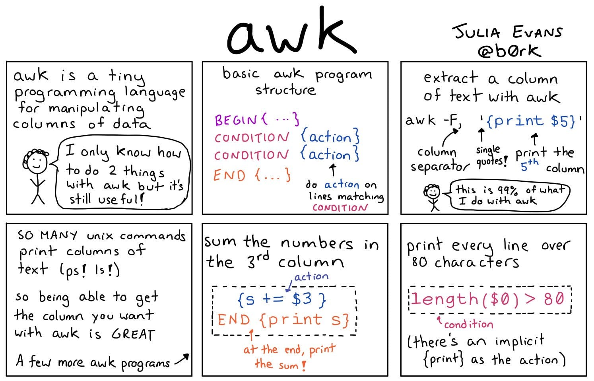

# `awk` Pattern-directed scanning and processing language

  * [AWK Tutorial][awk-tutorial]

  [awk-tutorial]: http://www.grymoire.com/Unix/Awk.html



### Vars

   Keyword | Meaning
-----------|---------
  FS       | The Input Field Separator Variable
  OFS      | The Output Field Separator Variable
  NF       | The Number of Fields Variable
  NR       | The Number of Records Variable
  RS       | The Record Separator Variable
  ORS      | The Output Record Separator Variable
  FILENAME | The Current Filename Variable

### Examples

```bash
# 10 Little Soldiers - Causes of Deathes
cat And_Then_There_Were_None.txt | awk '(NR-2)%3 == 0 {print $0}'
> One choked his little self, and then there were nine.
> One overslept himself, and then there were eight.
> One said he'd stay there, and then there were seven.
> One chopped himself in half, and then there were six.
> A bumble-bee stung one, and then there were five.
> One got in chancery, and then there were four.
> A red herring swallowed one, and then there were three.
> A big bear hugged one, and then there were two.
> One got frizzled up, and then there was one.
> He went and hanged himself and then there were none.
```

###### @todo: Add more real-life examples
