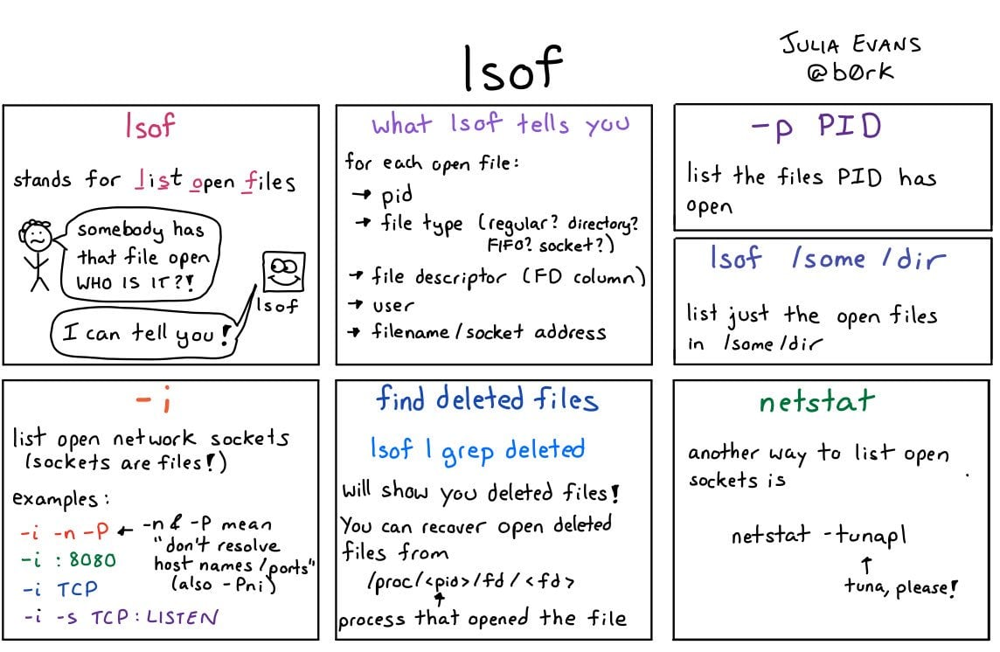

# `lsof` List open files




cmd | explaintion
----|------------
`lsof` | List open files.
`lsof -i :PORT` | Shows networking related port
`lsof -i@IP` | Shows connections to a specific host
`lsof -i -sTCP:LISTEN` | Shows listening ports
`lsof -i -sTCP:ESTABLISHED` | Shows established connections
`lsof -u USER` | What user opens
`lsof DIR` | Shows everything interacting with a given DIR
`lsof -i :PORT` | Shows which process uses the port

```bash
# What lisning port 80 ?
lsof -i :80

# Opened by process (ID)
lsof -p 17426

# Opened ports
lsof | grep LISTEN

# List all Network File System(NFS) files
lsof -N

# List all TCP or UDP connections
lsof -i tcp
lsof -i udp

# Kill all process that belongs to what you find out (-t returns process id list)
kill -9 `lsof -t options`

# Execute lsof in repeat mode (-r will continue to list, delay, list until a interrupt is given. +r will end when no open files are found.)
lsof /path-of-a-file -r5

# List opened files under a directory (+D will recurse the sub directories also)
lsof +D /path-of-a-directory

# List opened files based on process names starting with (You can give multiple -c switch on a single command line)
lsof -c ssh -c init

# List files opened by a specific user
lsof -u username
```
