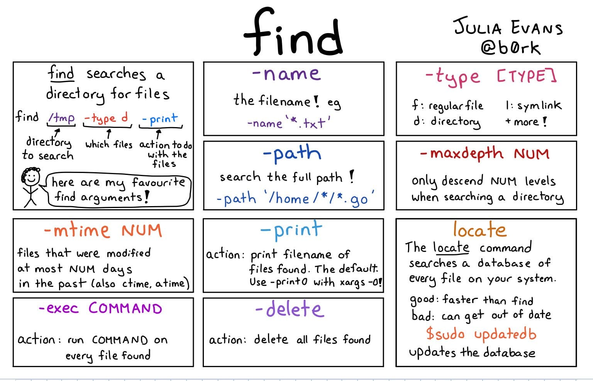

# `find` Walk a file hierarchy




```bash
# Searching for pattern *torrent* exceprt in ./Volumes
find * -path ./Volumes -prune -o -name "*torrent*"

# Searching and Executing Command ( -exec )
find * -path ./Volumes -prune -o -name "*torrent*" -exec file -i '{}' \;


# basic 'find file' commands
#--------------------------
find / -name foo.txt -type f -print             # full command
find / -name foo.txt -type f                    # -print isn't necessary
find / -name foo.txt                            # don't have to specify "type==file"
find . -name foo.txt                            # search under the current dir
find . -name "foo.*"                            # wildcard
find . -name "*.txt"                            # wildcard
find /users/al -name Cookbook -type d           # search '/users/al' dir

#search multiple dirs
#--------------------
find /opt /usr /var -name foo.scala -type f     # search multiple dirs

# search by user
#--------------------------
find . -user butuzov

# case-insensitive searching
#--------------------------
find . -iname foo                               # find foo, Foo, FOo, FOO, etc.
find . -iname foo -type d                       # same thing, but only dirs
find . -iname foo -type f                       # same thing, but only files

# find files with different extensions
#------------------------------------
find . -type f \( -name "*.c" -o -name "*.sh" \)                       # *.c and *.sh files
find . -type f \( -name "*cache" -o -name "*xml" -o -name "*html" \)   # three patterns

# find files that don't match a pattern (-not)
# --------------------------------------------
find . -type f -not -name "*.html"                                # find all files not ending in ".html"

# find files by text in the file (find + grep)
#--------------------------------------------
find . -type f -name "*.java" -exec grep -l StringBuffer {} \;    # find StringBuffer in all *.java files
find . -type f -name "*.java" -exec grep -il string {} \;         # ignore case with -i option
find . -type f -name "*.gz" -exec zgrep 'GET /foo' {} \;          # search for a string in gzip'd files

# 5 lines before, 10 lines after grep matches
-------------------------------------------
find . -type f -name "*.scala" -exec grep -B5 -A10 'null' {} \;
# http://alvinalexander.com/linux-unix/find-grep-print-lines-before-after-search-term

# find files and act on them (find + exec)
#----------------------------------------
find /usr/local -name "*.html" -type f -exec chmod 644 {} \;      # change html files to mode 644
find htdocs cgi-bin -name "*.cgi" -type f -exec chmod 755 {} \;   # change cgi files to mode 755
find . -name "*.pl" -exec ls -ld {} \;                            # run ls command on files found

# find and copy
#-------------
find . -type f -name "*.mp3" -exec cp {} /tmp/MusicFiles \;       # cp *.mp3 files to /tmp/MusicFiles

# copy one file to many dirs
#--------------------------
find dir1 dir2 dir3 dir4 -type d -exec cp header.shtml {} \;      # copy the file header.shtml to those dirs

# find and delete
#---------------
find . -type f -name "Foo*" -exec rm {} \;                        # remove all "Foo*" files under current dir
find . -type d -name CVS -exec rm -r {} \;                        # remove all subdirectories named "CVS" under current dir

# find files by modification time
#-------------------------------
find . -mtime 1               # 24 hours
find . -mtime -7              # last 7 days
find . -mtime -7 -type f      # just files
find . -mtime -7 -type d      # just dirs

# find files by modification time using a temp file
#-------------------------------------------------
touch 09301330 poop           # 1) create a temp file with a specific timestamp
find . -mnewer poop           # 2) returns a list of new files
rm poop                       # 3) rm the temp file

# find with time: this works on mac os x
#--------------------------------------
find / -newerct '1 minute ago' -print

# find and tar
#------------
find . -type f -name "*.java" | xargs tar cvf myfile.tar
find . -type f -name "*.java" | xargs tar rvf myfile.tar

# http://alvinalexander.com/blog/post/linux-unix/using-find-xargs-tar-create-huge-archive-cygwin-linux-unix

# find, tar, and xargs
#--------------------
find . -name -type f '*.mp3' -mtime -180 -print0 | xargs -0 tar rvf music.tar
# (-print0 helps handle spaces in filenames)
# http://alvinalexander.com/mac-os-x/mac-backup-filename-directories-spaces-find-tar-xargs

# find and pax (instead of xargs and tar)
#---------------------------------------
find . -type f -name "*html" | xargs tar cvf jw-htmlfiles.tar -
find . -type f -name "*html" | pax -w -f jw-htmlfiles.tar
# http://alvinalexander.com/blog/post/linux-unix/using-pax-instead-of-tar
```
