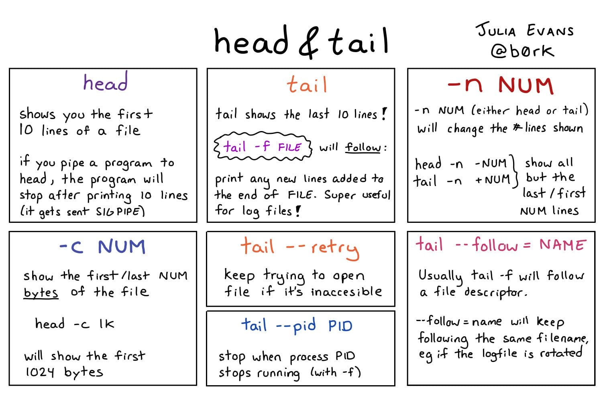

# `head` Display first lines of a file

# `tail` Display the last part of a file


### Keys

Key   | Description             | Example
------|-------------------------|-------------
`-f`  | File updates Monitoring | `tail -f error-log.txt`

### Examples

```bash

# Show Last Lines of file.txt
tail file.txt

# Show Last 15 Lines of file.txt
tail -n 15 file.txt

# Show Last 8 Bytes of file.txt
tail --bytes 8 file.txt
```

###### @todo: `head` add examples
###### @todo: `tail` add examples
