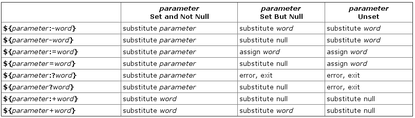

# Shell Expansions

Expansion is performed on the command line after it has been split into tokens. There are seven kinds of expansion performed:

| Type                            | Short Description
|---------------------------------|--------------------
| **Brace Expansion**                 | Expansion of expressions within braces.
| **Tilde Expansion**                 | Expansion of the ~ character.
| **Shell Parameter Expansion**       | How Bash expands variables to their values.
| **Command Substitution**            | Using the output of a command as an argument.
| **Arithmetic Expansion**            | How to use arithmetic in shell expansions.
| **Process Substitution**            | A way to write and read to and from a command.
| **Filename Expansion**              | A shorthand for specifying filenames matching patterns.

### [Brace Expansion](https://www.gnu.org/software/bash/manual/html_node/Brace-Expansion.html)

Brace expansion is a mechanism by which arbitrary strings may be generated. This mechanism is similar to `filename expansion`, but the filenames generated need not exist. Patterns to be brace expanded take the form of an optional `preamble`, followed by either a series of comma-separated strings or a sequence expression between a pair of braces, followed by an optional postscript. The preamble is prefixed to each string contained within the braces, and the postscript is then appended to each resulting string, expanding left to right.


```bash
$ echo a{d,c,b}e
ade ace abe

# Create 4 directories
$ mkdir /usr/local/src/bash/{old,new,dist,bugs}
```

### Tilde Expansion

| Type                | Short Description
|---------------------|--------------------
| `~`                 | `$HOME`
| `~/foo`             | `$HOME/foo`
| `~butuzov/Desktop`  | `Desktop` dir in `butuzov`'s home directory.
| `~+/foo`            | `${PWD}/foo`
| `~-/foo`            | `${OLDPWD-'~-'}/foo`
| `~N`                | `dirs +N`
| `~+N`               | `dirs -N`
| `~-N`               | `dirs -N`

### [Shell Parameter Expansion](https://www.gnu.org/software/bash/manual/html_node/Shell-Parameter-Expansion.html)



* https://wiki.bash-hackers.org/syntax/pe


##### Example

```bash
# print word, as TEST isn't set
> echo ${TEST:-word}

# assign value to TEXT is TEST is null or no value.
> ${TEST:=word}

# if TEST not set - word expandedd to stderr, else test substituted.
> ${TEST:?word}

# if TEST set - word expandedd to stdout, else  nothing happend.
> ${TEST:+word}


> TEST="Neque porro quisquam est qui dolorem ipsum quia dolor sit amet, consectetur, adipisci velit..."
# FIve characters after 4th character
echo ${TEST:4:5}

# Last 4 characters
echo ${TEST: -4}

# All starting from 4th character
echo ${TEST:4}

# All to the 4th character character
echo ${TEST::4}

# Repalce "Ne" with "Da"
echo ${TEST/Ne/Da}

# Expands variable name
echo ${!TE*}

# len of string
echo ${#TEXT}
```

### [Command Substitution](https://www.gnu.org/software/bash/manual/html_node/Command-Substitution.html)

##### Example
```bash
# Safe to use command substiution
echo $(pwd)

# Try to not use it becouse of the single quotes.
echo `pwd`
```


### [Arithmetic Expansion](https://www.gnu.org/software/bash/manual/html_node/Arithmetic-Expansion.html)

The shell allows arithmetic expressions to be evaluated, as one of the shell expansions or by using the `((` `))` compound command, the `let` builtin, or the `-i` option to the declare builtin.

Evaluation is done in fixed-width integers with no check for overflow, though division by 0 is trapped and flagged as an error. The operators and their precedence, associativity, and values are the same as in the C language. The following list of operators is grouped into levels of equal-precedence operators. The levels are listed in order of decreasing precedence.

| Example            | Operator   | Description      |
|--------------------|------------|------------------|
| `$((++i))`         | `++VAR`    | Pre Increment
| `$((--i))`         | `--VAR`    | Pre Decrement
| `$((i++))`         | `VAR++`    | Post Increment
| `$((i++))`         | `VAR--`    | Post Decrement
| `$((3**3))`        | `**`       | Exponentiation
| `$((i+4))`         | `+`        | Addition
| `$((i-2))`         | `-`        | Subtraction
| `$((i*3))`         | `*`        | Multiplication
| `$((i/3))`         | `/`        | Division
| `$((i%3))`         | `%`        | Remainder
| `$((i%3==0))`      | `==`       | Comparison - Equality
| `$((i%3!=0))`      | `!=`       | Comparison - Inequality
| `$((i%3>=0))`      | `>=`       | Comparison - Greater or Equal
| `$((i%3>0))`       | `>`        | Comparison - Greater
| `$((i+1<=5))`      | `<=`       | Comparison - Less or Equal
| `$((i+1<0))`       | `<`        | Comparison - Less
| `$((!i))`          | `!`        | Logical Negation
| `$((i&&2==2))`     | `&&`       | Logical AND
| `$((0||1==2))`     | `||`       | Logical OR
| `$((i%2==0?4:9))`  | `?:`       | Tenar Comparison

##### Example
```bash
# -i allow us to use typed variable
declare -i a
a=10
echo $a
a=hello
echo $a

# math expansion in action
a=$((1+12))
echo $a
```

### Process Substitution

Process substitution allows a process’s input or output to be referred to using a filename. It takes the form of `<(list)` or `>(list)`. The process list is run asynchronously, and its input or output appears as a filename. This filename is passed as an argument to the current command as the result of the expansion. If the `>(list)` form is used, writing to the file will provide input for list. If the <(list) form is used, the file passed as an argument should be read to obtain the output of list. Note that no space may appear between the `<` or `>` and the left parenthesis, otherwise the construct would be interpreted as a redirection. Process substitution is supported on systems that support named pipes (FIFOs) or the `/dev/fd` method of naming open files.

When available, process substitution is performed simultaneously with parameter and variable expansion, command substitution, and arithmetic expansion.

##### Example

```bash
$ diff <(ls) <(ls -a)
0a1,2
> .
> ..
```

### Filename Expansion

* https://www.gnu.org/software/bash/manual/html_node/Filename-Expansion.html
* https://www.gnu.org/software/bash/manual/html_node/Pattern-Matching.html

##### Example: Additional Example of Filepath renlated code.
```bash
> FILEPATH=~/Dropbox/Linux_Under_the_Hood.ipynb

# Path without Extension
> echo ${FILEPATH%.*}
~/Dropbox/Linux_Under_the_Hood

# Extension
> echo ${FILEPATH##*.}
ipynb

# Directory
> echo ${FILEPATH%/*}
~/Dropbox/

# FIlename
> echo ${FILEPATH##*/}
Linux_Under_the_Hood.ipynb
```

### [History Expansion](https://www.gnu.org/software/bash/manual/html_node/History-Interaction.html#History-Interaction)

|     Example      | Description
|------------------|--------------------------
 `!!`              |  Execute the last command.
 `!ls`             | Execute the last `ls` command (keyword execution).
 `!?kube`          | Execute the last comand that contains `kube` ( `kubectl` in my example command ).
 `!-3`             | Execute third previous command in history.
 `!48`             | Executes command number 48 from history
 `\^ls\^cat\^`     | Replace a string from the previous command
 `!cp:\^`          | First Argument of last cp command
 `!cp:$`           | Last Argument of last cp command
 `!cp:2`           | `n`-th Argument of last cp command (n is 2 in example)
 `!cp:2-1`         | Range Arguments of last cp command (n is 2 in example)
 `!cp:*`           | All Arguments of last cp command
 `!!:$:h`          | Remove the trailing path name from a word using :h
 `!!:$:t`          | Remove all leading path name from a word using :t
 `!!:$:r`          | Remove the file name extension from a word using :r
 `!!:s/ls -l/cat/` | Sed like Substitution in bash history using `:s/str1/str2/ `
