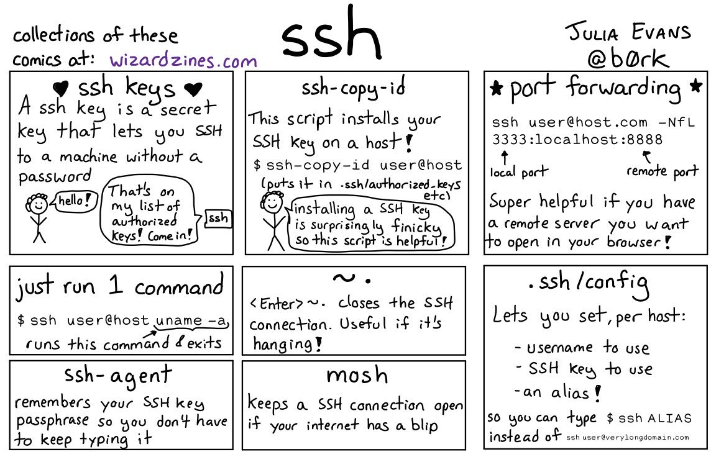

```bash

# Proxy Jump
ssh -J user@example.com me@internal-host.lan

# Running Command on remote host
ssh made.ua "echo 1"

# Bastion
ssh made.ua "ssh internal.made.ua \"echo 1\""

# Create ~/media.tag.gz on hqweb3
ssh made.ua "ssh internal.made.ua \"tar -zcvf ~/media.tar.gz -C /mnt media &> /dev/null\""

# Copy Over remote hosts
ssh made.ua "scp oleg@internal.made.ua:~/media.tar.gz ~/media.tar.gz"
```
