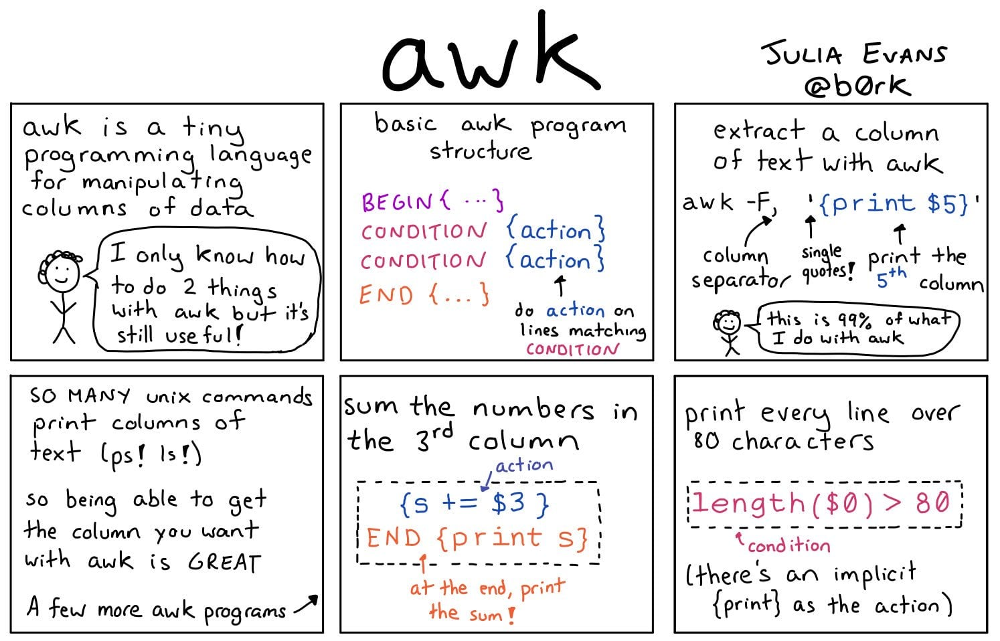
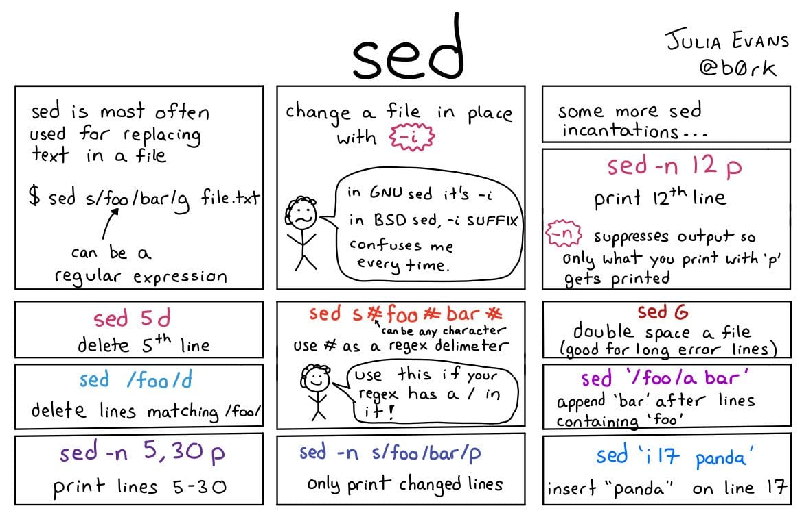

<h1>Table of Contents<span class="tocSkip"></span></h1>
<div class="toc"><ul class="toc-item"><li><ul class="toc-item"><li><span><a href="#iptables" data-toc-modified-id="iptables-0.1"><span class="toc-item-num">0.1&nbsp;&nbsp;</span><code>iptables</code></a></span></li></ul></li><li><span><a href="#Monitoring" data-toc-modified-id="Monitoring-1"><span class="toc-item-num">1&nbsp;&nbsp;</span>Monitoring</a></span><ul class="toc-item"><li><span><a href="#last" data-toc-modified-id="last-1.1"><span class="toc-item-num">1.1&nbsp;&nbsp;</span><code>last</code></a></span></li><li><span><a href="#top" data-toc-modified-id="top-1.2"><span class="toc-item-num">1.2&nbsp;&nbsp;</span><code>top</code></a></span></li></ul></li><li><span><a href="#System-Information" data-toc-modified-id="System-Information-2"><span class="toc-item-num">2&nbsp;&nbsp;</span>System Information</a></span><ul class="toc-item"><li><span><a href="#uname" data-toc-modified-id="uname-2.1"><span class="toc-item-num">2.1&nbsp;&nbsp;</span><code>uname</code></a></span></li></ul></li><li><span><a href="#Files-(Operations)" data-toc-modified-id="Files-(Operations)-3"><span class="toc-item-num">3&nbsp;&nbsp;</span>Files (Operations)</a></span><ul class="toc-item"><li><span><a href="#less" data-toc-modified-id="less-3.1"><span class="toc-item-num">3.1&nbsp;&nbsp;</span><code>less</code></a></span><ul class="toc-item"><li><span><a href="#Keyboard-shortcuts" data-toc-modified-id="Keyboard-shortcuts-3.1.1"><span class="toc-item-num">3.1.1&nbsp;&nbsp;</span>Keyboard shortcuts</a></span></li><li><span><a href="#Forward-Search-Navigation" data-toc-modified-id="Forward-Search-Navigation-3.1.2"><span class="toc-item-num">3.1.2&nbsp;&nbsp;</span>Forward Search Navigation</a></span></li><li><span><a href="#Backward-Search-Navigation" data-toc-modified-id="Backward-Search-Navigation-3.1.3"><span class="toc-item-num">3.1.3&nbsp;&nbsp;</span>Backward Search Navigation</a></span></li><li><span><a href="#Line-Navigation" data-toc-modified-id="Line-Navigation-3.1.4"><span class="toc-item-num">3.1.4&nbsp;&nbsp;</span>Line Navigation</a></span></li><li><span><a href="#Screen-Navigation" data-toc-modified-id="Screen-Navigation-3.1.5"><span class="toc-item-num">3.1.5&nbsp;&nbsp;</span>Screen Navigation</a></span></li><li><span><a href="#Count-numbers-as-options" data-toc-modified-id="Count-numbers-as-options-3.1.6"><span class="toc-item-num">3.1.6&nbsp;&nbsp;</span>Count numbers as options</a></span></li><li><span><a href="#Some-more-less-options" data-toc-modified-id="Some-more-less-options-3.1.7"><span class="toc-item-num">3.1.7&nbsp;&nbsp;</span>Some more less options</a></span></li></ul></li><li><span><a href="#more" data-toc-modified-id="more-3.2"><span class="toc-item-num">3.2&nbsp;&nbsp;</span><code>more</code></a></span></li></ul></li><li><span><a href="#Text-Tools" data-toc-modified-id="Text-Tools-4"><span class="toc-item-num">4&nbsp;&nbsp;</span>Text Tools</a></span><ul class="toc-item"><li><span><a href="#awk" data-toc-modified-id="awk-4.1"><span class="toc-item-num">4.1&nbsp;&nbsp;</span><code>awk</code></a></span><ul class="toc-item"><li><span><a href="#Resources:" data-toc-modified-id="Resources:-4.1.1"><span class="toc-item-num">4.1.1&nbsp;&nbsp;</span>Resources:</a></span></li><li><span><a href="#Vars" data-toc-modified-id="Vars-4.1.2"><span class="toc-item-num">4.1.2&nbsp;&nbsp;</span>Vars</a></span></li><li><span><a href="#Examples" data-toc-modified-id="Examples-4.1.3"><span class="toc-item-num">4.1.3&nbsp;&nbsp;</span>Examples</a></span></li></ul></li><li><span><a href="#grep" data-toc-modified-id="grep-4.2"><span class="toc-item-num">4.2&nbsp;&nbsp;</span><code>grep</code></a></span></li><li><span><a href="#printf" data-toc-modified-id="printf-4.3"><span class="toc-item-num">4.3&nbsp;&nbsp;</span><code>printf</code></a></span></li><li><span><a href="#sed" data-toc-modified-id="sed-4.4"><span class="toc-item-num">4.4&nbsp;&nbsp;</span><code>sed</code></a></span></li><li><span><a href="#tr" data-toc-modified-id="tr-4.5"><span class="toc-item-num">4.5&nbsp;&nbsp;</span><code>tr</code></a></span></li><li><span><a href="#wc" data-toc-modified-id="wc-4.6"><span class="toc-item-num">4.6&nbsp;&nbsp;</span><code>wc</code></a></span></li></ul></li></ul></div>

# Commands

<!-- @import "[TOC]" {cmd="toc" depthFrom=2 depthTo=6 orderedList=false} -->

<!-- code_chunk_output -->
<!-- /code_chunk_output -->

```python
## Network
```

### `iptables`

```bash
echo 123
```

## Monitoring

### `last`

Last will list the sessions of specified u`ser`s, `tty`s, and `host`s, in reverse time order.

```bash
# Shows last reboot (ther is pseudo "reboot" user)
last reboot

# Show last user interactions
last butuzov
```

### `top`


## System Information

### `uname`

Print (Linux) operating system name. More @ [How to check OS and version using a Linux command](https://unix.stackexchange.com/questions/88644/how-to-check-os-and-version-using-a-linux-command)

 * `-a` Behave as though all of the options -mnrsv were specified.
 * `-m` print the machine hardware name.
 * `-n` print the nodename (the nodename may be a name that the system is known by to a communications network).
 * `-p` print the machine processor architecture name.
 * `-r` print the operating system release.
 * `-s` print the operating system name.
 * `-v` print the operating system version.

## Files (Operations)

### `less`


```bash
# view file via less
less And_Then_There_Were_None.txt

# same but strting from 6th line.
less +6 And_Then_There_Were_None.txt
```

#### Keyboard shortcuts

*   [Arrows]/[Page Up]/[Page Down]/[Home]/[End]: Navigation.
*   [Space bar]: Next page.
*   b: Previous page.
*   ng: Jump to line number n. Default is the start of the file.
*   nG: Jump to line number n. Default is the end of the file.
*   /pattern: Search for pattern. Regular expressions can be used.
*   n: Go to next match (after a successful search).
*   N: Go to previous match.
*   ‘^ or g: Go to start of file.
*   ‘$ or G: Go to end of file.
*   s: Save current content (got from another program like grep) in a file.
*   =: File information.
*   F: continually read information from file and follow its end. Useful for logs watching. Use Ctrl+C to exit this mode.
*   -option: Toggle command-line option -option.
*   h: Help.
*   q or zz: Quit.

#### Forward Search Navigation
*  / – search for a pattern which will take you to the next occurrence.
*  n – for next match in forward
*  N – for previous match in backward

#### Backward Search Navigation
*  ? – search for a pattern which will take you to the previous occurrence.
*  n – for next match in forward
*  N – for previous match in backward

#### Line Navigation

*  j – navigate forward by one line
*  k – navigate backward by one line

#### Screen Navigation

*  CTRL+D – forward half window
*  CTRL+U – backward half window
*  CTRL+F – forward one window
*  CTRL+B – backward one window

#### Count numbers as options

*  5j – 5 lines forward.
*  10k – 10 lines backward.

####  Some more less options

*  :p - Examine the previous file in the command line list.
*  :d - Remove the current file from the list of files.
*  v – using the configured editor edit the current file.
*  &pattern – display only the matching lines, not all.
*  CTRL+G – show the current file name along with line, byte and percentage statistics.
*  mx – mark the current position with the letter `x`.
*  ‘x – go to the marked position `x`.

## Text Tools

### `awk`

`awk` Pattern-directed scanning and processing language



#### Resources:
[awk-tutorial]: http://www.grymoire.com/Unix/Awk.html

#### Vars

   Keyword | Meaning
-----------|---------
  FS       | The Input Field Separator Variable
  OFS      | The Output Field Separator Variable
  NF       | The Number of Fields Variable
  NR       | The Number of Records Variable
  RS       | The Record Separator Variable
  ORS      | The Output Record Separator Variable
  FILENAME | The Current Filename Variable

#### Examples

```bash
# 10 Little Soldiers - Causes of Deathes
cat And_Then_There_Were_None.txt | awk '(NR-2)%3 == 0 {print $0}'
> One choked his little self, and then there were nine.
> One overslept himself, and then there were eight.
> One said he'd stay there, and then there were seven.
> One chopped himself in half, and then there were six.
> A bumble-bee stung one, and then there were five.
> One got in chancery, and then there were four.
> A red herring swallowed one, and then there were three.
> A big bear hugged one, and then there were two.
> One got frizzled up, and then there was one.
> He went and hanged himself and then there were none.
```

Simple `ansible` inventory generator

```bash
#!/usr/bin/env bash
DIR=$(pwd | sed "s/\//\\\\\//g")

echo "[all:vars]"
echo "ansible_connection=ssh"
echo "ansible_user=vagrant"
echo "ansible_host=127.0.0.1"
echo "ansible_ssh_common_args='-o StrictHostKeyChecking=no'"
echo ""

vagrant ssh-config| \
    grep -iE "key|host|port" | \
    grep -ivE "strict|hosts" | \
    sed "s/^  //" | \
    sed "s/$DIR\///" | \
    awk '{
        row= ( NR/4 == int(NR/4)) ? NR/4 : int(NR/4)+1;
        if ( array[row] == "" ) {
            array[row] = $2
        } else {
            array[row]= array[row] " " $2
        }
    }
    END {
        for( i=1; i<= row; i++){
            print(  array[i] )
        }
    }
    ' | \
    sed "s/\"//g" | \
    awk '{print $1, "ansible_port="$3, "ansible_private_key_file="$4}' | \
    awk '{
        split( $1, a, /-/)
        if ( groups[a[1]] == "" ){
            groups[a[1]] = a[1]
            printf("\n[%s]\n", a[1])
        }
        print $1, $2, $3
    }'
```

### `grep`

File pattern searcher


```bash
# search for "HEY" in text.txt and show lines that has it
grep HEY text.txt

# same as above AND highlight searched term
grep --color=auto HEY text.txt

# same as above AND lines surrounding match
grep -C 1 -color=auto HEY text.txt

# same as above AND case insensetive search
grep -C 1 -color=auto -i HEY text.txt

# almost same as above but inverted. shows everything that not match term
grep -i -v HEY text.txt

# Find the character 's' followed by 'pring'
grep "[s]pring" text.txt

# we can search in directories as well.
grep -i password password-dn

# we can search in directories as well (recursive search)
grep -R password password-dn

# treat binary as text
grep -a password pass.bin

# safe cleanup local pip folder
python3 -m pip list | awk 'NR>2 {print $1}' | grep -Ev "pip|setuptools|wheel" | xargs -I {} sh -c "python3 -m pip uninstall {} -y"

# getting local ip addresses info
ifconfig | grep inet | grep -v inet6 | awk '{print $2}'
```

### `printf`

```bash
# floats
printf "%.6f" 0.65

# repeated formating
printf "%4s;" {1..4}
```

### `sed`



### `tr`

Translate Characters

```bash
# Convert to uppercase
cat filename.csv | tr '[A-Z]' '[a-z]'
```

### `wc`

Word, Line, Character and Byte count

```bash
# count
#   - characters
wc -c file.txt

#   - words
wc -w file.txt

#   - lines
wc -l file.txt

# like... all!
wc -cmlw And_Then_There_Were_None.txt
> 29 173 953 953 And_Then_There_Were_None.txt
```
