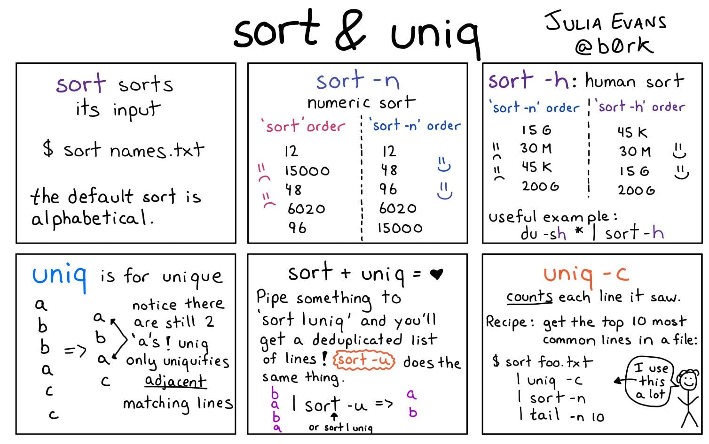

# `sort` Sort lines of text files




* sort -f ignore case
* sort -r reverse sort order
* sort -R scramble order
* uniq -c count number of occurrences
* uniq -d only print duplicate lines

## Examples
```bash
# Top 10 commands used:
history | awk '{print $2}' | awk 'BEGIN {FS="|"}{print $1}' | sort | uniq -c | sort -nr | head

# Shorter and Faster version
history | awk 'BEGIN {FS="[ \t]+|\\|"} {print $3}' | sort | uniq -c | sort -nr | head

# Duplicate file finder
find ./ -type f -print0 | xargs -0 -n1 md5sum | sort -k 1,32 | uniq -w 32 -d --all-repeated=separate | sed -e 's/^[0-9a-f]*\ *//;'


# Sorting a CSV file by the second column alphabetically
sort -t"," -k2,2 filename.csv

# Numerically
sort -t"," -k2n,2 filename.csv

# Reverse order
sort -t"," -k2nr,2 filename.csv

```
