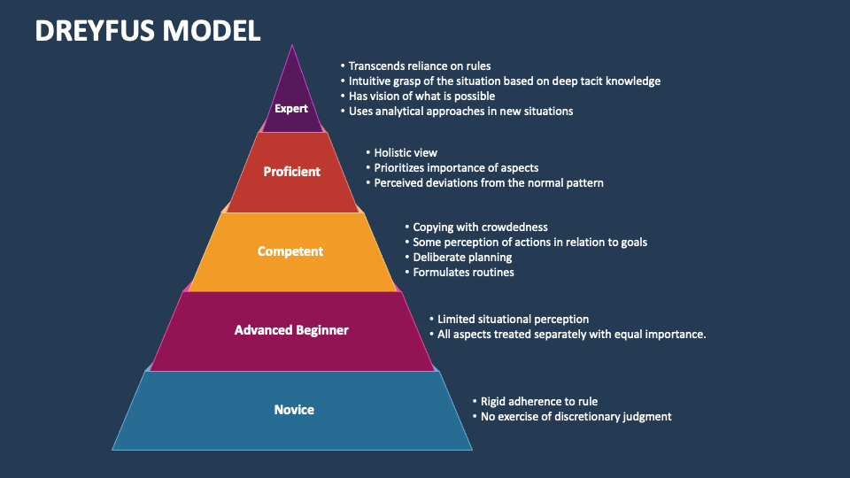
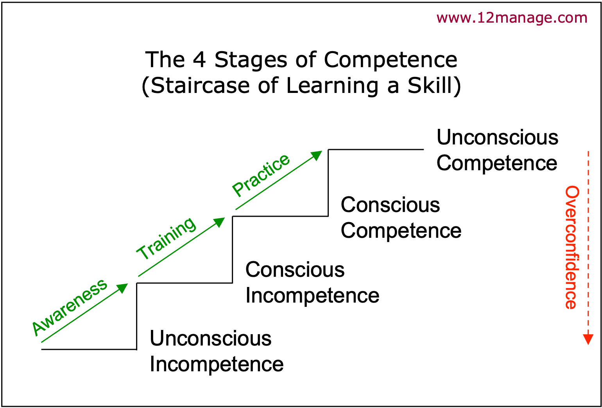

# Skill Acquisition

## Dreyfus Model

- **Novices** start with an instructor who splits a task into context free actions and rules. Beginners can perform the actions and follow the rules to solve the given task.
- **Advanced Beginners**. When the novices cope with a real context, they start to understand important aspects of the domain and match this context to the rules they was given by instructor.
- **Competence** students become overloaded by amount of rules and details. They start to relay on sense of what's important in particular case. With an instructor the start to figure out priorities, prepare plan, and ignore everything not related to the plan.
- **Proficiency** students become emotionally involved in a problem. On this stage it's hard to go back and learn missed rules. Students also understand anxiety of choice, start to decide based on a situation and grow up by positive and negative experience. Proficiency is developed only if experience is assimilated by a theoretical way.
- **Experts**. When proficiency students see both what to be done and how to do it, experts only see what should be achieved by their giant repertoire in situation discrimination. Experts decomposes situation into subclasses and know desired action.

## Four stages of competence

https://www.12manage.com/description_four_stages_of_competence.html

- Unconscious competence (ignorance)
- Conscious incompetence (awareness),
- Conscious competence (learning)
- Unconscious competence (mastery)
