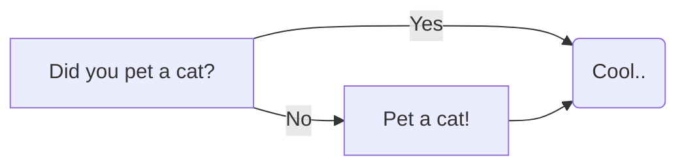

<!-- github: https://github.com/gohugoio/ -->
# Hugo

Powerful static site generator written in go. While its more enought to just use markdown, sometimes you need to go deeper.

## Recipes

### Embed another file with a shortcode

[tutorial](https://roneo.org/en/hugo-include-another-file-with-a-shortcode/)

### Customizing Code Area

We using [`mermaid`](http://mermaid.js.org) as example.

```html
<!-- head.html - head scripts -->
<script src="https://unpkg.com/mermaid/dist/mermaid.min.js"></script>
<script>mermaid.initialize({ startOnLoad: true });</script>
```
```go-template
{{ alternativly include }}
{{ if .Page.Store.Get "hasMermaid" }}
{{ $mermaid := resources.Get "js/mermaid.js" | js.Build (dict "minify" true) }}
<script>{{ $mermaid.Content | safeJS }}</script>
{{ end }}
```
```css
 /* some styling */
.mermaid {
    display: flex;
    justify-content: center;
    margin: 10px 0px 25px 0px
}
```
```markdown
  ```mermaid
  # emermade diagram
  flowchart LR
      s[Did you pet a cat?]
      s --> |Yes| a("Cool..")
      s --> |No| su[Pet a cat!] --> a
      click su href "https://en.wikipedia.org/wiki/Pallas%27s_cat" _blank
  ``
```

